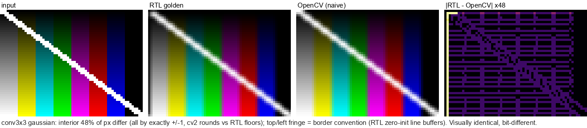
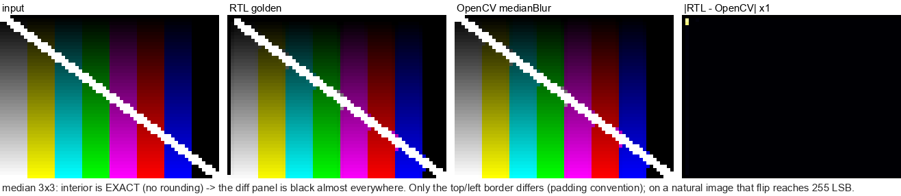
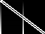

# 画像ファイル駆動検証 (`img_file_uvm`)

🌐 **[English](image_file_verification.md)** | **日本語**

**画像をテストパターンとして使う** img_proc スロット RTL のシミュレーション検証。
任意の画像ファイル（または内蔵パターン）を Verilator + cocotb + pyuvm（本物の UVM）上で
選択可能な DUT へ 1 画素/クロックでストリームし、DUT の出力フレームを UVM モニタで
キャプチャして画像として保存し、**同じ入力に同じフィルタを Python ソフトウェアで適用して
生成した期待値画像と全画素を比較**する（ゴールデンモデルは RTL からビット厳密に移植）。

本フレームワークは **6 つのスロット DUT** と、2 つの**多入力連鎖**（DoG と 4 段カスケード）を
対象とする。ゴールデンモデルはそれ自身の sim 不要な自己テストで保護され、刺激はランダムな
ハンドシェイクタイミング下で駆動され、到達した挙動上の隅は機能カバレッジで明示される。
本ドキュメントはその全体像を記述する。

コード: [verification/cocotb/img_file_uvm/](../../verification/cocotb/img_file_uvm/) ·
実行ラッパ: [scripts/run_image_test.ps1](../../scripts/run_image_test.ps1) ·
関連: [cocotb_python_test_guide.md](cocotb_python_test_guide.md)、
[image_processing_principles_ja.md](image_processing_principles_ja.md)

---

## 1. 3 枚の画像: 入力 → 期待値 vs 出力

すべての実行は 3 枚の画像を生成し、テスト判定は文字どおりその比較である。
実例 — 実行 `proc_slot_20260703_052153`（POST スロット、op=invert、内蔵 64×48 パターン）:

| | 画像 | 生成元 | 意味 |
|---|---|---|---|
|  | `input.png` | ホスト側（テストパターン生成器、または `IMG_FILE` 指定画像の変換結果） | DUT へストリームされるフレーム。1 画素/クロック、sof/eol/eof マーカー付き |
|  | `expected.png` | **ソフトウェアゴールデンモデル** — 同じ invert フィルタを Python で `input.png` に適用（[golden.py](../../verification/cocotb/img_file_uvm/golden.py)） | RTL が出力す*べき*画像（ビット厳密） |
|  | `output.png` | **RTL シミュレーション** — DUT 出力ストリームを UVM モニタがビートごとにキャプチャ | RTL が*実際に*出力した画像 |

UVM スコアボード（`FrameScoreboard`）は `output` を `expected` と
**全画素 — 3072 画素中 3072 画素、フレーム境界を含む — ピクセル単位で比較**し、さらに
各ビートの sof/eol/eof/err フレーミングマーカーも検証する。`PASS` は 2 枚の画像が
ビット一致していること（上図のとおり）を意味する。1 画素でも異なればテストは FAIL となり、
その (row, col) と got/exp 値が報告され、全差分が `mismatches.txt` に出力される。
`run_info.txt` には構成が記録される:

```text
dut=proc_slot proc_slot op=1 thresh=128
size: 64x48 frames=1
observed beats: 3072 / expected 3072
```

出力画像はチェックフェーズの**前**に書き出されるため、比較が失敗した場合でも必ず
キャプチャ画像を目視確認できる。

## 2. 6 つのスロット DUT

各 DUT は共通のスロット契約（`pixel[23:0]` = {R,G,B}、`valid`、`sof`/`eol`/`eof`/`err`、
1 画素/クロック）を持つ。1 シミュレーションにつき 1 DUT を検証し、`IMG_DUT` で選択する
（未指定なら 6 つ全部を pytest のパラメタライズで順に実行）。DUT の追加は
[`dut_registry.py`](../../verification/cocotb/img_file_uvm/dut_registry.py) の `DutSpec`
1 エントリ（RTL ソース・トップ名・cfg ピン駆動・ゴールデン関数）を足すだけである:

| DUT | RTL | フィルタ |
|---|---|---|
| `proc_slot` | `axis_rgb_proc_slot.sv` | ポイント演算（pass / invert / gray / swap / threshold / channel） |
| `conv3x3` | `axis_rgb_conv3x3.sv` | 3×3 畳み込み |
| `conv5x5` | `axis_rgb_conv5x5.sv` | 一般 5×5 畳み込み |
| `conv5x5_sep` | `axis_rgb_conv5x5_sep.sv` | **分離型 5×5** — 水平 1×5 → 垂直 5×1 の 2 パス |
| `prefilter` | `axis_rgb_prefilter.sv` + `median9.sv` | 3×3 前段フィルタ（median / gaussian / ポイント演算） |
| `dither` | `axis_rgb_dither.sv` | ordered Bayer / random LFSR ディザ |

`conv5x5_sep` は一言添える価値がある。ゴールデンは 2 パス RTL をそのまま模す必要があるからだ:
水平パスを符号付き 12bit に再量子化（`>>hshift` + clamp12）**してから**垂直 5×1 の
ラインバッファへ渡し、水平ウィンドウは EOL でリセットせず行境界を跨ぐ。分離型は設計上、
一般 5×5 に対して ±2 LSB 相当でしかないため、ゴールデンは一般 5×5 参照ではなく分離型の
再量子化を厳密にモデル化する。

サンプルギャラリー — 入力は同じ内蔵パターン、6 DUT のうちサンプル画像を持つ 5 本。各行は
Python ゴールデンの期待値と、キャプチャした RTL 出力を並べたもの（PASS した実行なので
ビット一致している）:

| DUT（フィルタ） | expected.png（Python ゴールデン） | output.png（RTL シミュレーション） |
|---|---|---|
| `proc_slot` — invert |  |  |
| `conv3x3` — gaussian, shift 4 |  |  |
| `conv5x5` — gaussian5, shift 8 |  |  |
| `prefilter` — median 3×3 |  |  |
| `dither` — ordered Bayer, 2 bit/ch |  |  |

畳み込み出力の上端/左端の暗いフリンジは**実在する検証済みの RTL 境界挙動**である —
ウィンドウの先頭行/列はゼロ初期化されたラインバッファを参照する — ゴールデンモデルは
これを正確に再現しているため、境界はマスクせず比較対象に含めている。

## 3. 期待値画像が信頼できる理由 — そしてゴールデンをどう守るか

`expected.png` は汎用ライブラリのフィルタではなく、**RTL のストリーミング・ビート順序
そのままの移植**である（[golden.py](../../verification/cocotb/img_file_uvm/golden.py)）:
同じ read-before-write ラインバッファ（ゼロ初期状態）、同じウィンドウシフトレジスタ、
同じ符号付き係数 × 符号なしタップ演算（算術シフト + 飽和）、同じ Bayer テーブルと
Galois LFSR（シード `0xA5`、valid ビートごとに更新、フレーム間で継続）、さらに RTL の
Verilog ビット幅の癖（dither のスミアシフト `n<<1`/`n<<2` は 3 ビット式なので mod 8 で
回り込む — 「修正」せず忠実に再現）まで一致させている。したがって不一致は常に本物の
RTL/モデル乖離であり、丸め方式の違いでは起こらない。ゴールデンモデルは RTL に対する
敵対的マルチエージェント監査を欠陥ゼロで通過している
（[diary_20260703.md](../progress/diary_20260703.md) 参照）。

### 「OpenCV でいいのでは」— 実測

「汎用ライブラリのフィルタではない」を具体化するため、OpenCV を普通に書いた場合の出力を
RTL 厳密ゴールデンと差分した（内蔵パターン。差分パネルはシフト補正 + 増幅済み）。ゴールデンは
RTL とビット一致なので、数字は OpenCV vs RTL である。



ゴールデンと OpenCV の出力は**見た目は同一**だが、自然画像では**内部画素の 85% が相違 —
すべて厳密に ±1**（OpenCV の `saturate_cast` は四捨五入、RTL は `>>` で floor）。RTL の floor
演算を cv2 に移植すると内部の相違は **0** になり、内部のズレは丸め規約だけと分かる。加えて
RTL はウィンドウ半径 `d=(taps-1)/2` だけずれて出力し（フリンジが上・左だけに出る理由）、
ゼロ初期化ラインバッファ + 行頭キャリーオーバーを再現する cv2 の `borderType` は存在しない
（ヒートマップのフリンジ）。



median は丸める演算がないので**内部は OpenCV とビット一致**（差分パネルは黒）。相違は境界のみで、
ゼロ埋めと reflect で中央値の順位が変わり最大 255 反転する。

| 期待値の作り方 | 内部の不一致（シフト補正後） | 境界 | 判定（許容誤差なし） |
|---|---|---|---|
| RTL 厳密ゴールデン | 0% | 一致 | **PASS** |
| OpenCV conv gaussian（自然画像） | 85%（すべて ±1） | 相違 | FAIL |
| OpenCV conv gaussian（内蔵パターン） | 48%（同上） | 相違 | FAIL |
| OpenCV median | 0%（内部は完全一致） | 最大 255 反転 | 境界のみ FAIL |

つまり OpenCV で期待値を作るには、
ウィンドウ半径シフト・±1 の許容誤差（か floor 再実装）・境界マスクを同時に要求される。RTL 移植
ゴールデンはこの 3 つが全部いらない。（実験:
[`verification/cocotb/experiments/`](../../verification/cocotb/experiments/)、リポジトリ
`.venv` + `opencv-python-headless`。生カウントは [diary_20260704.md](../progress/diary_20260704.md)。）

ゴールデンはスイート全体の期待値を一手に決めるモデルなので、それ自身が **sim を使わず**
[`golden_selftest/`](../../verification/cocotb/golden_selftest/)（`smoke` に登録された
`engine = "none"` ブロック）でレグレッションテストされる。各モデルを**別の書き方で独立に
再導出**したものと突き合わせ（2 次元インデックス直書きの畳み込み vs ストリーミングの
ウィンドウ生成器、明示的なガウシアン重み vs 詰め込んだ累算器）、仕様上の癖（ディザの
mod 8 スミア回り込み、LFSR の最大長周期）をピン留めする。ミューテーションテスト済みで、
ゴールデン定数を 1 つ壊すとシミュレーションを走らせる**前に**自己テストがレッドになる。
これがあるからこそ、画素比較は許容誤差ゼロのままでよい — 期待値が知らないうちにずれない。

## 4. 多段パイプライン: 実行カスケードと RTL 内連鎖

**実行カスケード。** テストは 1 シミュレーションにつき 1 スロットを実行するが、多段
パイプラインは実行のカスケードで検証できる: 各段のキャプチャ `output.ppm` を次段の
`-Image` 入力に渡し、各段は引き続きゴールデンとピクセル厳密に比較される。例 — 定番の
グレースケール → 輪郭抽出 → 二値化チェーン（実機ギャラリー
[`outline.png` / `edge_binary.png`](image_processing_samples_ja.md) のシミュレーション版）:

```powershell
.\scripts\run_image_test.ps1 -Dut proc_slot -Op gray      -OutDir chain\s1   # 第 1 段
.\scripts\run_image_test.ps1 -Image chain\s1\proc_slot_<ts>\output.ppm `
                             -Dut conv3x3   -Kernel laplacian -OutDir chain\s2   # 第 2 段
.\scripts\run_image_test.ps1 -Image chain\s2\conv3x3_<ts>\output.ppm `
                             -Dut proc_slot -Op threshold -Thresh 40 -OutDir chain\s3
```

| 入力 | 1. `proc_slot` gray | 2. `conv3x3` laplacian (abs) | 3. `proc_slot` threshold 40 |
|---|---|---|---|
|  |  |  |  |

3 段すべて PASS — 各キャプチャ画像はその段の Python ゴールデンとビット一致している。
第 1 段で右半分が黒くなる点に注意: RTL のグレースケールは仕様どおりの
**緑チャネル輝度近似**（`axis_rgb_proc_slot.sv` の `y = g`、乗算器を使わない意図的な
設計選択）であり、パターン右側のバー（マゼンタ / 赤 / 青 / 黒）はすべて G=0 だからである。
ゴールデンもこれを再現するので、このチェーンはハードウェアが実際に計算する内容を検証する。

**RTL 内の多入力連鎖 — DoG とカスケード。** 実行を繰り返すのではなく RTL の中で結線された
連鎖が 2 つある: `axis_rgb_dog_combine`（2 本の並列 conv 分岐 → 序数整合 FIFO → 差分/和合成）と
4 段の `cascade`（conv5x5 → sep → sep → DoG）。いずれも上の構成要素から合成したゴールデンに
対して**ビット厳密**である（[`axis_rgb_dog/`](../../verification/cocotb/axis_rgb_dog/)、
[`axis_rgb_cascade/`](../../verification/cocotb/axis_rgb_cascade/)）。合成を厳密にできる理由は
2 つ:

- **序数整合はレイテンシ演算を要さない。** conv3x3 の valid レイテンシは 5、conv5x5 は 6 なので
  分岐 A は分岐 B より 1 サイクル先行する。DoG の FIFO は k 番目の A 出力と k 番目の B 出力
  （同一空間画素）を対応づけるので、ゴールデンは 2 本の分岐ゴールデンの単純な要素ごと合成でよい。
- **2 フレーム定常比較でコールドスタート過渡を回避する。** コールドリセット直後の連鎖には
  1 行ぶんの FIFO/パイプライン充填過渡がある（旧 TB がウォームアップ + 許容誤差を使う理由）。
  2 フレームを連続で流して**2 枚目**を照合するとこれを避けられる: ストリーミングゴールデンは
  ラインバッファ/FIFO 状態を RTL どおりフレーム間で継続するので、2 枚目は定常状態でビット
  厳密に一致する — DoG 全 4 モード・カスケード全 4 タップで確認済み。

## 5. ハンドシェイク堅牢性と機能カバレッジ

「全部グリーン」を「指示的刺激が一度通った」以上のものにする 2 つの性質。

**valid ギャップ / バックプレッシャ・ストレス。** 全データパスは状態更新を `in_valid` で
ゲートしているが、連続 valid ドライバでは「`in_valid` ではなく clk で進めてしまう」バグに
到達できない。ゴールデン出力が**受理ビート列**だけの純関数（ビート間のアイドル時間に非依存）
なので、ランダムな valid=0 ストール注入にはスコアボードの変更が要らない:
[`lib/gap.py`](../../verification/cocotb/lib/gap.py)（既定オフ → 従来と完全に同一挙動）が
ストールを足し、`run_cocotb.ps1 -Suite stress -Gap sparse|burst|adversarial` で指示的スイート
全体をランダムなハンドシェイクタイミングで再実行できる。全 6 DUT が adversarial ギャップ下でも
ビット厳密一致 — valid ビートごとに進む dither の LFSR を含み、これは per-clock バグとこの
テストでしか区別できない性質である。

**機能カバレッジのクロージャ。** [`img_coverage/`](../../verification/cocotb/img_coverage/)
（sim 不要、`engine = "none"`、`smoke` に登録）が、ゴールデンの入力空間が挙動上の隅
（飽和の**両方**のレール、境界画素**と**内部画素、しきい値境界の両側、両ディザモード、注入した
全ギャップサイズ）に実際に到達することを、サードパーティのカバレッジパッケージではなく標準
ライブラリの `CoverageTally`（[`lib/coverage.py`](../../verification/cocotb/lib/coverage.py)）で
表明する。「全部グリーン」を「全部グリーン、**かつ刺激が何に到達したか**」に変える。

## 6. 実行方法

```powershell
# 任意画像（PNG/JPEG/BMP/... はリポジトリルート Pillow venv でデコード; .ppm/.pgm は直接）
.\scripts\run_image_test.ps1 -Image photo.png -Dut conv3x3 -Kernel sobel_x
.\scripts\run_image_test.ps1 -Image photo.jpg -Dut prefilter -Op median
.\scripts\run_image_test.ps1 -Image photo.png -Dut dither -DitherMode random -DitherBits 2

# 内蔵パターンで全 6 DUT（登録レグレッションが実行する構成）
.\scripts\run_image_test.ps1

# 環境変数形式（全一覧は img_file_uvm/img_config.py に記載）
$env:IMG_FILE='photo.jpg'; $env:IMG_DUT='dither'
.\scripts\pytest_cocotb.ps1 verification/cocotb/img_file_uvm

# 登録スイート
.\scripts\run_cocotb.ps1 -Suite image                 # img_file_uvm + golden_selftest + img_coverage
.\scripts\run_cocotb.ps1 -Suite stress -Gap adversarial  # 指示的スイートをハンドシェイクストール下で
.\scripts\run_cocotb.ps1 golden_selftest              # sim 不要のゴールデン自己テスト
```

各 `img_file_uvm` 実行は `verification/cocotb/_exec/img_file_uvm/<dut>_<timestamp>/` に出力する:

| ファイル | 内容 |
|---|---|
| `input.png` / `input.ppm` | ストリームされたフレーム（デコード/縮小後） |
| `expected.png` | ゴールデン画像（同じフィルタの Python ソフトウェア適用結果） |
| `output.png` / `output.ppm` | キャプチャした DUT 出力フレーム |
| `run_info.txt` | DUT、フィルタ構成、サイズ、観測/期待ビート数 |
| `mismatches.txt` | FAIL 時: 全差分画素を `f<frame> r<row> c<col> got/exp` 形式で列挙 |

補足: `-MaxWidth`/`-MaxHeight` は縮小上限（既定 640×480）。`LINE_PIXELS` は画像幅から
ビルドごとに設定される。スイート実行（`-Suite ...`）は古い `IMG_*` 環境変数を除去するため、
登録レグレッションは常に決定論的な内蔵パターン構成で走る。PPM 以外の入力はリポジトリルートの
CPython venv（Pillow）上の `scripts/img_to_ppm.py` でデコードする（sim 側 MinGW は標準ライブラリのみ）。

## 7. UVM アーキテクチャ

```
ImageFrameItem（1 フレーム = 1 トランザクション）
      │  ItemsSequence → sequencer
      ▼
FrameInputAgent ── FramePixelDriver ──► DUT（スロット契約: pixel/valid/sof/eol/eof/err）
                                          │
PixelOutputAgent ── PixelMonitor ◄────────┘  （analysis port、1 ビート = 1 PixelItem）
      │
      ▼
FrameScoreboard ── set_expected(golden) ── check_phase: ビート数 + マーカー + 全画素
```

全コンポーネントは [verification/cocotb/lib/uvm/](../../verification/cocotb/lib/uvm/)
にあり、他のビデオ系テストベンチからも再利用できる。`FramePixelDriver` は素の
`lib.pixel_stream` ドライバを合成しており、§5 の valid ギャップ注入はそのドライバに
実装されているので、ギャップストレスは UVM 層を無改造のまま通る。
