# Image Processing Sample Gallery

🌐 **English** | **[日本語](image_processing_samples_ja.md)**

A visual catalogue of every runtime image-processing filter, captured live on the
board (OV5640 → Zybo Z7-20 → HDMI/VDMA). Each sample is **one still grabbed from the
real pipeline**, not a software mock-up. For the underlying modules, op tables, and the
`0xFE` coefficient map, see
**[Image Processing Pipeline — Principles & Architecture](image_processing_principles.md)**.

> Reproduce the whole gallery in one command (uploads deps, runs on the board, pulls the
> stills): `python scripts/deploy_sample_filters.py`. The board-side capture logic lives in
> [scripts/sample_filters_capture.py](../../scripts/sample_filters_capture.py); the filter
> presets are defined in [scripts/camera_repl.py](../../scripts/camera_repl.py) (`PIPELINES`,
> `CONV_KERNELS`, `DOG_PRESETS`).

---

## Capture conditions (identical for every sample)

| Item | Value |
| --- | --- |
| Sensor / format | OV5640, RGB565 (`0x4300=0x6F`) → FPGA RGB888 24-bit |
| Resolution / rate | VGA 640×480, 30fps, continuous clock (`0x4800=0x14`) |
| Configuration | **All filters are runtime / no-rebuild** — one bitstream, switched via AXI-GPIO + SCCB reserved-page `0xFE` coefficients |
| Capture path | VDMA genlock single-shot; the least-tiled of 6 grabs is kept; right-edge 3px artifact and bottom frame-wrap are masked |

**The scene** is the same throughout: a cylindrical tube (fine printed text + a smooth
curved gradient) standing in front of a microphone shock-mount (the black **X** frame) and
a terminal monitor (high-contrast text). It is deliberately mixed content — fine text exercises
*sharpen / edge* filters, the smooth tube body exercises *blur / dither*, and the hard X-frame
lines exercise *binarize / sketch*.

The processing chain is **PRE → MID → POST → DITHER** (all live-switchable):

```text
video → PRE (3×3 denoise + point ops) → MID (convolution) → POST (point ops) → DITHER → capture/HDMI
```

---

## 1. Baseline & point operations (PRE/POST point ops)

Per-pixel operations — no spatial neighbourhood. Cheapest stage; `proc_op` 0–7.

### `colour` — Passthrough reference

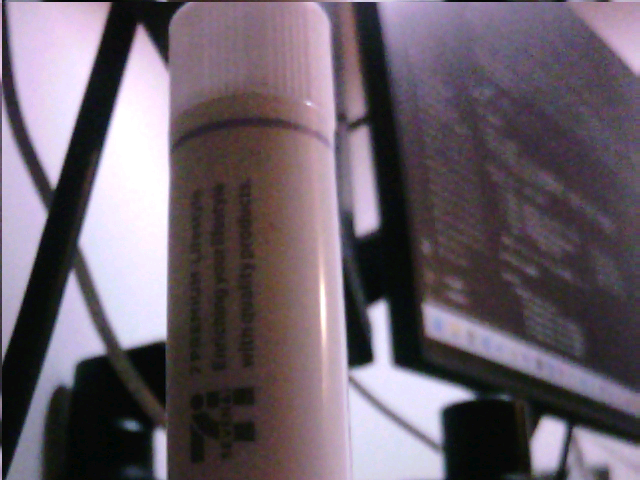

**Filter:** `cam.passthrough()` / `cam.pipeline('colour')` — `proc_op=0`
**What it does:** The unprocessed true-RGB888 image. This is the baseline every other sample
is compared against, and doubles as a pipeline health check (correct colour ⇒ unpack + genlock OK).

### `invert` — Photographic negative

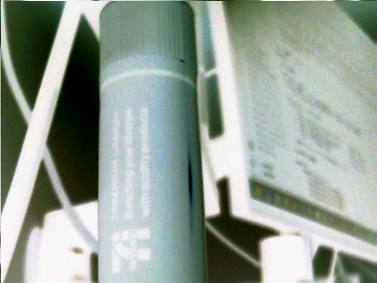

**Filter:** `cam.proc(1)` / `cam.pipeline('invert')` — `proc_op=1`
**What it does:** `out = 255 − in` on each channel. Light tube turns dark cyan/green, the dark
background turns pale — a film-negative look.

### `grayscale` — Luma

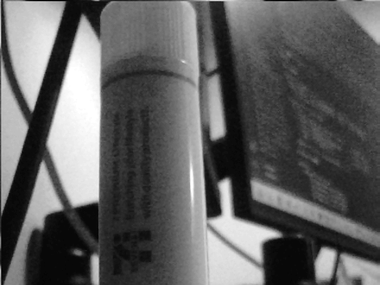

**Filter:** `cam.proc(2)` — `proc_op=2`
**What it does:** Collapses RGB to a single luminance (Y) replicated to all channels. Removes
hue, keeps brightness structure — the input most spatial/edge filters build on.

### `binarize` — Threshold

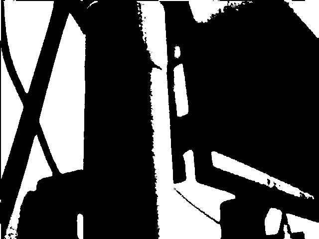

**Filter:** `cam.proc(4)` / `cam.pipeline('binarize')` — `proc_op=4`, threshold 128 (on green)
**What it does:** Each pixel becomes pure black or white depending on whether it crosses the
threshold. Two-level segmentation; the basis of the sketch/contour combinations below.

### `r_only` / `g_only` / `b_only` — Single channel

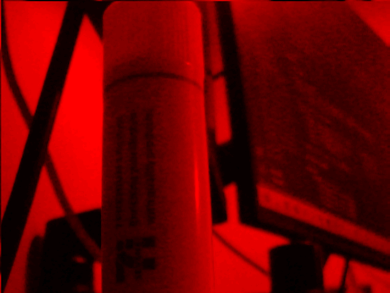 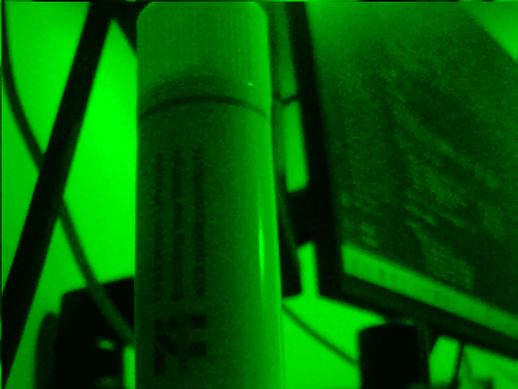 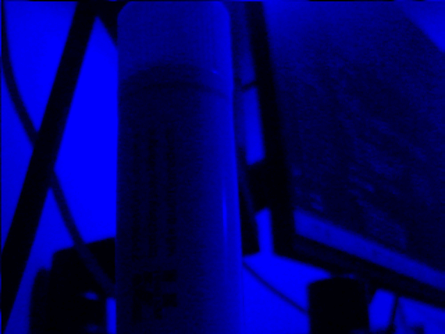

**Filter:** `cam.proc(5)` / `cam.proc(6)` / `cam.proc(7)` — `proc_op=5/6/7`
**What it does:** Keeps only the R, G, or B channel (others zeroed). Useful for inspecting
per-channel response and the Bayer/colour-matrix behaviour of the sensor.

---

## 2. Spatial denoise (PRE — `axis_rgb_prefilter`, 3×3 line-buffered)

3×3 neighbourhood filters applied **before** the convolution stage to clean the signal.

### `gaussian` — 3×3 Gaussian blur


**Filter:** `cam.denoise('gaussian')` / `cam.pipeline('gaussian')` — PRE op 8, kernel `[1,2,1; 2,4,2; 1,2,1] >> 4`
**What it does:** Weighted-average smoothing. Suppresses Gaussian/sensor noise at the cost of a
small amount of sharpness — a mild, symmetric blur.

### `median` — 3×3 median denoise


**Filter:** `cam.denoise('median')` / `cam.pipeline('median')` — PRE op 9 (19-CAS sort network)
**What it does:** Replaces each pixel with the neighbourhood median. Removes impulse / salt-and-pepper
noise while preserving edges far better than a blur — note the printed text stays legible.

---

## 3. Convolution (MID — arbitrary 3×3 kernel, `proc_op=8`)

Arbitrary signed 3×3 kernels run on a DSP48 array. Load with `cam.k(name)` (presets) or
`cam.kernel(coeffs, shift)` (custom).

### `sharpen` — Unsharp (4-neighbour)

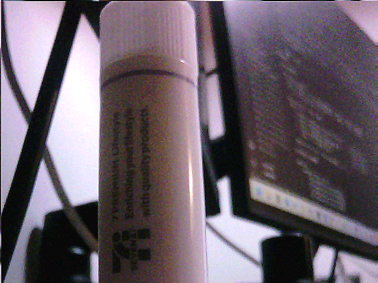

**Filter:** `cam.k('sharpen')` / `cam.pipeline('sharpen')` — kernel `[0,-1,0; -1,5,-1; 0,-1,0] >> 0`
**What it does:** Boosts the centre pixel against its neighbours, amplifying high-frequency
detail. Edges and the printed text become crisper (push too far and it rings/haloes).

### `emboss` — 3-D relief

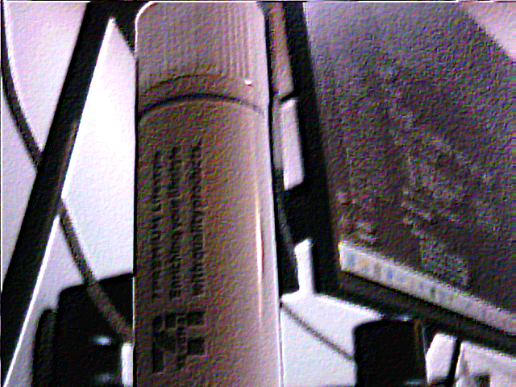

**Filter:** `cam.k('emboss')` / `cam.pipeline('emboss')` — kernel `[-2,-1,0; -1,1,1; 0,1,2] >> 0`
**What it does:** An asymmetric (diagonal) gradient biased to mid-grey, so the image looks
stamped into metal — flat areas go grey, edges become light/dark ridges lit from one direction.

### `sobel_x` — Vertical-edge gradient

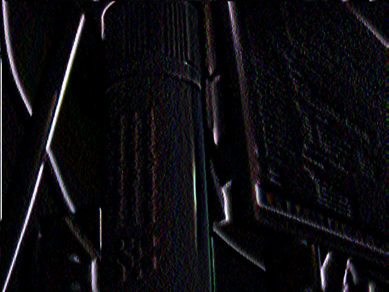

**Filter:** `cam.k('sobel_x')` — kernel `[-1,0,1; -2,0,2; -1,0,1] >> 0`
**What it does:** First-derivative in X → responds to **vertical** edges (left↔right intensity
change). Single-polarity: only one side of each edge lights up. Compare with `edges` (both polarities).

### `sobel_y` — Horizontal-edge gradient

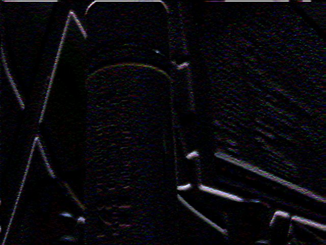

**Filter:** `cam.k('sobel_y')` — kernel `[-1,-2,-1; 0,0,0; 1,2,1] >> 0`
**What it does:** First-derivative in Y → responds to **horizontal** edges. The orthogonal
companion to `sobel_x`; the two are combined to form the omnidirectional `edges` magnitude.

### `laplacian` — Isotropic second-derivative

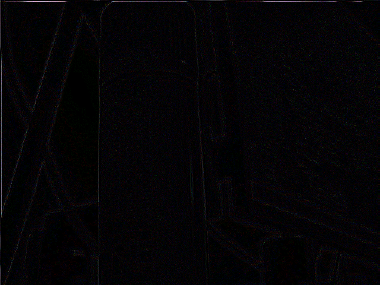

**Filter:** `cam.k('laplacian')` — kernel `[0,-1,0; -1,4,-1; 0,-1,0] >> 0`
**What it does:** Sum of second derivatives — direction-independent edge response. Highlights
fine detail and zero-crossings in all orientations at once (more noise-sensitive than Sobel).

### `outline` — 8-neighbour outline

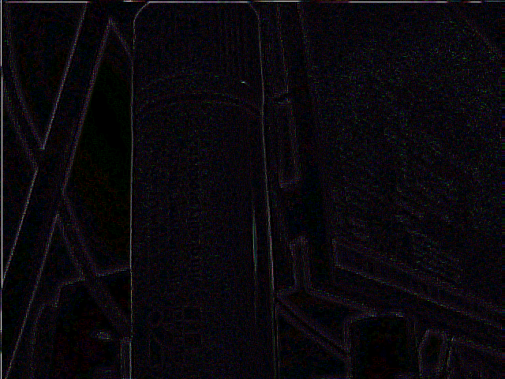

**Filter:** `cam.k('outline')` — kernel `[-1,-1,-1; -1,8,-1; -1,-1,-1] >> 0`
**What it does:** A stronger Laplacian using all 8 neighbours. Produces bold edge outlines on a
near-flat field — every boundary in the scene is traced.

### `edges` — Omnidirectional edge magnitude

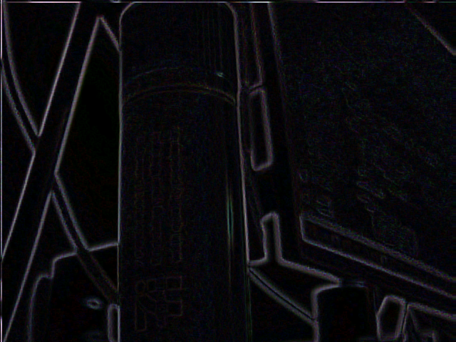

**Filter:** `cam.edges()` / `cam.pipeline('edges')` — `set_edges(2)`, `proc_op=12`, `|Gx| + |Gy|`
**What it does:** Sobel-X and Sobel-Y run in parallel, each rectified by `|·|` (`cfg_abs`) and summed,
so **both** edge polarities in **all** directions appear bright on black. The fully-isotropic edge
detector and the front-end of the sketch chains.

---

## 4. Variable blur (cascade) & DoG dual-kernel

Multi-stage convolution: a general 5×5 stage (S1) followed by two separable 5×5 stages (S2/S3).
Output tap selects the effective kernel size (`proc_op` 13/14/15); the DoG combiner subtracts two
blur radii (`proc_op=12`).

### `blur_5` / `blur_9` / `blur_13` — Cascade Gaussian blur

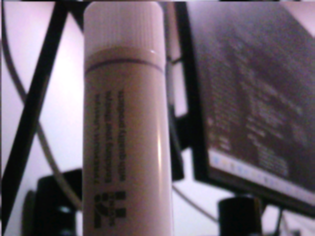 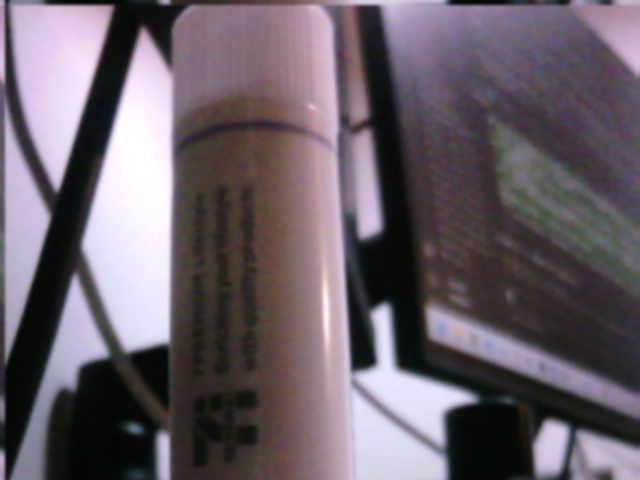 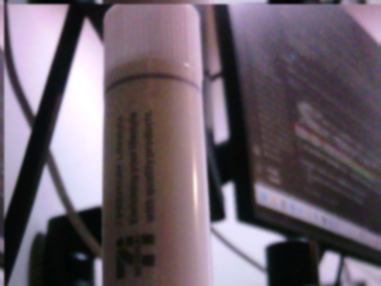

**Filter:** `cam.blur(5|9|13)` — `proc_op=13/14/15`, effective **5×5 / 9×9 / 13×13** Gaussian
**What it does:** Each cascade stage widens the blur radius (more stages = wider support), switched
live with no rebuild. From left to right the tube text and X-frame dissolve progressively — a
runtime-tunable depth-of-field / pre-smoothing knob.

### `dog_blob` — Difference of Gaussians (band-pass)

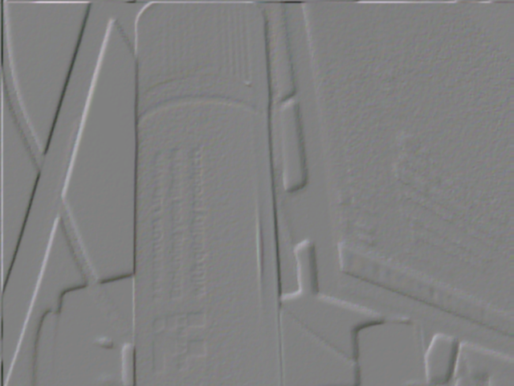

**Filter:** `cam.pipeline('dog_blob')` / `cam.dog('blob')` — `proc_op=12`, `clamp(G3/16 − G5/256 + 128)`
**What it does:** Subtracting a wide blur from a narrow blur keeps only a band of spatial
frequencies → blob / band-pass response about mid-grey. Flat regions cancel to grey; texture and
mid-scale features pop out (the classic blob/feature detector).

### `dog_unsharp` — Wide-radius unsharp mask

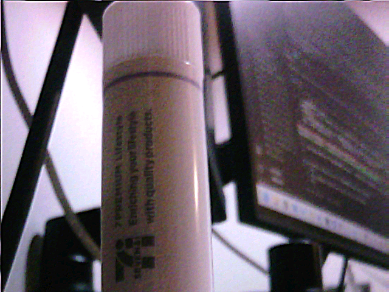

**Filter:** `cam.dog('unsharp')` — `proc_op=12`, `clamp(2·identity − G5/256)`
**What it does:** `2×original − wide blur` re-adds the missing high frequencies → a wider-radius
sharpen than the 3×3 `sharpen`. Restores local contrast and micro-detail while staying full-colour.

---

## 5. Filter combinations (curated chains)

PRE → MID → POST set in one call (`cam.chain(...)` / `cam.pipeline(name)`). The order matters —
binarize-then-edge gives clean contours, edge-then-binarize gives a thresholded edge map.

### `bin_edges` — Binarize → Sobel (contours)

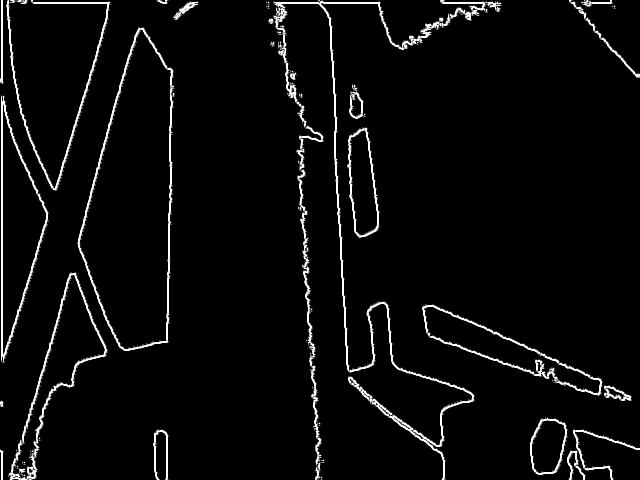

**Filter:** `cam.pipeline('bin_edges')` — PRE threshold(128) → MID `edges`
**What it does:** Thresholds first, then takes the edge magnitude of the binary regions → clean,
closed **contours** of the flat shapes (no internal texture).

### `edge_binary` — Sobel → Binarize (edge map)

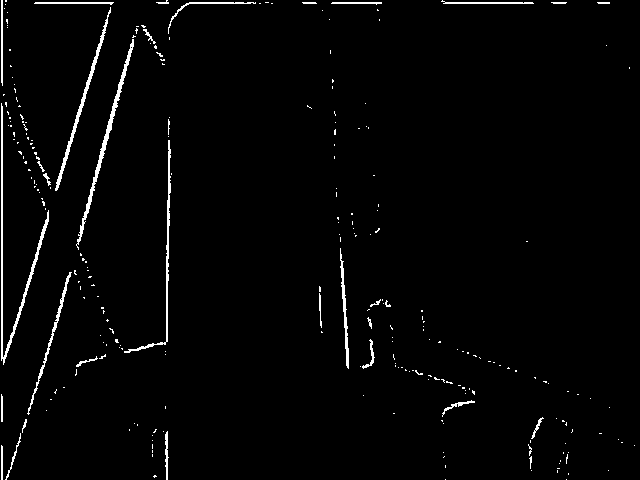

**Filter:** `cam.pipeline('edge_binary')` — MID `edges` → POST threshold(64)
**What it does:** Edges first, then a low threshold → a hard **binary edge map** (white lines on
black, ≈ Canny stage 1). Lower the threshold for more edges.

### `sketch` — Gray → edges → binarize (line art)

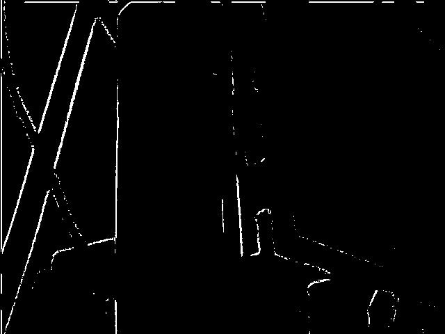

**Filter:** `cam.pipeline('sketch')` — PRE gray → MID `edges` → POST threshold(64)
**What it does:** Desaturate, detect edges, then binarize → a clean pencil-sketch / line-drawing
of the scene. The X-frame and tube outline reduce to crisp white strokes.

### `gray_edges` — Gray → edges (monochrome magnitude)

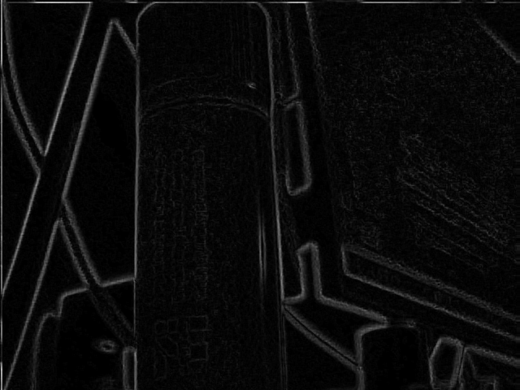

**Filter:** `cam.pipeline('gray_edges')` — PRE gray → MID `edges`
**What it does:** Edge magnitude computed on luma only — the grayscale version of `edges`, without
the residual chroma fringing on coloured boundaries.

### `denoise_edges` — Median → Sobel (clean edges)

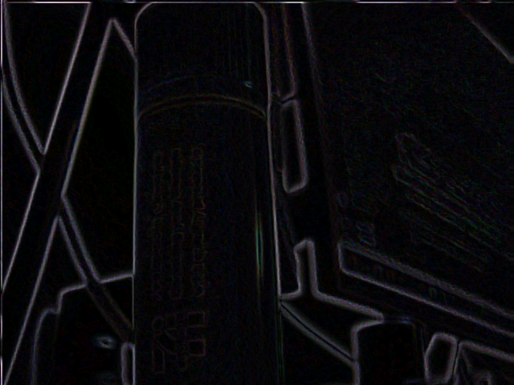

**Filter:** `cam.pipeline('denoise_edges')` — PRE median → MID `edges`
**What it does:** Median-denoise **before** edge detection removes impulse noise that would
otherwise fire false edges → noticeably cleaner edge map than raw `edges`.

### `median_sketch` / `smooth_sketch` — Denoised sketch variants

 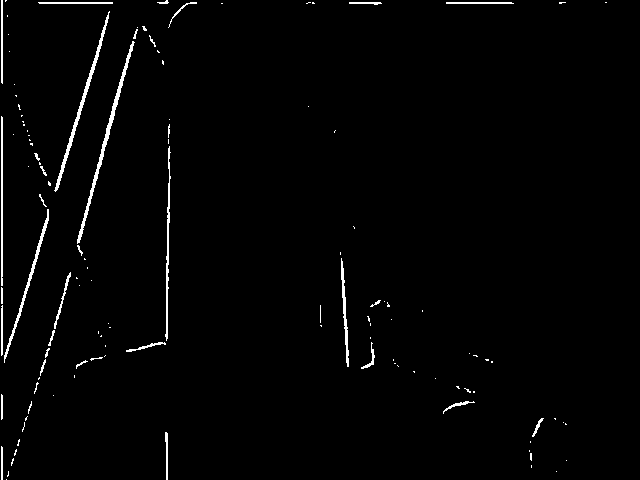

**Filter:** `cam.pipeline('median_sketch')` (median → edges → binarize) /
`cam.pipeline('smooth_sketch')` (gaussian → edges → binarize)
**What it does:** The same gray→edge→binarize idea as `sketch`, but with a denoise pre-pass.
`median_sketch` keeps fine lines while dropping speckle; `smooth_sketch` (Gaussian pre-blur)
yields fewer, thicker, smoother strokes.

---

## 6. Dither / halftone (DITHER — `axis_rgb_dither`, final stage)

Bit-depth quantization after POST, using an ordered (Bayer 4×4) or random (LFSR) dither pattern.

### `halftone` — Gray → 1-bit ordered (newspaper)

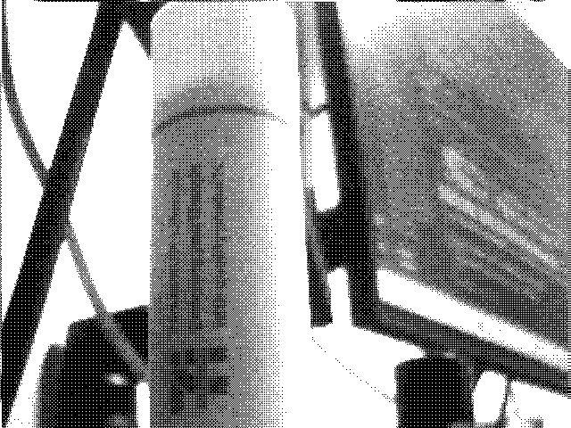

**Filter:** `cam.halftone()` / `cam.pipeline('halftone')` — PRE gray → DITHER 1-bit ordered
**What it does:** One bit per channel with an ordered Bayer matrix → classic newspaper halftone.
Apparent grays are reproduced purely by the local density of black/white dots.

### `poster` — 2-bit ordered posterize

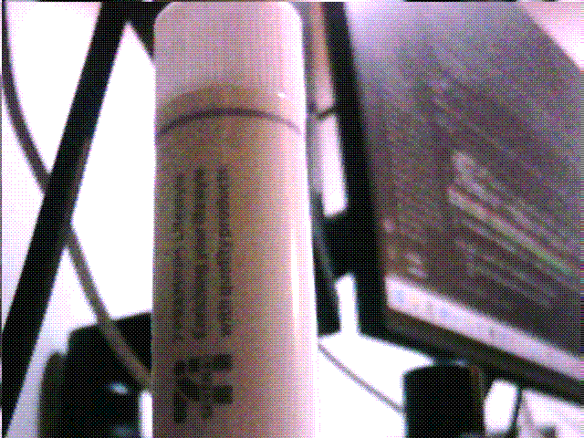

**Filter:** `cam.poster()` / `cam.pipeline('poster')` — DITHER 2-bit/channel ordered
**What it does:** Quantizes each channel to 4 levels with ordered dithering → a retro, poster-like
banded-colour look, while the Bayer pattern hides the hard banding.

### `edge_halftone` — Gray → edges → 1-bit

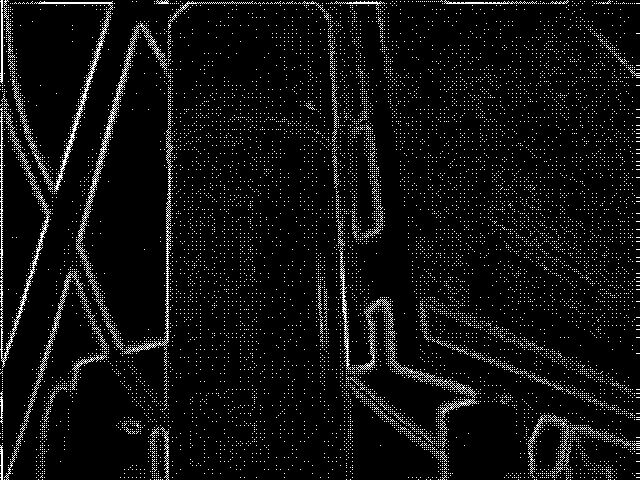

**Filter:** `cam.pipeline('edge_halftone')` — PRE gray → MID `edges` → DITHER 1-bit ordered
**What it does:** Halftones the edge magnitude → a dotted/engraved-line rendering of the scene's
edges. Combines the line-art of `gray_edges` with the stipple texture of `halftone`.

### `dither_random` — 2-bit random (LFSR)

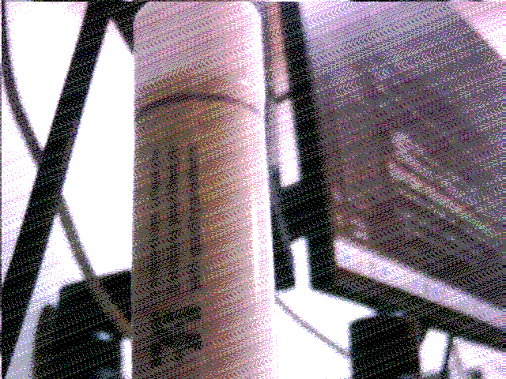

**Filter:** `cam.pipeline('dither_random')` — DITHER 2-bit/channel random
**What it does:** Same 2-bit quantization as `poster`, but the threshold is dithered with an LFSR
noise pattern instead of the Bayer matrix → a film-grain / TV-static texture that breaks up banding
with no fixed pattern.

---

## See also

- **[Image Processing Pipeline — Principles & Architecture](image_processing_principles.md)** — module-by-module design, op tables, the `0xFE` coefficient map, SW API, and FPGA resources.
- **[RTL Design Specification](rtl_design_spec.md)** — full RTL detail.
- Repository: **[README](../../README.md)**.
