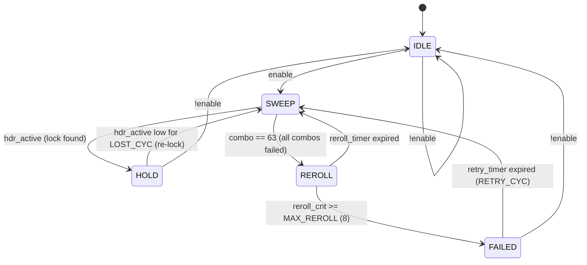
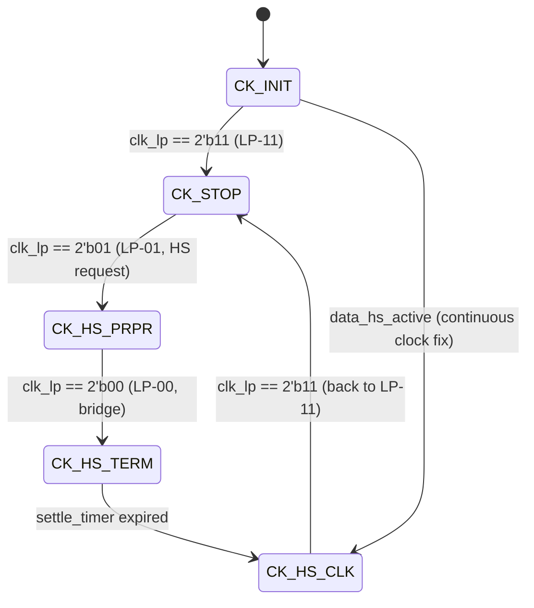
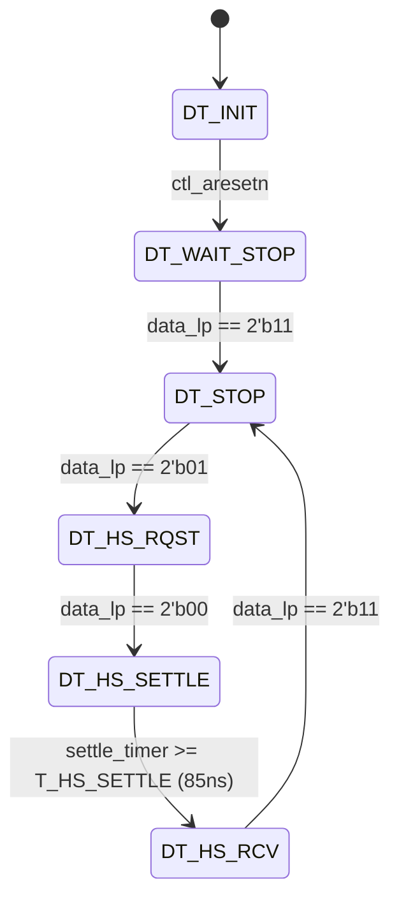
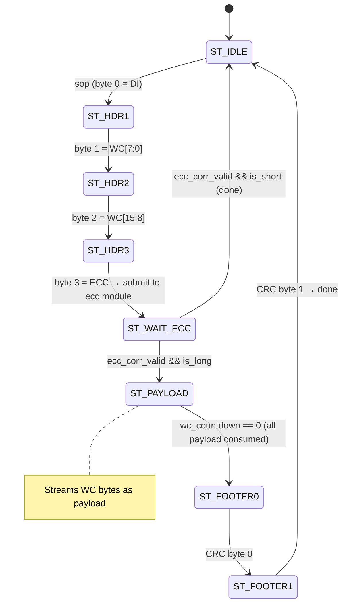
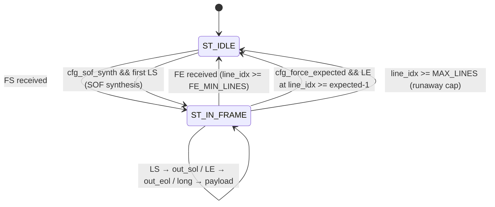

# RTL Design Specification — MIPI CSI-2 to HDMI Pipeline (2026-06-26)

Target: Zybo Z7-20 (xc7z020clg400-1), OV5640 2-lane MIPI CSI-2, RGB565 (DT=0x22), VGA 640x480 30fps.
Language: SystemVerilog. Simulator: DSim 2026. Synthesis: Vivado 2024.2.

This document describes every RTL module with sufficient detail to reproduce the implementation from scratch.

---

## 1. System Block Diagram

```
                     ┌──────────────────────────────────────────────────────────────────────┐
                     │                    mipi_to_hdmi_probe_top                            │
  D-PHY pins ──────► │                                                                      │
  (2-lane CSI-2)     │  [byte_clk ~96MHz]           [sysclk 125MHz]           [pix_clk 25MHz]│
                     │  ┌─────────────────┐  CDC     ┌───────────────┐                      │
  dphy_hs_clock ────►│  │ dphy_hs_byte_   │ (Gray   │ csi2_packet_  │                      │
  dphy_data_hs ────►│  │ probe           │ FIFO)   │ parser        │                      │
  dphy_clk_lp ─────►│  │  (IBUFDS/BUFIO/ │────────►│ (8-state FSM) │                      │
  dphy_data_lp ────►│  │   BUFR/ISERDES/ │         └──────┬────────┘                      │
                     │  │   IDELAY/bitslip│                │                                │
                     │  │   /settle-blank)│         ┌──────▼────────┐                      │
                     │  └───────┬─────────┘         │ csi2_header_  │                      │
                     │          │                    │ ecc           │                      │
  [refclk_200 MHz]   │  ┌───────▼─────────┐         └──────┬────────┘                      │
                     │  │ dphy_hwlock_fsm  │                │                                │
  PLLE2 (sysclk*8/5)│  │ (auto bitslip   │         ┌──────▼────────┐                      │
                     │  │  sweep+reroll)   │         │ csi2_payload_ │                      │
                     │  └─────────────────┘         │ crc           │                      │
                     │  ┌─────────────────┐         └──────┬────────┘                      │
                     │  │ dphy_lane_       │                │                                │
                     │  │ supervisor      │         ┌──────▼────────┐                      │
                     │  │ (opt-in clk mgmt)│        │ csi2_vcdt_    │                      │
                     │  └─────────────────┘         │ filter        │                      │
                     │                               └──────┬────────┘                      │
                     │                                      │                                │
                     │                               ┌──────▼────────┐                      │
                     │                               │ csi2_frame_   │                      │
                     │                               │ state         │                      │
                     │                               │ (SOF/EOF/     │                      │
                     │                               │  SOL/EOL)     │                      │
                     │                               └──────┬────────┘                      │
                     │                                      │ payload + markers              │
                     │                               ┌──────▼────────┐                      │
                     │                               │ rgb565_gray_  │                      │
                     │                               │ unpack        │                      │
                     │                               │ (2byte→RGB888)│                      │
                     │                               └──────┬────────┘                      │
                     │                     video_pixel[23:0]│                                │
                     │                   ┌──────────────────┤                                │
                     │                   │  COLOR_CAPTURE   │  !COLOR_CAPTURE                │
                     │            ┌──────▼───────┐   ┌──────▼───────┐                      │
                     │            │ IMG PROC      │   │ normalizer   │                      │
                     │            │ PIPELINE      │   │ +ob_masker   │                      │
                     │            │ (PRE+conv+DoG │   └──────┬───────┘                      │
                     │            │  +cascade+POST│          │ Y8                            │
                     │            └──────┬────────┘   ┌──────▼───────┐                      │
                     │          RGB24    │            │axis_video_   │                      │
                     │            ┌──────▼───────┐    │bridge (CDC)  │  ──► VDMA S2MM       │
                     │            │axis_video_   │    └──────────────┘     (DDR→HDMI)       │
                     │            │bridge (CDC)  │  ──► VDMA S2MM                           │
                     │            └──────────────┘                                          │
                     │                                                                      │
                     │  ┌─────────────────┐  cam_scl/sda  ┌──────────┐                     │
                     │  │ ov5640_sccb_    │──────────────►│ OV5640   │                     │
                     │  │ init_probe     │  (I2C bit-bang)│ sensor   │                     │
                     │  │ (260-step ROM) │               └──────────┘                     │
                     │  └─────────────────┘                                                 │
                     │                                                    cam_clk (25MHz)──►│
                     │  ┌─────────────────┐                                                 │
                     │  │ csi2_tpg        │  (internal test pattern, runtime switch)        │
                     │  └─────────────────┘                                                 │
                     │                                     ┌──────────┐                     │
                     │  hdmi_tx_* ◄────────────────────────│ HDMI TX  │                     │
                     │                                     │ (OBUFDS/ │                     │
                     │                                     │  OSERDES)│                     │
                     │                                     └──────────┘                     │
                     └──────────────────────────────────────────────────────────────────────┘
```

---

## 2. Clock Domains

| Domain | Frequency | Source | Usage |
|--------|-----------|--------|-------|
| `sysclk` | 125 MHz | PS7 FCLK_CLK0 | AXI-Lite, GPIO decode, CSI-2 protocol, image processing, debug pages |
| `refclk_200` | 200 MHz | PLLE2(sysclk*8/5) BUFG | IDELAYCTRL, HW lock FSM, lane supervisor |
| `byte_clk` | ~96 MHz | BUFR(÷4) of forwarded HS clock | ISERDES CLKDIV, SoT detect, bitslip, settle-blank |
| `cam_clk` | 25 MHz | PLLE2(sysclk*8/40) BUFG | OV5640 XCLK reference |
| `pix_clk` | 25 MHz | MMCME2(sysclk*8/40) BUFG | HDMI pixel clock (VGA 640x480@60 mode) |
| `tmds_clk` | 125 MHz | MMCME2(sysclk*8/8) BUFG | HDMI TMDS serialization |
| `capture_aclk` | — | External (BD) | VDMA AXI4-Stream clock |

**CDC boundaries:**
- `byte_clk → sysclk`: Gray-code async FIFO (`byte_to_core_cdc`, depth 1024)
- `sysclk → capture_aclk`: BRAM async FIFO (`axis_video_bridge`, depth 4096)
- All config signals: 2FF synchronizer (level, not bit-coherent for multi-bit)
- `byte_clk → refclk_200`: 2FF for `hdr_ok_byte` (1-bit lock quality)
- `refclk_200 → byte_clk`: 2FF for `sup_enable`, `cfg_settle_blank_k`

---

## 3. Top Module `mipi_to_hdmi_probe_top`

**File:** `rtl/prototype/mipi_to_hdmi_probe_top.sv` (~2200 lines)

### 3.1 Parameters

| Parameter | Type | Default | Description |
|-----------|------|---------|-------------|
| `PROBE_IDELAY_TAP` | int | 16 | Initial IDELAY tap for both data lanes |
| `PROBE_LANE1_BITSLIP_SWEEP` | bit | 0 | Enable runtime adaptive bitslip for lane 1 |
| `STREAM_PAIRING` | int | 0 | Lane pairing option |
| `OV5640_MIPI_CTRL_4800` | logic[7:0] | 8'h14 | MIPI control: 0x14 = continuous clock |
| `OV5640_FORMAT_CTRL_4300` | logic[7:0] | 8'h6F | Format: RGB565 |
| `OV5640_ISP_FORMAT_501F` | logic[7:0] | 8'h01 | ISP format mux: RGB565 |
| `OV5640_ISP_CTRL_5000` | logic[7:0] | 8'ha7 | ISP control 0 |
| `OV5640_ISP_CTRL_5001` | logic[7:0] | 8'h83 | ISP control 1 |
| `OV5640_TEST_PATTERN_ENABLE` | bit | 0 | Enable 0x503D test pattern at init |
| `COLOR_CAPTURE` | bit | 0 | 0=Y8 grayscale / 1=RGB888 color capture |
| `IMAGE_FORMAT` | int | 1 | 0=YUV422 / 1=RGB565 / 2=RAW8 / 3=RAW10 |
| `HWLOCK_DEFAULT_ON` | bit | 1 | HW lock FSM enabled at power-up |

### 3.2 Top-Level Ports

| Port | Direction | Width | Description |
|------|-----------|-------|-------------|
| `sysclk` | in | 1 | System clock 125 MHz |
| `led[3:0]` | out | 4 | Status LEDs |
| `dphy_hs_clock_clk_p/n` | in | 1 | D-PHY forwarded HS clock (differential) |
| `dphy_data_hs_p/n[1:0]` | in | 2 | D-PHY data lanes (differential) |
| `dphy_clk_lp_p/n` | in | 1 | Clock lane LP signals |
| `dphy_data_lp_p/n[1:0]` | in | 2 | Data lane LP signals |
| `cam_clk` | out | 1 | 25 MHz XCLK to OV5640 |
| `cam_gpio` | out | 1 | OV5640 RESETB (active-low) |
| `cam_scl/cam_sda` | inout | 1 | SCCB (I2C) bus |
| `hdmi_tx_clk_p/n` | out | 1 | HDMI TMDS clock (differential) |
| `hdmi_tx_p/n[2:0]` | out | 3 | HDMI TMDS data (differential) |
| `m_axis_capture_*` | out | — | AXI4-Stream to VDMA (8 or 24 bit) |
| `s_axis_hdmi_*` | in | 24 | AXI4-Stream from VDMA MM2S to HDMI |
| `sccb_rt_write_word_in` | in | 32 | Runtime SCCB write GPIO |
| `idelay_runtime_word_in` | in | 32 | IDELAY/proc_op GPIO |
| `bitslip_runtime_word_in` | in | 32 | Bitslip/HW-lock GPIO |
| `frame_lines_runtime_word_in` | in | 32 | Frame config GPIO |
| `debug_page_sel` | in | 8 | Debug page select |

### 3.3 Internal Architecture

1. **Reset**: 8-bit shift counter on sysclk; `rst_n = &rst_cnt` (255 cycle power-on reset)
2. **PLL**: PLLE2_BASE generates `refclk_200` (200 MHz) and `cam_clk` (25 MHz) from sysclk (125 MHz)
3. **MMCM**: MMCME2_BASE generates `tmds_clk` (125 MHz) and `pix_clk` (25 MHz) for HDMI
4. **GPIO decode**: 4 x 32-bit GPIO words (sccb/idelay/bitslip/frame_lines) are 2FF-synced into sysclk domain, edge-detected with `_apply_sys_d` for apply-strobe decode
5. **0xFE intercept**: When `sccb_rt_write_word_sys[15:8] == 8'hFE`, the write is routed to local coefficient registers instead of the SCCB engine
6. **Data path mux**: camera CDC output or internal TPG selected by `use_tpg_rt` via pipelined AND-OR mux (1-cycle register stage to reduce fanout congestion)
7. **Protocol reset**: `protocol_resetn = rst_n && sccb_done` (held until SCCB init completes)

### 3.4 Instantiation Hierarchy

```
mipi_to_hdmi_probe_top
├── PLLE2_BASE u_refclk_pll         (refclk_200 + cam_clk)
├── MMCME2_BASE u_hdmi_mmcm         (tmds_clk + pix_clk)
├── ov5640_sccb_init_probe u_ov5640  (260-step ROM SCCB init + runtime R/W)
├── dphy_hs_byte_probe u_dphy        (D-PHY frontend, byte_clk domain)
├── dphy_hwlock_fsm u_dphy_hwlock    (auto bitslip sweep, refclk_200)
├── dphy_lane_supervisor u_sup       (clock lane management, refclk_200)
├── dphy_raw_byte_ringbuf u_rawcap   (debug byte capture ring)
├── byte_to_core_cdc u_cdc          (byte_clk → sysclk Gray FIFO)
├── csi2_tpg u_csi2_tpg             (internal test pattern generator)
├── csi2_packet_parser u_parser      (header/payload/CRC separation)
├── csi2_header_ecc u_ecc           (Hamming ECC check/correct)
├── csi2_payload_crc u_crc          (CRC-16 check)
├── csi2_vcdt_filter u_filter       (VC/DT filter)
├── csi2_frame_state u_frame        (SOF/EOF/SOL/EOL management)
├── yuv422_gray_unpack u_yuv        (YUV422 → Y8)
├── rgb565_gray_unpack u_rgb565     (RGB565 → RGB888 or Y8)
├── raw8_passthrough u_raw8         (RAW8 → Y8)
├── raw10_unpack u_raw10            (RAW10 → Y8)
├── axis_rgb_prefilter u_prefilter  (PRE: 3x3 denoise + point ops) [COLOR_CAPTURE]
├── axis_rgb_conv3x3 u_conv3x3     (3x3 convolution, A branch)    [COLOR_CAPTURE]
├── axis_rgb_conv5x5 u_conv5x5     (5x5 convolution, B/S1 branch) [COLOR_CAPTURE]
├── axis_rgb_dog_combine u_dog      (parallel combiner αA−βB+off)  [COLOR_CAPTURE]
├── axis_rgb_conv5x5_sep u_s2      (cascade S2, separable 5x5)    [COLOR_CAPTURE]
├── axis_rgb_conv5x5_sep u_s3      (cascade S3, separable 5x5)    [COLOR_CAPTURE]
├── axis_rgb_proc_slot u_post_slot  (POST: point ops after conv)   [COLOR_CAPTURE]
├── video_frame_normalizer u_norm   (480x640 pin, NORMALIZE=0)     [!COLOR_CAPTURE]
├── ob_row_masker u_ob              (OB row mask)                  [!COLOR_CAPTURE]
├── axis_video_bridge u_capture_bridge (sysclk → capture_aclk CDC)
├── hdmi_output u_hdmi_output       (HDMI TX OSERDES/OBUFDS)
└── yuv422_crc_framebuffer_axis u_fb (CRC-checked framebuffer, non-primary)
```

---

## 4. D-PHY Frontend `dphy_hs_byte_probe`

**File:** `rtl/prototype/dphy_hs_byte_probe.sv` (~1800 lines)
**Clock domain:** `byte_clk` (derived from forwarded HS clock)

### 4.1 Parameters

| Parameter | Default | Description |
|-----------|---------|-------------|
| `LANES` | 2 | Number of data lanes |
| `SOT_WINDOW_BYTES` | 64 | SoT detection window size |
| `SWEEP_HOLD_BYTES` | 16384 | Adaptive sweep hold duration |
| `IDELAY_TAP` | 16 | Initial IDELAYE2 tap value (0-31) |
| `IDELAY_REFCLK_MHZ` | 200.0 | IDELAY reference clock frequency |
| `EXPECTED_LONG_DT` | 8'h1e | Expected long packet data type |
| `EXPECTED_LONG_WC` | 16'd1280 | Expected long packet word count |
| `MIN_SYNC_HEADER_SCORE` | 13 | Minimum score for valid sync header |
| `STREAM_PAIRING` | 0 | Lane pairing configuration |

### 4.2 Clocking Chain

```
dphy_hs_clock_p/n ─── IBUFDS ──► hs_clk_ibuf ──┬── BUFIO ──► hs_clk_io (ISERDES CLK)
                                                 └── BUFR(÷4) ──► byte_clk (ISERDES CLKDIV)
                                                      │
                                                      CLR = !rst_n
                                                          || (sup_enable && sup_bufr_clr)
                                                          || bufr_reroll
```

**BUFR.CLR behavior:** Asserting CLR resets the ÷4 divider. When CLR is released, the new byte_clk phase is one of 4 possible alignments (non-deterministic). This is the source of the byte-phase lottery that the HW lock FSM resolves.

### 4.3 Per-Lane ISERDES + IDELAY

For each of the 2 data lanes:

```
dphy_data_hs_p/n[i] ─── IBUFDS ──► IDELAYE2 ──► ISERDESE2(8:1, DDR=1'b0)
                                    (tap 0-31)     CLK=hs_clk_io
                                    (runtime)      CLKDIV=byte_clk
                                                   ──► serdes_byte_sample[i][7:0]
```

- `IDELAYE2`: Xilinx IODELAY2, `IDELAY_TYPE="VAR_LOAD"`, `IDELAY_VALUE=IDELAY_TAP`. Runtime tap is loaded via `CE`+`LD`+`CNTVALUEIN`. IODELAY_GROUP = `"mipi_dphy_idelay"`. IDELAYCTRL on `refclk_200`.
- `ISERDESE2`: `DATA_RATE="SDR"`, `DATA_WIDTH=8`, `INTERFACE_TYPE="NETWORKING"`. 8 bits per `byte_clk` cycle. `BITSLIP` input walks the bit boundary.

### 4.4 Byte Alignment (bitslip + rotation)

**Phase 1 — Bitslip:** `lane_bitslip_phase[2:0]` (0-7) selects which of the 8 possible bit boundaries is the byte boundary. The probe walks bitslip one step at a time toward `runtime_bitslip_phase` with `fixed_bitslip_wait=8` byte_clk debounce per step.

**Phase 2 — SoT Rotation:** Function `find_sot_rotation(byte)` tests all 8 right-rotations of the sampled byte looking for `0xB8` (CSI-2 SoT sync byte). `current_rotation` is the matching rotation amount. `has_sot_rotation` indicates a match was found.

Combined: bitslip establishes the bit boundary, rotation finds the CSI-2 byte boundary within that alignment.

### 4.5 Settle-Blank and SoT Window

Each MIPI data burst starts with an LP→HS transition. The burst head contains HS-prepare/settle garbage that can corrupt SoT detection.

```
LP-exit detected ──► sot_blank_count = cfg_settle_blank_k
                     │
                     ▼
   [K byte_clks: sot_window_active=0, suppress SoT search]
                     │
                     ▼ (count reaches 1)
   sot_window_active=1 ──► search for 0xB8 in SOT_WINDOW_BYTES window
                            │
                            ▼ (0xB8 found)
                     current_sot_in_window=1 ──► byte alignment locked for this burst
```

**Default K=8** (verified: K=0→452 lines, K=6→471, K=8→480 = full frame).

### 4.6 2-Lane Stream Assembly

After SoT detection, aligned bytes from both lanes are assembled into a 16-bit stream:

```
Lane 0: B0, B2, B4, ...
Lane 1: B1, B3, B5, ...
Paired:  [B1:B0], [B3:B2], ...  → stream_byte_data[15:0]
```

Output signals to CDC:
- `stream_byte_data[15:0]` — 2 bytes per beat (lane1_byte, lane0_byte)
- `stream_byte_keep[1:0]` — byte valid mask
- `stream_byte_valid` — beat valid
- `stream_byte_sop` — start of packet (burst)
- `stream_byte_eop` — end of packet

### 4.7 Sync Header Scanner

After SoT, the first 8 bytes are captured into trace slots. A scanner tries all bit-offset × pairing combinations to find a valid CSI-2 header (by computing ECC syndrome and scoring). `sync_header_valid` is asserted when score >= `MIN_SYNC_HEADER_SCORE`. This signal drives:
- HW lock FSM's windowed quality detector
- Debug page readback

---

## 5. HW Deterministic Lock FSM `dphy_hwlock_fsm`

**File:** `rtl/mipi_rx/dphy_hwlock_fsm.sv`
**Clock domain:** `refclk_200` (survives BUFR.CLR which kills byte_clk)

### 5.1 Interface

| Port | Dir | Width | Description |
|------|-----|-------|-------------|
| `clk` | in | 1 | refclk_200 |
| `rst_n` | in | 1 | Active-low reset |
| `enable` | in | 1 | FSM enable (cfg_hw_lock CDC'd) |
| `hdr_active` | in | 1 | Windowed sync-header quality (CDC'd from byte_clk) |
| `bitslip_p0` | out | 3 | Target bitslip phase for lane 0 |
| `bitslip_p1` | out | 3 | Target bitslip phase for lane 1 |
| `bufr_clr` | out | 1 | BUFR.CLR re-roll request |
| `locked` | out | 1 | Lock achieved |
| `failed` | out | 1 | All combos exhausted, MAX_REROLL exceeded |
| `dbg_state` | out | 3 | Current FSM state |
| `dbg_reroll` | out | 4 | Re-roll counter |
| `dbg_combo` | out | 6 | Current combo index |

### 5.2 FSM State Diagram



### 5.3 Algorithm

1. **IDLE**: Wait for `enable`.
2. **SWEEP**: Iterate all 64 combos `(p0, p1) = (combo[5:3], combo[2:0])`:
   - Output `bitslip_p0 = combo[5:3]`, `bitslip_p1 = combo[2:0]`
   - Wait `SETTLE_MIN_CYC` for bitslip retrain + window stabilization
   - Sample `hdr_active`:
     - If high → HOLD (lock found, record winning combo)
     - If timeout (`SETTLE_CYC`) → next combo
   - If combo reaches 63 with no lock → REROLL
3. **REROLL**: Assert `bufr_clr` for `REROLL_CYC` cycles (re-roll ÷4 byte phase). Increment `reroll_cnt`. If `reroll_cnt >= MAX_REROLL` → FAILED, else → SWEEP (retry with new byte phase).
4. **HOLD**: Lock stable. Monitor `hdr_active`. If it drops for `LOST_CYC` → re-SWEEP. If `!enable` → IDLE.
5. **FAILED**: Wait `RETRY_CYC` then try SWEEP again (allows boot before stream starts).

### 5.4 Windowed Lock Quality Detector (in top module)

```systemverilog
// byte_clk domain, feeds hdr_ok_byte
always_ff @(posedge byte_clk or negedge rst_n) begin
    if (!rst_n) begin hwlock_win_cnt <= 0; hwlock_hdr_cnt <= 0; hdr_ok_byte <= 0; end
    else if (hwlock_win_cnt == 16383) begin  // HWLOCK_WINDOW = 16384
        hdr_ok_byte    <= (hwlock_hdr_cnt >= 4);  // HWLOCK_HDR_MIN = 4
        hwlock_hdr_cnt <= 0;
        hwlock_win_cnt <= 0;
    end else begin
        hwlock_win_cnt <= hwlock_win_cnt + 1;
        if (sync_header_valid && hwlock_hdr_cnt != 255)
            hwlock_hdr_cnt <= hwlock_hdr_cnt + 1;
    end
end
// 2FF CDC: hdr_ok_byte → refclk_200 → hdr_active_ctl → FSM
```

---

## 6. D-PHY Lane Supervisor `dphy_lane_supervisor`

**File:** `rtl/mipi_rx/dphy_lane_supervisor.sv`
**Clock domain:** `refclk_200` (= `ctl_clk`)

### 6.1 Interface

| Port | Dir | Width | Description |
|------|-----|-------|-------------|
| `ctl_clk` | in | 1 | refclk_200 |
| `ctl_aresetn` | in | 1 | Active-low reset |
| `clk_lp[1:0]` | in | 2 | Clock lane LP pins {P, N} |
| `data_lp[1:0]` | in | 2 | Data lane LP pins {P, N} |
| `byte_clk` | in | 1 | byte_clk for CDC outputs |
| `cfg_clk_settle_cyc[7:0]` | in | 8 | Clock HS-TERM→HS-CLK settle cycles |
| `bufr_clr` | out | 1 | BUFR.CLR control |
| `serdes_rst_byte` | out | 1 | ISERDES reset (byte_clk domain) |
| `rx_clk_active_byte` | out | 1 | Divided clock alive indicator |
| `hs_settled_byte` | out | 1 | Data lane HS settle complete |
| `sts_clk_state[2:0]` | out | 3 | Clock FSM state |
| `sts_data_state[2:0]` | out | 3 | Data FSM state |

### 6.2 Clock Lane FSM



**Key:** `bufr_clr = (ck_nstate != CK_HS_CLK)`. BUFR is held in CLR except during active HS clock — each clock restart deterministically re-phases the ÷4 divider.

LP pins are 2FF synchronized + glitch filtered (T_LP_GLITCH = 20 ns at 200 MHz = 4 cycles).

### 6.3 Data Lane FSM



`hs_settled` is asserted in `DT_HS_RCV` state, providing a per-burst SoT gate.

---

## 7. byte→core CDC `byte_to_core_cdc`

**File:** `rtl/mipi_rx/byte_to_core_cdc.sv`
**Parameters:** `IN_WIDTH=16, KEEP_WIDTH=2, FIFO_DEPTH=1024, CORE_OUTPUT_INTERVAL=2`

### 7.1 Interface

| Port | Dir | Width | Description |
|------|-----|-------|-------------|
| `byte_clk` | in | 1 | Write clock |
| `byte_aresetn` | in | 1 | Write-side reset |
| `core_clk` | in | 1 | Read clock |
| `core_aresetn` | in | 1 | Read-side reset |
| `s_byte_data` | in | 16 | Input data (2 bytes) |
| `s_byte_keep` | in | 2 | Byte valid mask |
| `s_byte_valid` | in | 1 | Input valid |
| `s_byte_sop` | in | 1 | Start of packet |
| `s_byte_eop` | in | 1 | End of packet |
| `m_byte_*` | out | — | Mirror of s_byte (core_clk domain) |
| `sts_lane_fifo_ovf_cnt` | out | 16 | Overflow counter |

### 7.2 Implementation

Standard **Gray-pointer async FIFO** (depth = power of 2):
- Write side (byte_clk): On `s_byte_valid`, push `{eop, sop, keep, data}` into FIFO. `wr_gray = bin_to_gray(wr_bin)`.
- Read side (core_clk): `wr_gray` synchronized via 2FF. `empty = (rd_gray == wr_gray_sync2)`. **`CORE_OUTPUT_INTERVAL=2`** throttles output to 50% duty cycle (1 read every 2 core_clk cycles), preventing downstream parser FIFO overflow when TPG runs at 100% duty.
- Overflow: write when full asserted → `sts_lane_fifo_ovf_cnt++`.

---

## 8. CSI-2 Packet Parser `csi2_packet_parser`

**File:** `rtl/mipi_rx/csi2_packet_parser.sv`
**Clock domain:** `sysclk` (core_clk)

### 8.1 Interface

| Port | Dir | Width | Description |
|------|-----|-------|-------------|
| `core_clk` | in | 1 | Processing clock |
| `core_aresetn` | in | 1 | Active-low reset |
| `s_byte_data` | in | 16 | Input byte stream (2 bytes/beat) |
| `s_byte_keep` | in | 2 | Byte valid mask |
| `s_byte_valid` | in | 1 | Input valid |
| `s_byte_sop` | in | 1 | Start of packet |
| `s_byte_eop` | in | 1 | End of packet |
| `ecc_hdr_valid` | out | 1 | Header ready for ECC check |
| `ecc_hdr_raw` | out | 32 | Raw 4-byte header |
| `ecc_hdr_corr_valid` | in | 1 | ECC correction done |
| `ecc_hdr_di` | in | 8 | Corrected data identifier |
| `ecc_hdr_wc` | in | 16 | Corrected word count |
| `m_pkt_di` | out | 8 | Packet DI |
| `m_pkt_wc` | out | 16 | Packet word count |
| `m_pkt_is_long` | out | 1 | Long packet flag |
| `m_pkt_is_short` | out | 1 | Short packet flag |
| `m_payload_data` | out | 8 | Payload byte |
| `m_payload_valid` | out | 1 | Payload valid |
| `m_payload_first` | out | 1 | First byte of payload |
| `m_payload_last` | out | 1 | Last byte of payload |
| `m_footer_data` | out | 16 | 2-byte CRC footer |
| `m_footer_valid` | out | 1 | Footer valid |
| `m_pkt_done` | out | 1 | Packet complete |
| `sts_short/long/trunc_cnt` | out | 16 | Counters |

### 8.2 Internal Byte FIFO

The 16-bit/beat input is broken into individual bytes via an internal FIFO (depth 32). Two bytes are pushed per beat (when keep indicates valid); bytes are popped one at a time by the FSM.

### 8.3 FSM States



**Truncation recovery:** If an unexpected `sop` arrives mid-packet, increment `sts_pkt_trunc_cnt` and re-enter `ST_HDR1`.

### 8.4 Long vs Short Determination

```systemverilog
is_long = (DI[5:0] >= 6'h10);  // DT >= 0x10 = long packet (pixel data)
// Short: FS=0x00, FE=0x01, LS=0x02, LE=0x03
```

---

## 9. CSI-2 Header ECC `csi2_header_ecc`

**File:** `rtl/mipi_rx/csi2_header_ecc.sv` (124 lines)
**Clock domain:** `sysclk`

### 9.1 Principle — Hamming(24,6) SEC-DED code

A CSI-2 packet header consists of 4 bytes = 32 bits:

```
byte 0: DI[7:0]   = {VC[1:0], DT[5:0]}  (Data Identifier)
byte 1: WC[7:0]   (Word Count low)
byte 2: WC[15:8]  (Word Count high)
byte 3: ECC[7:0]  (Error Correction Code, upper 2 bits unused)
```

The protected field is the 24 bits of DI+WC (`data[23:0] = {WC[15:8], WC[7:0], DI[7:0]}`).
The ECC generates **6 parity bits** over these 24 bits.

#### 9.1.1 Theoretical background

A Hamming code is a kind of **linear block code**; as an `(n, k)` code it appends `r = n - k` redundant bits to `k` data bits. In CSI-2, `k = 24`, `r = 6`, `n = 30`.

- **Encoding**: Each parity bit `P[i]` is computed as the XOR of a specific subset of the data bits. The subset is defined by a row of the parity-check matrix `H`.
- **Checking**: The receiver uses the same matrix to compute `syndrome = P_received XOR P_calculated`.
- **SEC (Single Error Correction)**: A nonzero syndrome indicates an error. If the syndrome corresponds to a data-bit position, that bit is flipped to correct it.
- **DED (Double Error Detection)**: A nonzero syndrome that matches neither any data bit nor any ECC bit indicates 2 or more bit errors, which are uncorrectable.

#### 9.1.2 Parity-check matrix defined by MIPI CSI-2

Expressed as the transpose of the `H` matrix defined by the MIPI CSI-2 specification (MIPI Alliance Specification for CSI-2), the set of data bits covered by each parity bit is:

| P bit | Covered data bits `d[i]` | Bit count |
|-------|-------------------------------|----------|
| P[0] | 0, 1, 2, 4, 5, 7, 10, 11, 13, 16, 20, 21, 22, 23 | 14 |
| P[1] | 0, 1, 3, 4, 6, 8, 10, 12, 14, 17, 20, 21, 22, 23 | 14 |
| P[2] | 0, 2, 3, 5, 6, 9, 11, 12, 15, 18, 20, 21, 22 | 13 |
| P[3] | 1, 2, 3, 7, 8, 9, 13, 14, 15, 19, 20, 21, 23 | 13 |
| P[4] | 4, 5, 6, 7, 8, 9, 16, 17, 18, 19, 20, 22, 23 | 13 |
| P[5] | 10, 11, 12, 13, 14, 15, 16, 17, 18, 19, 21, 22, 23 | 13 |

Design rationale of this matrix:
- Each data bit has a **unique syndrome pattern** (= the corresponding column of `H`). That is, each of the 24 data bits is unique within the 6-bit syndrome space, so the position of a single-bit error can be identified.
- An error in an ECC bit itself produces a one-hot syndrome (only a single bit set), so it can be distinguished as requiring no data correction.
- A simultaneous error in 2 or more bits produces a syndrome matching none of the above, so it is detected as uncorrectable.

#### 9.1.3 Meaning of the syndrome

```
syndrome[5:0] = received_ECC[5:0] XOR calc_ecc6(received_data[23:0])
```

| syndrome value | Meaning | Action |
|-------------|------|-----------|
| `6'b000000` | No error | Pass through unchanged |
| Matches `bit_syndrome(i)` (i=0..23) | 1-bit error in data bit `d[i]` | Flip `d[i]` to correct |
| one-hot (6'b000001, 000010, ..., 100000) | Error in an ECC bit itself | No data correction needed |
| None of the above | Multi-bit error (2 or more bits) | Uncorrectable |

Here `bit_syndrome(i)` is "the value of `calc_ecc6` for a 24-bit word with only data bit `i` set to 1", which equals column `i` of the `H` matrix.

### 9.2 Interface

| Port | Dir | Width | Description |
|------|-----|-------|-------------|
| `core_clk` | in | 1 | Processing clock (sysclk) |
| `core_aresetn` | in | 1 | Active-low synchronous reset |
| `hdr_valid` | in | 1 | Raw header available (from parser) |
| `hdr_raw[31:0]` | in | 32 | Raw header `{ECC[7:0], WC[15:8], WC[7:0], DI[7:0]}` |
| `hdr_corr_valid` | out | 1 | Correction complete (1 cycle after stage_valid) |
| `hdr_corr[23:0]` | out | 24 | Corrected data `{WC[15:8], WC[7:0], DI[7:0]}` |
| `hdr_di[7:0]` | out | 8 | Corrected Data Identifier |
| `hdr_wc[15:0]` | out | 16 | Corrected Word Count |
| `hdr_ecc_no_error` | out | 1 | No error detected |
| `hdr_ecc_corrected` | out | 1 | Single-bit error corrected (data or ECC bit) |
| `hdr_ecc_uncorrectable` | out | 1 | Multi-bit error, correction impossible |
| `sts_ecc_corr_cnt[15:0]` | out | 16 | Corrected error count (saturating) |
| `sts_ecc_uncorr_cnt[15:0]` | out | 16 | Uncorrectable error count (saturating) |

### 9.3 Circuit implementation — 2-stage pipeline

#### Stage 1 (hdr_valid → stage_valid): Syndrome calculation

```systemverilog
// Parity calculation — 6 parity bits over 24 data bits
function automatic [5:0] calc_ecc6(input logic [23:0] d);
    calc_ecc6[0] = d[0]^d[1]^d[2]^d[4]^d[5]^d[7]^d[10]^d[11]^d[13]^d[16]^d[20]^d[21]^d[22]^d[23];
    calc_ecc6[1] = d[0]^d[1]^d[3]^d[4]^d[6]^d[8]^d[10]^d[12]^d[14]^d[17]^d[20]^d[21]^d[22]^d[23];
    calc_ecc6[2] = d[0]^d[2]^d[3]^d[5]^d[6]^d[9]^d[11]^d[12]^d[15]^d[18]^d[20]^d[21]^d[22];
    calc_ecc6[3] = d[1]^d[2]^d[3]^d[7]^d[8]^d[9]^d[13]^d[14]^d[15]^d[19]^d[20]^d[21]^d[23];
    calc_ecc6[4] = d[4]^d[5]^d[6]^d[7]^d[8]^d[9]^d[16]^d[17]^d[18]^d[19]^d[20]^d[22]^d[23];
    calc_ecc6[5] = d[10]^d[11]^d[12]^d[13]^d[14]^d[15]^d[16]^d[17]^d[18]^d[19]^d[21]^d[22]^d[23];
endfunction

// Stage 1: compute syndrome, hold data and ECC
always_ff @(posedge core_clk) begin
    stage_valid    <= hdr_valid;
    stage_data     <= hdr_raw[23:0];                        // data = {WC_hi, WC_lo, DI}
    stage_ecc      <= hdr_raw[31:24];                       // received ECC (upper 2 bits unused)
    stage_syndrome <= hdr_raw[29:24] ^ calc_ecc6(hdr_raw[23:0]);  // received ECC[5:0] XOR calculated ECC
end
```

**Synthesis result**: `calc_ecc6` is a pure XOR tree (6 outputs × up to 14-input XOR). On Xilinx 7 series, each parity bit is implemented in 2-3 LUT6 stages. The syndrome calculation is also a 6-bit XOR, so the additional LUTs are minimal. The whole block is roughly 20-30 LUTs, with combinational delay < 2 ns.

#### Stage 2 (stage_valid → hdr_corr_valid): Syndrome decode and correction

```systemverilog
// Helper to compute the "unique syndrome" of each data bit
function automatic [5:0] bit_syndrome(input int bit_idx);
    automatic logic [23:0] onehot;
    onehot = 24'h000000;
    onehot[bit_idx] = 1'b1;
    bit_syndrome = calc_ecc6(onehot);   // column bit_idx of the H matrix
endfunction

// Decode the error bit position from the syndrome (24-way linear search)
function automatic int decode_data_bit(input logic [5:0] syndrome);
    decode_data_bit = -1;   // no match
    for (int idx = 0; idx < 24; idx++) begin
        if (syndrome == bit_syndrome(idx))
            decode_data_bit = idx;
    end
endfunction

// Detect an error in an ECC bit itself: a one-hot syndrome is an ECC bit error
function automatic logic is_onehot6(input logic [5:0] value);
    is_onehot6 = (value != 0) && ((value & (value - 1)) == 0);
endfunction
```

The Stage 2 decision logic that uses these:

```systemverilog
if (stage_valid) begin
    corrected_data = stage_data;
    corrected_bit  = decode_data_bit(stage_syndrome);

    // Classification: split into 4 cases by syndrome value
    data_bit_error = (stage_syndrome != 0) && (corrected_bit >= 0);
    ecc_bit_error  = (stage_syndrome != 0) && is_onehot6(stage_syndrome) && !data_bit_error;
    uncorrectable  = (stage_syndrome != 0) && !data_bit_error && !ecc_bit_error;

    // On a data-bit error, flip that bit (SEC)
    if (data_bit_error)
        corrected_data[corrected_bit] = ~corrected_data[corrected_bit];

    hdr_corr    <= corrected_data;
    hdr_di      <= corrected_data[7:0];         // corrected DI
    hdr_wc      <= corrected_data[23:8];        // corrected WC
    hdr_corr_valid        <= 1'b1;
    hdr_ecc_no_error      <= (stage_syndrome == 0);
    hdr_ecc_corrected     <= data_bit_error || ecc_bit_error;
    hdr_ecc_uncorrectable <= uncorrectable;

    // Saturating counter update
    if (data_bit_error || ecc_bit_error)
        sts_ecc_corr_cnt <= sat_inc16(sts_ecc_corr_cnt);
    else if (uncorrectable)
        sts_ecc_uncorr_cnt <= sat_inc16(sts_ecc_uncorr_cnt);
end
```

**Synthesis result**: At elaboration, `decode_data_bit` expands the 24 `bit_syndrome(i)` constants and becomes an OR tree of 24 6-bit comparators. In practice Vivado optimizes this into LUTs, with one 6-LUT handling one comparison → 24 LUTs + a priority encoder. The bit flip `corrected_data[corrected_bit]` becomes a 24-input MUX (a 1-hot decode flips only the relevant bit). The whole thing is combinational logic but is registered at the Stage 2 FF output (1 cycle latency).

#### Timing of the overall pipeline

```
cycle N  : parser asserts hdr_valid, presents hdr_raw[31:0]
cycle N+1: syndrome/data/ecc latched into Stage 1 FF. stage_valid = 1
cycle N+2: corrected DI/WC latched into Stage 2 FF. hdr_corr_valid = 1
           → parser's ST_WAIT_ECC receives it, dispatches to long/short
```

### 9.4 Transmit-side ECC generation (TPG `csi2_tpg.sv`)

The ECC generation in the test pattern generator uses the **same `calc_ecc6` function**:

```systemverilog
function automatic [7:0] hdr_ecc(input logic [7:0] di, input logic [15:0] wc);
    return {2'b00, calc_ecc6({wc[15:8], wc[7:0], di})};
    //       ^^^^^ upper 2 bits = 0 (unused)
endfunction
```

On transmit, the 4 header bytes are output 2 bytes/beat in the order `{hdr_ecc(DI, WC), WC[15:8], WC[7:0], DI}`. Because it is exactly the same function as the receiver's `calc_ecc6`, `syndrome = 0` is guaranteed when there is no error.

### 9.5 Concrete examples — locating errors via the syndrome

**Example 1: DI = 0x22 (RGB565 long), WC = 0x0500 (1280)**
```
data[23:0] = {0x05, 0x00, 0x22} = 24'h050022
calc_ecc6(24'h050022) = (by calculation) 6'bXXXXXX → ECC byte = {2'b00, P[5:0]}
```

**Example 2: 1-bit error in data[7] (bit 7 of DI)**
```
bit_syndrome(7) = calc_ecc6(24'h000080) = 6'b011001  (P[0],P[3],P[4] are set)
receiver: syndrome = received_ECC ^ calc_ecc6(corrupted_data) = 6'b011001
decode_data_bit(6'b011001) → bit 7 → flip corrected_data[7] → correct DI recovered
```

**Example 3: simultaneous 2-bit error in data[0] and data[1]**
```
bit_syndrome(0) = 6'b000111, bit_syndrome(1) = 6'b001011
actual syndrome = 6'b000111 XOR 6'b001011 = 6'b001100
decode_data_bit(6'b001100) → no match (-1)
is_onehot6(6'b001100) → false (2 bits set)
→ uncorrectable = true
```

---

## 10. CSI-2 Payload CRC `csi2_payload_crc`

**File:** `rtl/mipi_rx/csi2_payload_crc.sv` (89 lines)
**Clock domain:** `sysclk`

### 10.1 Principle — CRC-16-CCITT (reflected)

#### 10.1.1 Basic principle of CRC

CRC (Cyclic Redundancy Check) is an error-detection code that treats the data as a **polynomial over GF(2)**, divides it by a generator polynomial `G(x)`, and appends the remainder as redundant bits.

- Transmitter: compute the remainder `R(x)` of `M(x) * x^r` divided by `G(x)`, and send `M(x) * x^r + R(x)`
- Receiver: divide the entire received data by `G(x)`; if the remainder = 0, there is no error
- Since the polynomial coefficients are in GF(2) (= {0, 1}), addition/subtraction is XOR and multiplication is AND

The error-detection capability of a CRC depends on the degree `r` and the structure of the generator polynomial:
- **Burst errors**: detects 100% of burst errors of length ≤ `r`
- **Random errors**: the probability of failing to detect a burst error of length > `r` is `2^(-r)` (1/65536 for CRC-16)

#### 10.1.2 Polynomial defined by CSI-2

The CSI-2 specification uses **CRC-16-CCITT**:

```
normal polynomial: G(x) = x^16 + x^12 + x^5 + 1
  → hex form: 0x1021 (16 bits, x^16 omitted)

reflected polynomial: 0x8408
  → bit-reversal of 0x1021 (LSB↔MSB swap)
```

**What "reflected" means**: In an implementation that processes data LSB first, the polynomial is also bit-reversed before use. This matches naturally with LSB-first protocols such as UART/I2C. Because CSI-2 payload bytes are transmitted LSB first, a reflected implementation is appropriate.

| Item | Value |
|------|-----|
| Generator polynomial (normal) | `0x1021` = `x^16 + x^12 + x^5 + 1` |
| Generator polynomial (reflected) | `0x8408` |
| Initial value | `0xFFFF` |
| Final XOR | None (0x0000) |
| Input reflection | Yes (implicit in the reflected implementation) |
| Output reflection | None |

#### 10.1.3 Bit-level CRC update algorithm

The CRC register (16 bits) is regarded as a shift register running LSB→MSB, and the data is processed one bit at a time:

```
for each data bit (LSB first):
    feedback = CRC[0] XOR data_bit
    CRC = CRC >> 1               (right shift = toward LSB)
    if feedback:
        CRC = CRC XOR 0x8408     (reflected poly)
```

This operation is exactly an **LFSR (Linear Feedback Shift Register)**:

```
                    ┌──────────────────────── feedback ◄── CRC[0] XOR data_bit
                    │                                          ▲
                    ▼                                          │
              ┌───[XOR]───┬───┬───┬───[XOR]──┬───────┬───[XOR]─┤
data_bit ──►  │   bit15   │14 │13 │12  bit11  │ ...   │5  bit0  │──► discard
              └───────────┴───┴───┴──────────┴───────┴─────────┘
                 ▲ poly bit15=1          ▲ poly bit11=1     ▲ poly bit0=0 (feedback pt)
                   (0x8408)               (0x8408)

poly 0x8408 = 1000_0100_0000_1000 → feedback is XORed into bit3, bit10, bit15
(bit3=x^12 reflected, bit10=x^5 reflected, bit15=x^0=1)
```

#### 10.1.4 Byte-wise unrolling

In RTL, 1 byte (8 bits) is processed at once. The above bit operation is unrolled by looping 8 times:

```systemverilog
function automatic [15:0] crc_update_byte(
    input logic [15:0] crc_in,
    input logic [7:0]  data
);
    automatic logic [15:0] crc_next;
    automatic logic feedback;
    crc_next = crc_in;
    for (int bit_idx = 0; bit_idx < 8; bit_idx++) begin
        feedback = crc_next[0] ^ data[bit_idx];   // LSB first
        crc_next = crc_next >> 1;                  // right shift
        if (feedback)
            crc_next = crc_next ^ 16'h8408;        // reflected poly XOR
    end
    crc_update_byte = crc_next;
endfunction
```

Vivado's synthesizer **fully unrolls** this loop and optimizes the 8-stage XOR chain into a single stage of combinational logic. The result is expressed as "each bit of the 16-bit CRC register is a linear combination (XOR) of the old 16-bit CRC and the new 8-bit data".

**Synthesis result**: 16 LUT6s (each output bit is up to a 6-input XOR) × 2-3 stages = roughly 32-48 LUTs. After the 8-stage XOR collapses, the critical path is 2-3 LUT stages (< 3 ns @ 125 MHz, with margin).

### 10.2 Interface

| Port | Dir | Width | Description |
|------|-----|-------|-------------|
| `core_clk` | in | 1 | Processing clock (sysclk) |
| `core_aresetn` | in | 1 | Active-low synchronous reset |
| `payload_data[7:0]` | in | 8 | Payload byte (from parser) |
| `payload_valid` | in | 1 | Payload byte valid |
| `payload_first` | in | 1 | First byte of this long packet's payload |
| `payload_last` | in | 1 | Last byte of payload |
| `footer_data[15:0]` | in | 16 | Received 2-byte CRC (from parser) |
| `footer_valid` | in | 1 | Footer CRC bytes ready |
| `crc_check_valid` | out | 1 | Check complete (1 cycle pulse) |
| `crc_match` | out | 1 | CRC match (no error) |
| `crc_calc[15:0]` | out | 16 | Calculated CRC (for debug) |
| `crc_received[15:0]` | out | 16 | Received CRC (for debug) |
| `sts_crc_ok_cnt[15:0]` | out | 16 | Match count (saturating) |
| `sts_crc_err_cnt[15:0]` | out | 16 | Mismatch count (saturating) |

### 10.3 Circuit implementation — streaming CRC checker

#### Parameters

```systemverilog
parameter logic [15:0] INIT           = 16'hFFFF;   // CRC initial value
parameter logic [15:0] REFLECTED_POLY = 16'h8408;   // reflected CRC-16-CCITT
```

#### Operation sequence

```systemverilog
always_ff @(posedge core_clk) begin
    if (!core_aresetn) begin
        crc_reg <= INIT;                 // 16'hFFFF
        crc_check_valid <= 0;
        // ... (counters clear)
    end else begin
        crc_check_valid <= 0;

        // (A) On payload byte arrival: update CRC incrementally
        if (payload_valid) begin
            next_crc = crc_update_byte(
                payload_first ? INIT : crc_reg,  // initialize to INIT on the first byte
                payload_data
            );
            crc_reg  <= next_crc;
            crc_calc <= next_crc;         // hold latest CRC for debug
        end

        // (B) On footer arrival: compare CRC register against received CRC
        if (footer_valid) begin
            match_now = (crc_reg == footer_data);
            crc_received    <= footer_data;
            crc_match       <= match_now;
            crc_check_valid <= 1;         // 1 cycle pulse
            if (match_now)
                sts_crc_ok_cnt  <= sat_inc16(sts_crc_ok_cnt);
            else
                sts_crc_err_cnt <= sat_inc16(sts_crc_err_cnt);
        end
    end
end
```

#### Timing chart — CRC check of 1 packet

```
cycle:  ... | P0      | P1      | P2      | ... | Pn-1    | F       |
             payload   payload   payload          payload   footer
             first=1   first=0   first=0          last=1    valid=1
             valid=1   valid=1   valid=1          valid=1

crc_reg: FFFF→C1     →C2      →C3      → ... →Cn       (comparison target)
                                                          ↕ footer_data
                                                      match? → crc_check_valid=1
```

- `payload_first` resets `crc_reg` to `0xFFFF` (discarding the residual CRC of the previous packet)
- each `payload_valid` updates the CRC one byte at a time (no pipeline; update + store in the same cycle)
- `footer_valid` compares the final `crc_reg` against the received 2-byte CRC for a **bit-exact match**

#### Correspondence with transmit-side CRC generation (TPG)

The TPG (`csi2_tpg.sv`) generates the CRC with the same `crc_byte` function:

```systemverilog
// Update 2 bytes/beat (payload is emitted 2 bytes at a time)
function automatic [15:0] crc_beat(
    input logic [15:0] c,
    input logic [7:0]  b0, b1
);
    return crc_byte(crc_byte(c, b0), b1);  // update twice, in the order b0 → b1
endfunction

// When emitting the payload:
crc_reg <= crc_beat(crc_reg, pb0_r, pb1_r);

// When emitting the CRC footer:
m_byte_data <= {crc_reg[15:8], crc_reg[7:0]};  // little-endian: low byte first
```

Because transmit and receive use the same polynomial + same initial value + same byte order, `crc_reg == footer_data` holds on the receive side when there is no error.

### 10.4 Concrete example — tracing the CRC calculation

**Example: 4-byte payload `{0x01, 0x02, 0x03, 0x04}`**

```
initial: crc = 0xFFFF

byte 0x01 (bit: 1,0,0,0,0,0,0,0):
  bit0: fb=FF[0]^1=0  → crc=7FFF
  bit1: fb=7F[0]^0=1  → crc=3FFF^8408=0x3407 → crc=BBF7  ... (8 iterations)
  result: crc = 0xCC9C  (actual value)

byte 0x02: crc = crc_update_byte(0xCC9C, 0x02) = 0x???
byte 0x03: crc = crc_update_byte(...,    0x03) = 0x???
byte 0x04: crc = crc_update_byte(...,    0x04) = final CRC

transmitter: footer = {crc[15:8], crc[7:0]}
receiver: crc_reg == footer → crc_match = 1
```

### 10.5 Error-detection capability

Detection guarantees of CRC-16-CCITT:

| Error pattern | Detection rate |
|---------------|--------|
| All 1-bit errors | 100% |
| All 2-bit errors | 100% |
| Odd number of bit errors | 100% (the poly has (x+1) as a factor) |
| Burst errors of length ≤ 16 | 100% |
| Burst errors of length 17 | 99.997% (1 - 2^(-15)) |
| Burst errors of length > 17 | 99.998% (1 - 2^(-16)) |

For one CSI-2 line = 1280 bytes (RGB565 640px), if the D-PHY bit error rate is `10^(-12)` or lower, CRC-16 provides ample detection power for practical purposes.

### 10.6 Division of roles between ECC and CRC

| | Header ECC | Payload CRC |
|--|-----------|-------------|
| Protected field | Header 3 bytes (DI + WC) | Entire payload (WC bytes) |
| Redundant bits | 6 bits (Hamming) | 16 bits (CRC) |
| Error correction | 1-bit SEC (Single Error Correction) | None (detection only) |
| Error detection | 2-bit DED (Double Error Detection) | Full detection of bursts ≤ 16 bits |
| Purpose | The header is short (3 bytes) and determines all subsequent interpretation, so correction is required | The payload is long (up to 65535 bytes), so correction is costly and detection-only is sufficient |
| Circuit cost | ~50 LUT (XOR tree + 24-way decode) | ~40 LUT (16-bit LFSR) |
| Latency | 2 cycles (pipelined) | 0 cycles (streaming update; comparison takes 1 cycle at the footer) |

---

## 11. CSI-2 VC/DT Filter `csi2_vcdt_filter`

**File:** `rtl/mipi_rx/csi2_vcdt_filter.sv`
**Clock domain:** `sysclk`

### 11.1 Interface

| Port | Dir | Width | Description |
|------|-----|-------|-------------|
| `cfg_expected_vc` | in | 2 | Expected virtual channel (0) |
| `cfg_expected_dt` | in | 6 | Expected data type (0x22 = RGB565) |
| `cfg_pass_short` | in | 1 | Pass short packets (1) |
| `cfg_pass_emb_data` | in | 1 | Pass embedded data DT=0x12 (0) |
| `pkt_hdr_valid` | in | 1 | Packet header valid |
| `pkt_di` | in | 8 | Data identifier [7:6]=VC, [5:0]=DT |
| `pkt_wc` | in | 16 | Word count |
| `out_pkt_start` | out | 1 | Admitted packet start |
| `out_pkt_end` | out | 1 | Admitted packet end |
| `out_pkt_err` | out | 1 | Packet error (ECC uncorrectable or CRC mismatch) |
| `out_payload_*` | out | — | Filtered payload |
| `sts_drop_vc/dt_cnt` | out | 16 | Drop counters |

### 11.2 Admit Logic

```systemverilog
accept_vc = (DI[7:6] == cfg_expected_vc);
accept_dt = is_short ? cfg_pass_short :
            (DT == 6'h12) ? cfg_pass_emb_data :
            (DT == cfg_expected_dt);
admit = accept_vc && accept_dt;
```

Passes: VC0 + DT=0x22 (RGB565 long) + all short packets (FS/FE/LS/LE). Drops: embedded data (0x12), wrong VC, wrong DT.

---

## 12. CSI-2 Frame State `csi2_frame_state`

**File:** `rtl/mipi_rx/csi2_frame_state.sv` (~600 lines)
**Clock domain:** `sysclk`

### 12.1 Parameters

| Parameter | Default | Description |
|-----------|---------|-------------|
| `MAX_LINES` | 640 | Runaway cap (forced close) |
| `GUARD_FRAME_LINES` | 1 | Enable frame guarding |
| `EXPECTED_FRAME_LINES` | 480 | Target frame height |
| `EXPECTED_LINE_WC` | 16'd1280 | Expected line word count |
| `FS_MIN_LINES` | 300 | FS plausibility floor (reject spurious early FS) |
| `FE_DELIMITS` | 1 | Close frame on FE (not FS) |
| `FE_MIN_LINES` | 460 | FE plausibility floor (reject spurious early FE) |

### 12.2 Runtime Configuration

| Signal | Source | Description |
|--------|--------|-------------|
| `cfg_use_lsle` | frame_lines[16] | Use LS/LE delimiters for line boundaries |
| `cfg_expected_frame_lines` | frame_lines[15:0] | Target height (480) |
| `cfg_sof_synth` | frame_lines[30] | Synthesize SOF from first LS when FS is lost |
| `cfg_force_expected` | frame_lines[31] | Force-close at exactly expected lines |
| `cfg_long_as_line` | idelay[26] | Accept no-LS long packets as lines |

### 12.3 FSM



### 12.4 Detailed Operating Sequence (LSLE mode, force-480)

1. **Frame open:** In IDLE, when first LS arrives (cfg_sof_synth=1) or FS arrives → `state = IN_FRAME`, `sof_pending=1`, `out_sol`.
2. **Line handling:** LS → `out_sol`, `line_open=1`. LE → `out_eol`, `line_idx++`, `line_open=0`.
3. **Payload:** Long packet while `line_open` → `current_long_active=1`, payload bytes forwarded as `out_payload_*`. First payload byte with `sof_pending` → assert `out_sof`.
4. **Force-close at 480:** When `cfg_force_expected=1` and LE handler sees `line_idx >= 479` → `out_eof` + return to IDLE. Sets `synth_wait_fe=1`.
5. **Re-sync:** While `synth_wait_fe=1`, SOF synthesis is blocked. When FE (chip frame bottom) arrives → `synth_wait_fe=0`, allowing next frame to open at true top.

### 12.5 Plausibility Guards

- **FS/FE floor:** `line_idx < FS_MIN_LINES` → FS ignored (spurious zero-run FS). `line_idx < FE_MIN_LINES` → FE ignored (spurious early FE).
- **Runaway cap:** `line_idx >= MAX_LINES` → forced close (prevents infinite frame).

---

## 13. Format Unpacker `rgb565_gray_unpack`

**File:** `rtl/img_proc/rgb565_gray_unpack.sv`
**Clock domain:** `sysclk`

### 13.1 Parameters

| Parameter | Default | Description |
|-----------|---------|-------------|
| `RGB565_BIG_ENDIAN` | 0 | Byte order (0=little-endian) |
| `RGB_OUT` | COLOR_CAPTURE | 1=output true RGB888, 0=output Y8 grayscale |
| `LINE_PIXELS` | 640 | Pixels per line |

### 13.2 Operation

Two payload bytes form one RGB565 pixel:
- `byte_phase` toggles 0/1 on each `payload_valid`, reset on `payload_first`
- Phase 0: store low byte. Phase 1: combine into 16-bit word.
- RGB565 → RGB888: `R = {r5, r5[4:2]}`, `G = {g6, g6[5:4]}`, `B = {b5, b5[4:2]}` (bit replication)
- If `RGB_OUT=0`: luma `Y = (77*R + 150*G + 29*B) >> 8`, output `{Y, Y, Y}`
- If `RGB_OUT=1`: output `{R, G, B}` (true color)

Output: `out_pixel[23:0] = {R[7:0], G[7:0], B[7:0]}`, `out_pixel_valid`, `out_pixel_sof/eol/eof/err`.

---

## 14. Image Processing Pipeline

All processing modules share the **slot contract**:
```
input:  {pixel[23:0], valid, sof, eol, eof, err}
output: {pixel[23:0], valid, sof, eol, eof, err}
```
`ENABLE=0` → pure wire-through (zero logic). Reset default = identity/passthrough.

### 14.1 Pipeline Data Flow

```
video_pixel ─► axis_rgb_prefilter (PRE: point or 3x3 median/gaussian)
               │ proc_pixel
               ├────────────────────────────────────────┐
               ▼ (A branch)                             ▼ (B branch = S1)
         axis_rgb_conv3x3                        axis_rgb_conv5x5
               │ conv_pixel                            │ conv5_pixel
               │                                       ├────────────────────┐
               └───► axis_rgb_dog_combine ◄────────────┤                    │
                          │ dog_pixel                   │                    ▼
                          │                             │         axis_rgb_conv5x5_sep (S2)
                          │                             │                    │ s2_pixel
                          │                             │                    ▼
                          │                             │         axis_rgb_conv5x5_sep (S3)
                          │                             │                    │ s3_pixel
                          ▼                             ▼                    ▼
                    ┌──────── final mux (by cfg_proc_op) ──────────────────┐
                    │  0-11  = conv_pixel (point/single 3x3)              │
                    │  12    = dog_pixel  (DoG dual kernel)               │
                    │  13    = conv5_pixel (cascade t1 = 5x5)             │
                    │  14    = s2_pixel   (cascade t2 = eff 9x9)          │
                    │  15    = s3_pixel   (cascade t3 = eff 13x13)        │
                    └────────────┬─────────────────────────────────────────┘
                                 ▼
                    axis_rgb_proc_slot (POST: point op after conv)
                                 │ post_pixel
                                 ▼
                    axis_video_bridge → VDMA → HDMI
```

### 14.2 `axis_rgb_prefilter` — PRE stage (3x3 spatial + point ops)

**File:** `rtl/img_proc/axis_rgb_prefilter.sv` (198 lines)

**Parameters:** `LINE_PIXELS=640`, `ENABLE=COLOR_CAPTURE`

**Ports:**

| Port | Dir | Width | Description |
|------|-----|-------|-------------|
| `clk` | in | 1 | sysclk |
| `rst_n` | in | 1 | Active-low reset |
| `cfg_op[3:0]` | in | 4 | 0=pass, 1=invert, 2=gray, 3=BGR, 4=thresh, 5/6/7=R/G/B, 8=gaussian, 9=median |
| `cfg_thresh_level[7:0]` | in | 8 | Threshold level for op=4 |
| `in_pixel/valid/sof/eol/eof/err` | in | — | Slot contract input |
| `out_pixel/valid/sof/eol/eof/err` | out | — | Slot contract output |

**Architecture (8-cycle latency, all modes equal):**

1. **Line buffers** (2x BRAM, reset-free): `lbA[640]`, `lbB[640]`. Cascade: `lbB[col] ← lbA[col] ← in_pixel`. Read-before-write: `prev1 = lbA[col]`, `prev2 = lbB[col]`.
2. **Stage 1** (1 cycle): Register reads. `vtop=prev2`, `vmid=prev1`, `vbot=in_d`.
3. **Stage 2** (1 cycle): Form 3x3 window `w[0:2][0:2]` as shift register. `w[r][0]←w[r][1]←w[r][2]←vrow_r`.
4. **Branch A — Median** (4 cycles): 3 instances of `median9` (R/G/B channels). `med_pix = {med_r, med_g, med_b}`.
5. **Branch B — Gaussian** (4 cycles, shift-add, 0 DSP): Kernel `{1,2,1;2,4,2;1,2,1}/16`. Per channel: corners sum (×1), edges sum (×2), centre (×4) → total → `>>4`.
6. **Branch C — Point op** (1 cycle + 4 delay): Centre tap `w[1][1]` through case mux + 4-stage delay pipeline.
7. **Marker delay** (5 stages): `mk1..mk5 = {v2,s2,e2,f2,r2}` delayed to match branches.
8. **Output mux** (1 cycle): `cfg_op==8` → gaussian, `cfg_op==9` → median, else → point.

### 14.3 `median9` — Pipelined median-of-9

**File:** `rtl/img_proc/median9.sv` (133 lines)

**Ports:** `clk`, `rst_n`, `in_en`, `s0..s8` (9 × 8-bit unsigned), `med` (8-bit median output)

**Algorithm:** Smith/Paeth 19 compare-exchange (CAS) network, 5 pipeline stages:

```
function cas(a, b) = {min(a,b), max(a,b)};

Stage 1 (D1+D2): cas(1,2) cas(4,5) cas(7,8) → cas(0,1') cas(3,4') cas(6,7')
Stage 2 (D3+D4): cas(1,2) cas(4,5) cas(7,8) → cas(0,3) cas(5,8) cas(4,7)
Stage 3a (D5):   cas(3,6) cas(1,4) cas(2,5)
Stage 3b (D6+D7): cas(4,7) → cas(2,4')
Stage 4 (D8+D9): cas(4,6) → cas(2,4') → med = result index 4
```

Latency: 5 cycles. Verified by Knuth's 0-1 principle (512 vectors) + all 362,880 permutations.

### 14.4 `axis_rgb_conv3x3` — 3x3 Convolution (A branch)

**File:** `rtl/img_proc/axis_rgb_conv3x3.sv` (165 lines)

**Parameters:** `LINE_PIXELS=640`, `ENABLE=COLOR_CAPTURE`

**Ports:**

| Port | Dir | Width | Description |
|------|-----|-------|-------------|
| `cfg_en` | in | 1 | 1=apply kernel, 0=passthrough (centre pixel) |
| `cfg_coeffs` | in | 72 | 9 × signed 8-bit coefficients [idx=r*3+c] |
| `cfg_shift` | in | 4 | Right shift for normalization |
| `cfg_abs` | in | 1 | Output `|result|` (gradient magnitude) |

**Pipeline (5 stages):**

1. **Line buffers + alignment** (1 cycle): Same as prefilter (2 BRAM line buffers, read-before-write).
2. **3x3 window** (1 cycle): Shift register `w[0:2][0:2]`, `w[r][2]` = newest column.
3. **Products** (1 cycle, DSP48): `prod[sc][t] = coeff[t] * {1'b0, tap(t, sc)}` — 27 DSP48 slices (9 taps × 3 channels). Attribute `(* use_dsp = "yes" *)`.
4. **Sum** (1 cycle): `acc[sc] = Σ prod[sc][0..8]` — 9-input signed sum per channel.
5. **Shift + Saturate** (1 cycle): `v = acc >>> cfg_shift`. If `cfg_abs && v < 0` then `v = -v`. Clamp to [0, 255].

If `cfg_en=0`: output = `center` (w[1][1], passthrough). Markers delayed 5 stages.

**Reset coefficients:** `{0,0,0, 0,1,0, 0,0,0}`, shift=0 = identity.

### 14.5 `axis_rgb_conv5x5` — General 5x5 Convolution (B/S1 branch)

**File:** `rtl/img_proc/axis_rgb_conv5x5.sv` (191 lines)

**Parameters:** `LINE_PIXELS=640`, `ENABLE=COLOR_CAPTURE`

**Ports:** Same structure as conv3x3 but `cfg_coeffs[199:0]` = 25 × signed 8-bit.

**Pipeline (6 stages):**

1. **Line buffers** (4 BRAM: lbA..lbD, read-before-write cascade).
2. **5x5 window** (shift register `w[0:4][0:4]`).
3. **Products** (75 DSP48: 25 taps × 3 channels).
4. **Group sum** (5 groups of 5 products per channel — first adder tree level).
5. **Accumulate** (5 partials per channel — second adder tree level).
6. **Shift + abs + saturate** (same `sat()` as conv3x3).

**Reset coefficients:** 25 zeros except index 12 = 1 (identity). 2-level adder tree prevents 25-input sum in one stage.

### 14.6 `axis_rgb_dog_combine` — Parallel Branch Combiner

**File:** `rtl/img_proc/axis_rgb_dog_combine.sv` (156 lines)

**Parameters:** `ENABLE=COLOR_CAPTURE`, `DEPTH=1024`

**Ports:**

| Port | Dir | Width | Description |
|------|-----|-------|-------------|
| `cfg_mode[1:0]` | in | 2 | 0=A pass, 1=B pass, 2=DoG(αA−βB), 3=sum(αA+βB) |
| `cfg_alpha/beta` | in | 8 | Unsigned multipliers |
| `cfg_shift` | in | 4 | Normalization shift |
| `cfg_offset` | in | signed 9 | DC offset (-256..255) |
| `a_pixel/a_valid` | in | 24+1 | Branch A (3x3, leads) |
| `b_pixel/b_valid/sof/eol/eof/err` | in | — | Branch B (5x5, lags) |

**Architecture (4-cycle pipeline):**

1. **Ordinal alignment FIFO** (BRAM, depth 1024): A pixels are pushed on `a_valid`, popped on `b_valid`. FIFO RAM is reset-free (async reset on arrays forces ~24k FFs instead of BRAM).
2. **Register B bundle** (1 cycle): Align `b_pixel/markers` with FIFO read `a_q1`.
3. **Products** (1 cycle, 6 DSP48): `pa[sc] = α × A_channel`, `pb[sc] = β × B_channel`.
4. **Pre-combine** (1 cycle): `sel[sc] = mode==3 ? (pa+pb) : (pa-pb)` (split from shift/sat to fix WNS).
5. **Output** (1 cycle): mode 0/1 = passthrough A/B. mode 2/3 = `sat9((sel >>> shift) + offset)`.

### 14.7 `axis_rgb_conv5x5_sep` — Separable 5x5 (Cascade S2/S3)

**File:** `rtl/img_proc/axis_rgb_conv5x5_sep.sv` (192 lines)

**Parameters:** `LINE_PIXELS=640`, `ENABLE=COLOR_CAPTURE`

**Ports:**

| Port | Dir | Width | Description |
|------|-----|-------|-------------|
| `cfg_h[39:0]` | in | 40 | 5 × signed 8-bit horizontal taps |
| `cfg_v[39:0]` | in | 40 | 5 × signed 8-bit vertical taps |
| `cfg_hshift[3:0]` | in | 4 | Horizontal requantize shift |
| `cfg_vshift[3:0]` | in | 4 | Vertical normalize shift |

**Pipeline (8 stages):**

**Horizontal pass (1×5):**
1. **Column window** (1 cycle): 5-deep shift register `hwin[0:4]`.
2. **H products** (1 cycle, 15 DSP): `hprod[sc][i] = h_coeff[i] × pixel_ch`.
3. **H sum** (1 cycle): `hsum[sc] = Σ hprod[sc][0..4]`. (Split from shift/clamp.)
4. **H requantize** (1 cycle): `hout[sc] = clamp12(hsum >>> hshift)` — clamp to signed 12-bit.

**Vertical pass (5×1):**
5. **Line buffers** (4 BRAM of 36-bit packed hout, read-before-write cascade) + alignment.
6. **V products** (1 cycle, 15 DSP): `vprod[sc][j] = v_coeff[j] × hout_row_j`.
7. **V sum** (1 cycle): `vsum[sc] = Σ vprod[sc][0..4]`. (Split from shift/sat.)
8. **V normalize + saturate** (1 cycle): `out[sc] = sat8(vsum >>> vshift)`.

**Reset coefficients:** `h = v = {0, 0, 1, 0, 0}`, shifts = 0 (identity/passthrough). 30 DSP per instance (vs 75 for general 5x5).

### 14.8 `axis_rgb_proc_slot` — POST Point Operations

**File:** `rtl/img_proc/axis_rgb_proc_slot.sv` (87 lines)

**Parameters:** `ENABLE=COLOR_CAPTURE`

**Ports:**

| Port | Dir | Width | Description |
|------|-----|-------|-------------|
| `cfg_op[2:0]` | in | 3 | 0=pass, 1=invert, 2=gray, 3=BGR, 4=thresh, 5/6/7=R/G/B |
| `cfg_thresh_level[7:0]` | in | 8 | Threshold level |

**Implementation (1-cycle latency):**

```systemverilog
always_comb begin
    unique case (cfg_op)
        3'd1: op_pixel = {~r, ~g, ~b};               // invert
        3'd2: op_pixel = {g, g, g};                   // grayscale (green approx)
        3'd3: op_pixel = {b, g, r};                   // BGR swap
        3'd4: op_pixel = (g > cfg_thresh_level) ? 24'hFFFFFF : 24'h000000; // threshold
        3'd5: op_pixel = {r, 8'd0, 8'd0};             // R only
        3'd6: op_pixel = {8'd0, g, 8'd0};             // G only
        3'd7: op_pixel = {8'd0, 8'd0, b};             // B only
        default: op_pixel = {r, g, b};                 // passthrough
    endcase
end
always_ff @(posedge clk or negedge rst_n) begin
    if (!rst_n) begin out_pixel <= 0; /* markers <= 0 */ end
    else begin out_pixel <= op_pixel; /* markers <= in_markers */ end
end
```

### 14.9 Final Output Mux

Combinational mux in top module:
```systemverilog
always_comb begin
    unique case (cfg_proc_op_sys)
        4'd12:   {final_pixel, ...} = {dog_pixel, ...};    // DoG
        4'd13:   {final_pixel, ...} = {conv5_pixel, ...};  // cascade t1 (5x5)
        4'd14:   {final_pixel, ...} = {s2_pixel, ...};     // cascade t2 (9x9)
        4'd15:   {final_pixel, ...} = {s3_pixel, ...};     // cascade t3 (13x13)
        default: {final_pixel, ...} = {conv_pixel, ...};   // point/single 3x3
    endcase
end
```

---

## 15. AXIS Video Bridge `axis_video_bridge`

**File:** `rtl/mipi_rx/axis_video_bridge.sv`
**Clock domains:** `core_clk` → `aclk` (BRAM async FIFO)

### 15.1 Interface

| Port | Dir | Width | Description |
|------|-----|-------|-------------|
| `core_clk` | in | 1 | Write clock (sysclk) |
| `core_aresetn` | in | 1 | Write reset |
| `aclk` | in | 1 | Read clock (capture_aclk or pix_clk) |
| `aresetn` | in | 1 | Read reset |
| `in_pixel` | in | TDATA_WIDTH | Pixel data (8 or 24 bit) |
| `in_pixel_valid/sof/eol/eof/err` | in | — | Slot contract input |
| `m_axis_tdata` | out | TDATA_WIDTH | AXI4-Stream data |
| `m_axis_tvalid` | out | 1 | AXI4-Stream valid |
| `m_axis_tready` | in | 1 | AXI4-Stream ready |
| `m_axis_tlast` | out | 1 | End of line (= in_eol) |
| `m_axis_tuser[0]` | out | 1 | Start of frame (= in_sof) |

### 15.2 Implementation

- BRAM async FIFO (depth 4096, Gray pointers). Pack `{err, eof, eol, sof, pixel}`.
- Read side: Prefetch pipeline (compensates BRAM read latency + tready handshake).
- AXIS mapping: `tdata=pixel`, `tlast=eol`, `tuser[0]=sof`, `tuser[1]=err` (debug).

---

## 16. OV5640 SCCB Init Probe `ov5640_sccb_init_probe`

**File:** `rtl/prototype/ov5640_sccb_init_probe.sv` (~700 lines)
**Clock domain:** `sysclk`

### 16.1 Parameters

| Parameter | Default | Description |
|-----------|---------|-------------|
| `CLK_HZ` | 125_000_000 | System clock frequency |
| `I2C_HZ` | 100_000 | SCCB (I2C) clock frequency |
| `POWERUP_DELAY_MS` | 50 | Delay before init sequence |
| `MIPI_CTRL_300E_IDLE_2LANE` | 8'h40 | 0x300E value for idle (stream off) |
| `MIPI_CTRL_300E_STREAM_2LANE` | 8'h45 | 0x300E value for streaming |
| `MIPI_CTRL_4800` | param | Continuous clock control |
| `FORMAT_CTRL_4300` | param | Format control |
| `USE_EXTERNAL_IOBUF` | 1 | External IOBUF for SDA/SCL |

### 16.2 Init ROM

260-step flat distributed ROM: `init_rom[i] = {is_read, addr[15:0], data[7:0], delay[15:0]}` (41 bits per entry).

Key sequence structure:
```
Steps 0-43:   SW reset, PLL, timing, system control
Step 44:      0x300E = 0x40 (MIPI idle — stream off)
Step 45:      0x4800 = 0x14 (continuous clock)
Steps 46-70:  AEC/AWB/gamma/LENC tables
Step 71:      0x4300 = 0x6F (RGB565 format)
Step 72:      0x501F = 0x01 (ISP format mux)
Steps 73-258: ISP, debug, analog batch, readback verification
Step 259:     0x300E = 0x45 (MIPI stream on)
Step 260:     0x3008 = 0x02 (system control start)
```

The idle→stream cycle (0x40→0x45) latches the format change at boot.

### 16.3 SCCB Bit-Bang FSM

```mermaid
stateDiagram-v2
    [*] --> ST_POWERUP
    ST_POWERUP --> ST_LOAD_STEP : delay expired
    ST_LOAD_STEP --> ST_START_SDA_LOW : step loaded (write)
    ST_LOAD_STEP --> ST_DONE : step > LAST_STEP
    ST_START_SDA_LOW --> ST_START_SCL_LOW : SDA low (START condition)
    ST_START_SCL_LOW --> ST_BYTE_BIT7 : SCL low
    ST_BYTE_BIT7 --> ST_BYTE_BIT6 : SCL toggle (MSB first)
    note right of ST_BYTE_BIT7 : 8 bits: device_addr[7:1]+W
    ST_BYTE_BIT0 --> ST_ACK_SDA_RELEASE : all bits sent
    ST_ACK_SDA_RELEASE --> ST_ACK_SAMPLE : SCL high, sample ACK
    ST_ACK_SAMPLE --> ST_BYTE_BIT7 : ACK ok, next byte (addr_hi, addr_lo, data)
    ST_ACK_SAMPLE --> ST_STOP_SCL_HIGH : all bytes done
    ST_STOP_SCL_HIGH --> ST_STOP_SDA_HIGH : STOP condition
    ST_STOP_SDA_HIGH --> ST_NEXT : inter-step delay
    ST_NEXT --> ST_LOAD_STEP : next step
```

3-byte write per step: `[0x78(slave_addr+W), addr_hi, addr_lo]` for reads, `[0x78, addr_hi, addr_lo, data]` for writes.

### 16.4 Runtime SCCB R/W

Via `rt_reg_write_*` and `rt_reg_read_*` ports, PYNQ can issue arbitrary SCCB writes/reads to the OV5640 after init completes. Priority: test_pattern > reg_write > reg_read.

---

## 17. CSI-2 Test Pattern Generator `csi2_tpg`

**File:** `rtl/prototype/csi2_tpg.sv`
**Clock domain:** `sysclk`

### 17.1 Parameters

| Parameter | Default | Description |
|-----------|---------|-------------|
| `H_PIXELS` | 640 | Horizontal resolution |
| `V_LINES` | 480 | Vertical resolution |
| `DT` | FORMAT_EXPECTED_DT | Data type |
| `VC` | 2'h0 | Virtual channel |
| `LSLE_EN` | 0 | Emit LS/LE short packets |
| `FRAME_GAP_CLOCKS` | 1_000_000 | Inter-frame gap |
| `OUTPUT_INTERVAL` | 2 | Output throttle (must match CDC interval) |

### 17.2 Operation

Generates CSI-2 compliant byte stream:
1. FS short packet (DI=0x00)
2. For each line: [optional LS] + long packet header (DI=DT, WC=H_PIXELS×2) + payload (pattern) + CRC + [optional LE]
3. FE short packet (DI=0x01)
4. Frame gap

**Pattern modes** (`pattern_sel[1:0]`):
- 00: vertical ramp (x % 256)
- 01: horizontal ramp (y % 256)
- 10: checkerboard ((x+y) & 1 ? 0xFF : 0x00)
- 11: diagonal ramp ((x+y) % 256)

---

## 18. HDMI Output `hdmi_output`

**File:** `rtl/hdmi/hdmi_output.sv`

DVI/HDMI TMDS encoder + serializer:
- 3 channels × TMDS 8b/10b encoding → OSERDES2 (10:1) → OBUFDS
- Clock channel: OSERDES2 → OBUFDS
- Input: `{R, G, B}` 8-bit each + hsync/vsync/de on `pix_clk`
- VTC generates 640×480@60Hz timing (pix_clk = 25 MHz, tmds_clk = 250 MHz via 10:1 OSERDES)

---

## 19. VDMA 32-bit Pack/Unpack (BD side)

### 19.1 `axis_rgb24_to_vdma32` (S2MM ingress)

**File:** `rtl/img_proc/axis_rgb24_to_vdma32.sv`

Pack 24-bit RGB pixel into 32-bit VDMA word: `{8'h00, R, G, B}` (RGBA32 with zero alpha). 1 pixel per 32-bit beat. TLAST=EOL, TUSER[0]=SOF.

### 19.2 `axis_vdma32_to_rgb24` (MM2S egress)

**File:** `rtl/img_proc/axis_vdma32_to_rgb24.sv`

Unpack 32-bit VDMA word to 24-bit RGB: discard upper 8 bits.

### 19.3 `axis_y8_to_vdma32` / `axis_vdma32_to_y8` (Y8 legacy)

Pack 4 × Y8 → 32-bit (little-endian: px0=[7:0]..px3=[31:24]). Unpack reverse.

---

## 20. Runtime Configuration Summary

### 20.1 `cfg_proc_op[3:0]` — Processing Mode Select

| op | Output Source | DSP Active | SW API |
|----|---------------|------------|--------|
| 0 | passthrough | 0 | `cam.proc(0)` |
| 1-7 | point op | 0 | `cam.proc(n)` |
| 8-11 | conv3x3 | 27 | `cam.k(name)` |
| 12 | DoG combiner | 27+75+6=108 | `cam.dog(preset)` |
| 12+abs | edge magnitude | 108 | `cam.edges()` |
| 13 | cascade t1 (5x5) | 75+30×2=135 | `cam.blur(5)` |
| 14 | cascade t2 (9x9) | 135 | `cam.blur(9)` |
| 15 | cascade t3 (13x13) | 135 | `cam.blur(13)` |

### 20.2 `0xFE` Coefficient Page (SCCB intercept, NOT sent to chip)

| Address | Width | Target |
|---------|-------|--------|
| 0xFE00-08 | 8-bit signed | 3x3 conv coefficients [0..8] |
| 0xFE09 | 4-bit | 3x3 shift |
| 0xFE20-38 | 8-bit signed | 5x5 conv coefficients [0..24] |
| 0xFE39 | 4-bit | 5x5 shift |
| 0xFE40 | 2-bit | DoG combiner mode (0=A,1=B,2=DoG,3=sum) |
| 0xFE41/42 | 8-bit | DoG alpha / beta |
| 0xFE43 | 4-bit | DoG combiner shift |
| 0xFE44 | 8-bit | DoG offset |
| 0xFE45 | 2-bit | cfg_abs: bit0=conv3x3, bit1=conv5x5 |
| 0xFE46 | 4-bit | PRE op (0-9) |
| 0xFE47 | 8-bit | PRE threshold |
| 0xFE48 | 3-bit | POST op |
| 0xFE49 | 8-bit | POST threshold |
| 0xFE50-54/55 | 8-bit/4-bit | S2 h[5] / hshift |
| 0xFE56-5A/5B | 8-bit/4-bit | S2 v[5] / vshift |
| 0xFE60-64/65 | 8-bit/4-bit | S3 h[5] / hshift |
| 0xFE66-6A/6B | 8-bit/4-bit | S3 v[5] / vshift |

---

## 21. Debug Page Map

Read via `dbg_gpio`: `channel2 = page_select`, `channel1 = data[31:0]`.

| Page | Content | Layout |
|------|---------|--------|
| 0x00 | Status flags | [26]=setup_ready, [25]=cam_gpio, [23]=long_seen, [22]=crc_ok, [21]=crc_err, [20]=yuv_pixel |
| 0x02 | CRC counters | [31:16]=crc_ok, [15:0]=crc_err |
| 0x03 | Packet counters | [31:16]=short_pkt, [15:0]=long_pkt |
| 0x07 | Drop counters | [31:16]=drop_dt, [15:0]=drop_vc |
| 0x0F | Lane 0 trace [0:3] | Post-sync HS bytes |
| 0x10 | Lane 1 trace [0:3] | Post-sync HS bytes |
| 0x18 | FS/FE counters | [31:16]=fs, [15:0]=fe |
| 0x19 | LS/LE counters | [31:16]=ls, [15:0]=le |
| 0x1B | Last FE lines | [15:0]=sts_last_frame_lines |
| 0x2B | SoT-miss diag | [31:16]=sot_burst, [15:0]=burst |
| 0x2E | HW lock FSM | [31]=failed, [30]=locked, [29:27]=state, [26:23]=reroll, [22:17]=combo, [16:14]=p0, [13:11]=p1, [10]=hdr_active |
| 0x30 | Supervisor | [31:24]=lost, [23:16]=settle, [15:8]=lock, [7:5]=data_st, [4:2]=clk_st, [1]=bufr_clr, [0]=rx_clk_active |
| 0x3F | Boundary trace | btrace_snap[btrace_idx] |

---

## 22. Resource Summary (xc7z020, cascade build 2026-06-24)

| Resource | Used | Available | % |
|----------|------|-----------|---|
| LUT | 18,606 | 53,200 | 35.0 |
| FF | 17,705 | 106,400 | 16.6 |
| BRAM (36Kb) | 9 | 140 | 6.4 |
| DSP48E1 | 170 | 220 | 77.3 |
| WNS | +0.017 ns | — | met |

---

## 23. Verification

| Testbench | Module(s) | Key checks |
|-----------|-----------|------------|
| `tb_dphy_hwlock_fsm` | dphy_hwlock_fsm | 18/18: sweep/lock/reroll/fail/retry |
| `tb_axis_rgb_proc_slot` | axis_rgb_proc_slot | 10/10: all point ops, threshold level |
| `tb_axis_rgb_conv3x3` | axis_rgb_conv3x3 | Identity, Gaussian, Sobel, abs, arbitrary kernel |
| `tb_axis_rgb_conv5x5` | axis_rgb_conv5x5 | 25-tap sum, identity, adder tree |
| `tb_axis_rgb_dog` | axis_rgb_dog_combine | Flat→offset, edge, A/B passthrough |
| `tb_axis_rgb_conv5x5_sep` | axis_rgb_conv5x5_sep | Separable == general (all channels) |
| `tb_axis_rgb_cascade` | cascade S1-S2-S3 | Blur widens 4/7/10, runtime bypass |
| `tb_axis_rgb_prefilter` | axis_rgb_prefilter + median9 | Gaussian/median/point modes, equal latency |
| `tb_median9` | median9 | 0-1 principle + all permutations |

Simulator: DSim 2026. Pass criteria: `TEST PASSED`, exit code 0.
