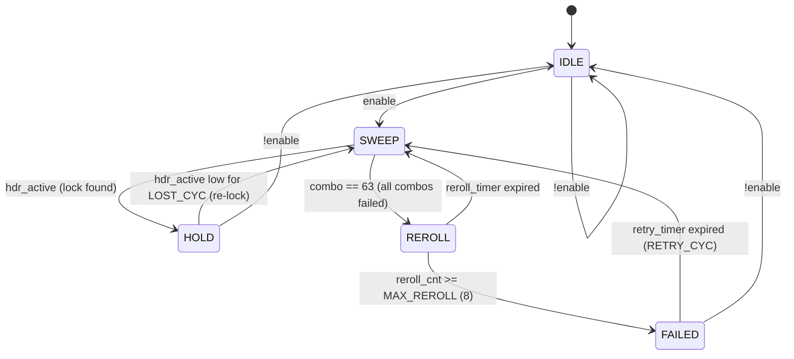
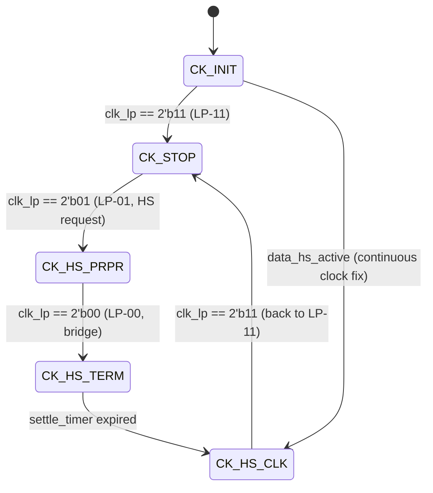
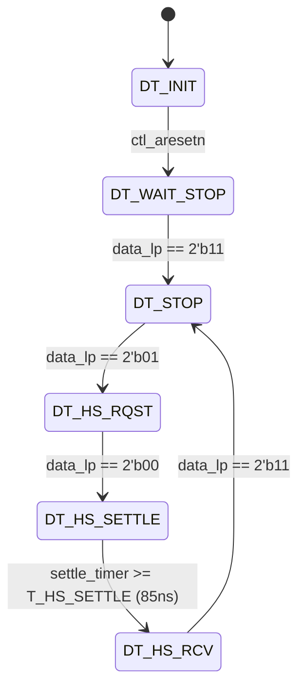
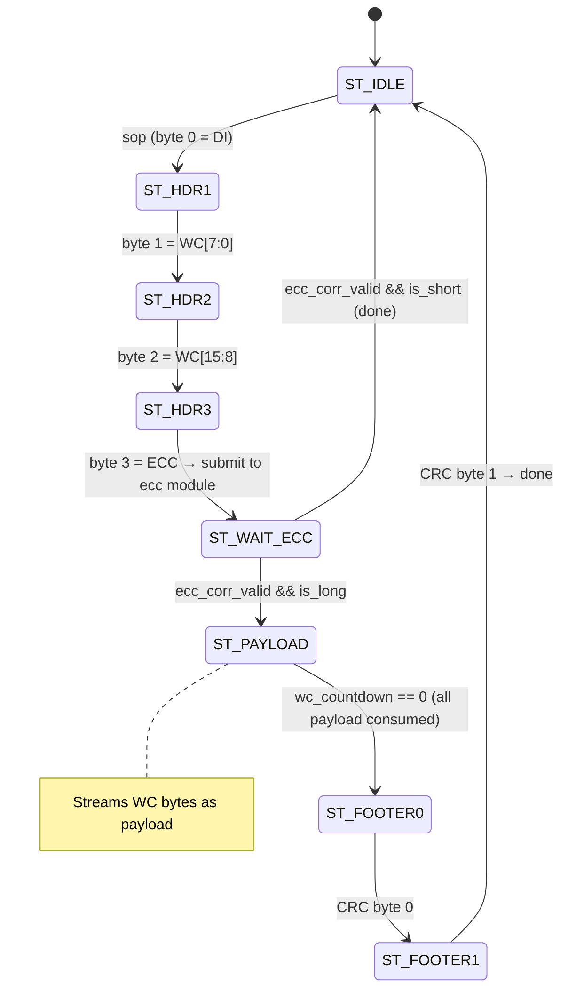
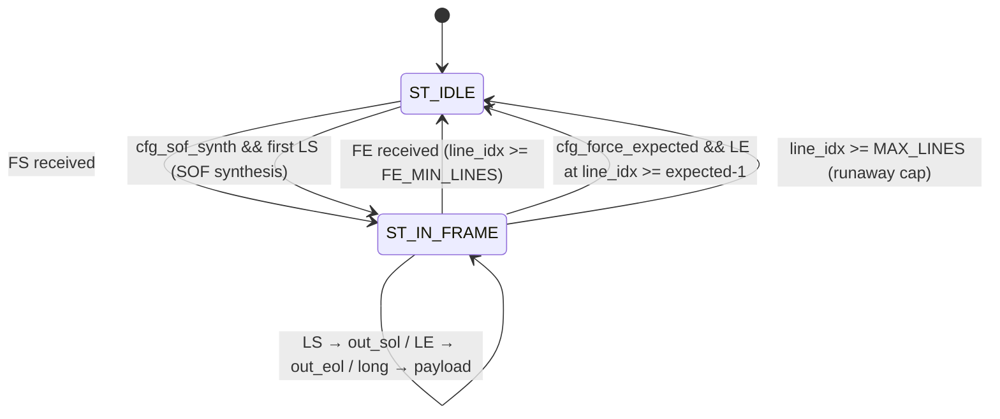

# RTL 設計仕様 — MIPI CSI-2 → HDMI パイプライン (2026-06-26)

対象: Zybo Z7-20 (xc7z020clg400-1)、OV5640 2-lane MIPI CSI-2、RGB565 (DT=0x22)、VGA 640x480 30fps。
言語: SystemVerilog。シミュレータ: DSim 2026。合成: Vivado 2024.2。

本書は、各 RTL モジュールを一から再実装できるだけの詳細度ですべて記述する。

---

## 1. システムブロック図

```
                     ┌──────────────────────────────────────────────────────────────────────┐
                     │                    mipi_to_hdmi_probe_top                            │
  D-PHY pins ──────► │                                                                      │
  (2-lane CSI-2)     │  [byte_clk ~96MHz]           [sysclk 125MHz]           [pix_clk 25MHz]│
                     │  ┌─────────────────┐  CDC     ┌───────────────┐                      │
  dphy_hs_clock ────►│  │ dphy_hs_byte_   │ (Gray   │ csi2_packet_  │                      │
  dphy_data_hs ────►│  │ probe           │ FIFO)   │ parser        │                      │
  dphy_clk_lp ─────►│  │  (IBUFDS/BUFIO/ │────────►│ (8-state FSM) │                      │
  dphy_data_lp ────►│  │   BUFR/ISERDES/ │         └──────┬────────┘                      │
                     │  │   IDELAY/bitslip│                │                                │
                     │  │   /settle-blank)│         ┌──────▼────────┐                      │
                     │  └───────┬─────────┘         │ csi2_header_  │                      │
                     │          │                    │ ecc           │                      │
  [refclk_200 MHz]   │  ┌───────▼─────────┐         └──────┬────────┘                      │
                     │  │ dphy_hwlock_fsm  │                │                                │
  PLLE2 (sysclk*8/5)│  │ (auto bitslip   │         ┌──────▼────────┐                      │
                     │  │  sweep+reroll)   │         │ csi2_payload_ │                      │
                     │  └─────────────────┘         │ crc           │                      │
                     │  ┌─────────────────┐         └──────┬────────┘                      │
                     │  │ dphy_lane_       │                │                                │
                     │  │ supervisor      │         ┌──────▼────────┐                      │
                     │  │ (opt-in clk mgmt)│        │ csi2_vcdt_    │                      │
                     │  └─────────────────┘         │ filter        │                      │
                     │                               └──────┬────────┘                      │
                     │                                      │                                │
                     │                               ┌──────▼────────┐                      │
                     │                               │ csi2_frame_   │                      │
                     │                               │ state         │                      │
                     │                               │ (SOF/EOF/     │                      │
                     │                               │  SOL/EOL)     │                      │
                     │                               └──────┬────────┘                      │
                     │                                      │ payload + markers              │
                     │                               ┌──────▼────────┐                      │
                     │                               │ rgb565_gray_  │                      │
                     │                               │ unpack        │                      │
                     │                               │ (2byte→RGB888)│                      │
                     │                               └──────┬────────┘                      │
                     │                     video_pixel[23:0]│                                │
                     │                   ┌──────────────────┤                                │
                     │                   │  COLOR_CAPTURE   │  !COLOR_CAPTURE                │
                     │            ┌──────▼───────┐   ┌──────▼───────┐                      │
                     │            │ IMG PROC      │   │ normalizer   │                      │
                     │            │ PIPELINE      │   │ +ob_masker   │                      │
                     │            │ (PRE+conv+DoG │   └──────┬───────┘                      │
                     │            │  +cascade+POST│          │ Y8                            │
                     │            └──────┬────────┘   ┌──────▼───────┐                      │
                     │          RGB24    │            │axis_video_   │                      │
                     │            ┌──────▼───────┐    │bridge (CDC)  │  ──► VDMA S2MM       │
                     │            │axis_video_   │    └──────────────┘     (DDR→HDMI)       │
                     │            │bridge (CDC)  │  ──► VDMA S2MM                           │
                     │            └──────────────┘                                          │
                     │                                                                      │
                     │  ┌─────────────────┐  cam_scl/sda  ┌──────────┐                     │
                     │  │ ov5640_sccb_    │──────────────►│ OV5640   │                     │
                     │  │ init_probe     │  (I2C bit-bang)│ sensor   │                     │
                     │  │ (260-step ROM) │               └──────────┘                     │
                     │  └─────────────────┘                                                 │
                     │                                                    cam_clk (25MHz)──►│
                     │  ┌─────────────────┐                                                 │
                     │  │ csi2_tpg        │  (internal test pattern, runtime switch)        │
                     │  └─────────────────┘                                                 │
                     │                                     ┌──────────┐                     │
                     │  hdmi_tx_* ◄────────────────────────│ HDMI TX  │                     │
                     │                                     │ (OBUFDS/ │                     │
                     │                                     │  OSERDES)│                     │
                     │                                     └──────────┘                     │
                     └──────────────────────────────────────────────────────────────────────┘
```

---

## 2. クロックドメイン

| Domain | Frequency | Source | Usage |
|--------|-----------|--------|-------|
| `sysclk` | 125 MHz | PS7 FCLK_CLK0 | AXI-Lite、GPIO デコード、CSI-2 プロトコル、画像処理、デバッグページ |
| `refclk_200` | 200 MHz | PLLE2(sysclk*8/5) BUFG | IDELAYCTRL、HW ロック FSM、レーンスーパーバイザ |
| `byte_clk` | ~96 MHz | 転送 HS クロックの BUFR(÷4) | ISERDES CLKDIV、SoT 検出、bitslip、settle-blank |
| `cam_clk` | 25 MHz | PLLE2(sysclk*8/40) BUFG | OV5640 XCLK リファレンス |
| `pix_clk` | 25 MHz | MMCME2(sysclk*8/40) BUFG | HDMI ピクセルクロック (VGA 640x480@60 モード) |
| `tmds_clk` | 125 MHz | MMCME2(sysclk*8/8) BUFG | HDMI TMDS シリアライズ |
| `capture_aclk` | — | 外部 (BD) | VDMA AXI4-Stream クロック |

**CDC 境界:**
- `byte_clk → sysclk`: Gray コード非同期 FIFO (`byte_to_core_cdc`、深さ 1024)
- `sysclk → capture_aclk`: BRAM 非同期 FIFO (`axis_video_bridge`、深さ 4096)
- 全コンフィグ信号: 2FF シンクロナイザ (レベル同期、マルチビットではビット整合性は保証しない)
- `byte_clk → refclk_200`: `hdr_ok_byte` (1-bit ロック品質) 用の 2FF
- `refclk_200 → byte_clk`: `sup_enable`、`cfg_settle_blank_k` 用の 2FF

---

## 3. トップモジュール `mipi_to_hdmi_probe_top`

**File:** `rtl/prototype/mipi_to_hdmi_probe_top.sv` (~2200 lines)

### 3.1 パラメータ

| Parameter | Type | Default | Description |
|-----------|------|---------|-------------|
| `PROBE_IDELAY_TAP` | int | 16 | 両データレーンの初期 IDELAY タップ |
| `PROBE_LANE1_BITSLIP_SWEEP` | bit | 0 | レーン 1 のランタイム適応 bitslip を有効化 |
| `STREAM_PAIRING` | int | 0 | レーンペアリングオプション |
| `OV5640_MIPI_CTRL_4800` | logic[7:0] | 8'h14 | MIPI 制御: 0x14 = continuous clock |
| `OV5640_FORMAT_CTRL_4300` | logic[7:0] | 8'h6F | フォーマット: RGB565 |
| `OV5640_ISP_FORMAT_501F` | logic[7:0] | 8'h01 | ISP フォーマットマルチプレクサ: RGB565 |
| `OV5640_ISP_CTRL_5000` | logic[7:0] | 8'ha7 | ISP 制御 0 |
| `OV5640_ISP_CTRL_5001` | logic[7:0] | 8'h83 | ISP 制御 1 |
| `OV5640_TEST_PATTERN_ENABLE` | bit | 0 | init 時に 0x503D テストパターンを有効化 |
| `COLOR_CAPTURE` | bit | 0 | 0=Y8 グレースケール / 1=RGB888 カラーキャプチャ |
| `IMAGE_FORMAT` | int | 1 | 0=YUV422 / 1=RGB565 / 2=RAW8 / 3=RAW10 |
| `HWLOCK_DEFAULT_ON` | bit | 1 | 電源投入時に HW ロック FSM を有効化 |

### 3.2 トップレベルポート

| Port | Direction | Width | Description |
|------|-----------|-------|-------------|
| `sysclk` | in | 1 | システムクロック 125 MHz |
| `led[3:0]` | out | 4 | ステータス LED |
| `dphy_hs_clock_clk_p/n` | in | 1 | D-PHY 転送 HS クロック (差動) |
| `dphy_data_hs_p/n[1:0]` | in | 2 | D-PHY データレーン (差動) |
| `dphy_clk_lp_p/n` | in | 1 | クロックレーン LP 信号 |
| `dphy_data_lp_p/n[1:0]` | in | 2 | データレーン LP 信号 |
| `cam_clk` | out | 1 | OV5640 への 25 MHz XCLK |
| `cam_gpio` | out | 1 | OV5640 RESETB (アクティブロー) |
| `cam_scl/cam_sda` | inout | 1 | SCCB (I2C) バス |
| `hdmi_tx_clk_p/n` | out | 1 | HDMI TMDS クロック (差動) |
| `hdmi_tx_p/n[2:0]` | out | 3 | HDMI TMDS データ (差動) |
| `m_axis_capture_*` | out | — | VDMA への AXI4-Stream (8 または 24 ビット) |
| `s_axis_hdmi_*` | in | 24 | VDMA MM2S から HDMI への AXI4-Stream |
| `sccb_rt_write_word_in` | in | 32 | ランタイム SCCB 書き込み GPIO |
| `idelay_runtime_word_in` | in | 32 | IDELAY/proc_op GPIO |
| `bitslip_runtime_word_in` | in | 32 | Bitslip/HW-lock GPIO |
| `frame_lines_runtime_word_in` | in | 32 | フレーム設定 GPIO |
| `debug_page_sel` | in | 8 | デバッグページ選択 |

### 3.3 内部アーキテクチャ

1. **リセット**: sysclk 上の 8 ビットシフトカウンタ。`rst_n = &rst_cnt` (255 サイクルのパワーオンリセット)
2. **PLL**: PLLE2_BASE が sysclk (125 MHz) から `refclk_200` (200 MHz) と `cam_clk` (25 MHz) を生成
3. **MMCM**: MMCME2_BASE が HDMI 用に `tmds_clk` (125 MHz) と `pix_clk` (25 MHz) を生成
4. **GPIO デコード**: 4 つの 32 ビット GPIO ワード (sccb/idelay/bitslip/frame_lines) を sysclk ドメインへ 2FF 同期し、`_apply_sys_d` でエッジ検出して apply-strobe をデコードする
5. **0xFE インターセプト**: `sccb_rt_write_word_sys[15:8] == 8'hFE` のとき、書き込みは SCCB エンジンではなくローカル係数レジスタへルーティングされる
6. **データパスマルチプレクサ**: カメラ CDC 出力または内部 TPG を `use_tpg_rt` で選択。パイプライン化した AND-OR マルチプレクサ経由 (ファンアウト輻輳を抑えるため 1 サイクルのレジスタ段を挿入)
7. **プロトコルリセット**: `protocol_resetn = rst_n && sccb_done` (SCCB init 完了まで保持)

### 3.4 インスタンス化階層

```
mipi_to_hdmi_probe_top
├── PLLE2_BASE u_refclk_pll         (refclk_200 + cam_clk)
├── MMCME2_BASE u_hdmi_mmcm         (tmds_clk + pix_clk)
├── ov5640_sccb_init_probe u_ov5640  (260-step ROM SCCB init + runtime R/W)
├── dphy_hs_byte_probe u_dphy        (D-PHY frontend, byte_clk domain)
├── dphy_hwlock_fsm u_dphy_hwlock    (auto bitslip sweep, refclk_200)
├── dphy_lane_supervisor u_sup       (clock lane management, refclk_200)
├── dphy_raw_byte_ringbuf u_rawcap   (debug byte capture ring)
├── byte_to_core_cdc u_cdc          (byte_clk → sysclk Gray FIFO)
├── csi2_tpg u_csi2_tpg             (internal test pattern generator)
├── csi2_packet_parser u_parser      (header/payload/CRC separation)
├── csi2_header_ecc u_ecc           (Hamming ECC check/correct)
├── csi2_payload_crc u_crc          (CRC-16 check)
├── csi2_vcdt_filter u_filter       (VC/DT filter)
├── csi2_frame_state u_frame        (SOF/EOF/SOL/EOL management)
├── yuv422_gray_unpack u_yuv        (YUV422 → Y8)
├── rgb565_gray_unpack u_rgb565     (RGB565 → RGB888 or Y8)
├── raw8_passthrough u_raw8         (RAW8 → Y8)
├── raw10_unpack u_raw10            (RAW10 → Y8)
├── axis_rgb_prefilter u_prefilter  (PRE: 3x3 denoise + point ops) [COLOR_CAPTURE]
├── axis_rgb_conv3x3 u_conv3x3     (3x3 convolution, A branch)    [COLOR_CAPTURE]
├── axis_rgb_conv5x5 u_conv5x5     (5x5 convolution, B/S1 branch) [COLOR_CAPTURE]
├── axis_rgb_dog_combine u_dog      (parallel combiner αA−βB+off)  [COLOR_CAPTURE]
├── axis_rgb_conv5x5_sep u_s2      (cascade S2, separable 5x5)    [COLOR_CAPTURE]
├── axis_rgb_conv5x5_sep u_s3      (cascade S3, separable 5x5)    [COLOR_CAPTURE]
├── axis_rgb_proc_slot u_post_slot  (POST: point ops after conv)   [COLOR_CAPTURE]
├── video_frame_normalizer u_norm   (480x640 pin, NORMALIZE=0)     [!COLOR_CAPTURE]
├── ob_row_masker u_ob              (OB row mask)                  [!COLOR_CAPTURE]
├── axis_video_bridge u_capture_bridge (sysclk → capture_aclk CDC)
├── hdmi_output u_hdmi_output       (HDMI TX OSERDES/OBUFDS)
└── yuv422_crc_framebuffer_axis u_fb (CRC-checked framebuffer, non-primary)
```

---

## 4. D-PHY フロントエンド `dphy_hs_byte_probe`

**File:** `rtl/prototype/dphy_hs_byte_probe.sv` (~1800 lines)
**Clock domain:** `byte_clk` (転送 HS クロックから導出)

### 4.1 パラメータ

| Parameter | Default | Description |
|-----------|---------|-------------|
| `LANES` | 2 | データレーン数 |
| `SOT_WINDOW_BYTES` | 64 | SoT 検出ウィンドウサイズ |
| `SWEEP_HOLD_BYTES` | 16384 | 適応スイープの保持期間 |
| `IDELAY_TAP` | 16 | 初期 IDELAYE2 タップ値 (0-31) |
| `IDELAY_REFCLK_MHZ` | 200.0 | IDELAY リファレンスクロック周波数 |
| `EXPECTED_LONG_DT` | 8'h1e | 期待されるロングパケットのデータタイプ |
| `EXPECTED_LONG_WC` | 16'd1280 | 期待されるロングパケットのワードカウント |
| `MIN_SYNC_HEADER_SCORE` | 13 | 有効な同期ヘッダの最小スコア |
| `STREAM_PAIRING` | 0 | レーンペアリング設定 |

### 4.2 クロッキングチェーン

```
dphy_hs_clock_p/n ─── IBUFDS ──► hs_clk_ibuf ──┬── BUFIO ──► hs_clk_io (ISERDES CLK)
                                                 └── BUFR(÷4) ──► byte_clk (ISERDES CLKDIV)
                                                      │
                                                      CLR = !rst_n
                                                          || (sup_enable && sup_bufr_clr)
                                                          || bufr_reroll
```

**BUFR.CLR の挙動:** CLR をアサートすると ÷4 分周器がリセットされる。CLR を解除すると、新しい byte_clk 位相は 4 通りの整列のうちの 1 つ (非決定的) になる。これが HW ロック FSM が解決する byte 位相くじ引きの源である。

### 4.3 レーンごとの ISERDES + IDELAY

2 本のデータレーンそれぞれについて:

```
dphy_data_hs_p/n[i] ─── IBUFDS ──► IDELAYE2 ──► ISERDESE2(8:1, DDR=1'b0)
                                    (tap 0-31)     CLK=hs_clk_io
                                    (runtime)      CLKDIV=byte_clk
                                                   ──► serdes_byte_sample[i][7:0]
```

- `IDELAYE2`: Xilinx IODELAY2、`IDELAY_TYPE="VAR_LOAD"`、`IDELAY_VALUE=IDELAY_TAP`。ランタイムタップは `CE`+`LD`+`CNTVALUEIN` でロードされる。IODELAY_GROUP = `"mipi_dphy_idelay"`。IDELAYCTRL は `refclk_200` 上。
- `ISERDESE2`: `DATA_RATE="SDR"`、`DATA_WIDTH=8`、`INTERFACE_TYPE="NETWORKING"`。`byte_clk` サイクルあたり 8 ビット。`BITSLIP` 入力でビット境界を歩進する。

### 4.4 バイト整列 (bitslip + ローテーション)

**フェーズ 1 — Bitslip:** `lane_bitslip_phase[2:0]` (0-7) は、8 通りのビット境界のうちどれをバイト境界とするかを選択する。プローブはステップごとに `fixed_bitslip_wait=8` byte_clk のデバウンスを挟みつつ、`runtime_bitslip_phase` に向けて bitslip を 1 ステップずつ歩進する。

**フェーズ 2 — SoT ローテーション:** 関数 `find_sot_rotation(byte)` は、サンプルしたバイトの 8 通りの右ローテーションすべてを試し、`0xB8` (CSI-2 SoT 同期バイト) を探す。`current_rotation` は一致したローテーション量。`has_sot_rotation` は一致が見つかったことを示す。

統合: bitslip がビット境界を確立し、ローテーションがその整列内での CSI-2 バイト境界を見つける。

### 4.5 Settle-Blank と SoT ウィンドウ

各 MIPI データバーストは LP→HS 遷移で始まる。バーストの先頭には HS-prepare/settle のゴミが含まれ、SoT 検出を破壊しうる。

```
LP-exit detected ──► sot_blank_count = cfg_settle_blank_k
                     │
                     ▼
   [K byte_clks: sot_window_active=0, suppress SoT search]
                     │
                     ▼ (count reaches 1)
   sot_window_active=1 ──► search for 0xB8 in SOT_WINDOW_BYTES window
                            │
                            ▼ (0xB8 found)
                     current_sot_in_window=1 ──► byte alignment locked for this burst
```

**デフォルト K=8** (検証済み: K=0→452 行、K=6→471、K=8→480 = フルフレーム)。

### 4.6 2 レーンストリーム組み立て

SoT 検出後、両レーンの整列済みバイトを 16 ビットストリームに組み立てる:

```
Lane 0: B0, B2, B4, ...
Lane 1: B1, B3, B5, ...
Paired:  [B1:B0], [B3:B2], ...  → stream_byte_data[15:0]
```

CDC への出力信号:
- `stream_byte_data[15:0]` — ビートあたり 2 バイト (lane1_byte, lane0_byte)
- `stream_byte_keep[1:0]` — バイト有効マスク
- `stream_byte_valid` — ビート有効
- `stream_byte_sop` — パケット (バースト) の開始
- `stream_byte_eop` — パケットの終了

### 4.7 同期ヘッダスキャナ

SoT 後、最初の 8 バイトがトレーススロットにキャプチャされる。スキャナはすべての bit-offset × pairing の組み合わせを試し、有効な CSI-2 ヘッダを探す (ECC シンドロームを計算してスコアリングする)。スコアが `MIN_SYNC_HEADER_SCORE` 以上のとき `sync_header_valid` がアサートされる。この信号は以下を駆動する:
- HW ロック FSM のウィンドウ品質検出器
- デバッグページのリードバック

---

## 5. HW 決定論的ロック FSM `dphy_hwlock_fsm`

**File:** `rtl/mipi_rx/dphy_hwlock_fsm.sv`
**Clock domain:** `refclk_200` (byte_clk を消す BUFR.CLR を生き延びる)

### 5.1 インタフェース

| Port | Dir | Width | Description |
|------|-----|-------|-------------|
| `clk` | in | 1 | refclk_200 |
| `rst_n` | in | 1 | アクティブローリセット |
| `enable` | in | 1 | FSM イネーブル (cfg_hw_lock を CDC) |
| `hdr_active` | in | 1 | ウィンドウ同期ヘッダ品質 (byte_clk から CDC) |
| `bitslip_p0` | out | 3 | レーン 0 のターゲット bitslip 位相 |
| `bitslip_p1` | out | 3 | レーン 1 のターゲット bitslip 位相 |
| `bufr_clr` | out | 1 | BUFR.CLR 再くじ引き要求 |
| `locked` | out | 1 | ロック達成 |
| `failed` | out | 1 | 全組み合わせを使い果たし、MAX_REROLL 超過 |
| `dbg_state` | out | 3 | 現在の FSM 状態 |
| `dbg_reroll` | out | 4 | 再くじ引きカウンタ |
| `dbg_combo` | out | 6 | 現在の組み合わせインデックス |

### 5.2 FSM 状態図



### 5.3 アルゴリズム

1. **IDLE**: `enable` を待つ。
2. **SWEEP**: 64 通りの組み合わせ `(p0, p1) = (combo[5:3], combo[2:0])` をイテレートする:
   - `bitslip_p0 = combo[5:3]`、`bitslip_p1 = combo[2:0]` を出力
   - bitslip 再トレーニング + ウィンドウ安定化のため `SETTLE_MIN_CYC` を待つ
   - `hdr_active` をサンプル:
     - high なら → HOLD (ロック発見、勝者の組み合わせを記録)
     - タイムアウト (`SETTLE_CYC`) なら → 次の組み合わせ
   - 組み合わせが 63 に達してもロックしなければ → REROLL
3. **REROLL**: `bufr_clr` を `REROLL_CYC` サイクルアサートする (÷4 byte 位相を再くじ引き)。`reroll_cnt` をインクリメント。`reroll_cnt >= MAX_REROLL` なら → FAILED、そうでなければ → SWEEP (新しい byte 位相で再試行)。
4. **HOLD**: ロック安定。`hdr_active` を監視。`LOST_CYC` の間ドロップしたら → 再 SWEEP。`!enable` なら → IDLE。
5. **FAILED**: `RETRY_CYC` を待ってから再度 SWEEP を試す (ストリーム開始前のブートを許容)。

### 5.4 ウィンドウロック品質検出器 (トップモジュール内)

```systemverilog
// byte_clk domain, feeds hdr_ok_byte
always_ff @(posedge byte_clk or negedge rst_n) begin
    if (!rst_n) begin hwlock_win_cnt <= 0; hwlock_hdr_cnt <= 0; hdr_ok_byte <= 0; end
    else if (hwlock_win_cnt == 16383) begin  // HWLOCK_WINDOW = 16384
        hdr_ok_byte    <= (hwlock_hdr_cnt >= 4);  // HWLOCK_HDR_MIN = 4
        hwlock_hdr_cnt <= 0;
        hwlock_win_cnt <= 0;
    end else begin
        hwlock_win_cnt <= hwlock_win_cnt + 1;
        if (sync_header_valid && hwlock_hdr_cnt != 255)
            hwlock_hdr_cnt <= hwlock_hdr_cnt + 1;
    end
end
// 2FF CDC: hdr_ok_byte → refclk_200 → hdr_active_ctl → FSM
```

---

## 6. D-PHY レーンスーパーバイザ `dphy_lane_supervisor`

**File:** `rtl/mipi_rx/dphy_lane_supervisor.sv`
**Clock domain:** `refclk_200` (= `ctl_clk`)

### 6.1 インタフェース

| Port | Dir | Width | Description |
|------|-----|-------|-------------|
| `ctl_clk` | in | 1 | refclk_200 |
| `ctl_aresetn` | in | 1 | アクティブローリセット |
| `clk_lp[1:0]` | in | 2 | クロックレーン LP ピン {P, N} |
| `data_lp[1:0]` | in | 2 | データレーン LP ピン {P, N} |
| `byte_clk` | in | 1 | CDC 出力用の byte_clk |
| `cfg_clk_settle_cyc[7:0]` | in | 8 | クロック HS-TERM→HS-CLK セトリングサイクル数 |
| `bufr_clr` | out | 1 | BUFR.CLR 制御 |
| `serdes_rst_byte` | out | 1 | ISERDES リセット (byte_clk ドメイン) |
| `rx_clk_active_byte` | out | 1 | 分周クロック生存インジケータ |
| `hs_settled_byte` | out | 1 | データレーン HS セトリング完了 |
| `sts_clk_state[2:0]` | out | 3 | クロック FSM 状態 |
| `sts_data_state[2:0]` | out | 3 | データ FSM 状態 |

### 6.2 クロックレーン FSM



**要点:** `bufr_clr = (ck_nstate != CK_HS_CLK)`。BUFR はアクティブな HS クロック中を除いて CLR 保持される — クロックの再起動ごとに ÷4 分周器が決定論的に再位相付けされる。

LP ピンは 2FF 同期 + グリッチフィルタされる (T_LP_GLITCH = 20 ns、200 MHz で 4 サイクル)。

### 6.3 データレーン FSM



`hs_settled` は `DT_HS_RCV` 状態でアサートされ、バーストごとの SoT ゲートを提供する。

---

## 7. byte→core CDC `byte_to_core_cdc`

**File:** `rtl/mipi_rx/byte_to_core_cdc.sv`
**Parameters:** `IN_WIDTH=16, KEEP_WIDTH=2, FIFO_DEPTH=1024, CORE_OUTPUT_INTERVAL=2`

### 7.1 インタフェース

| Port | Dir | Width | Description |
|------|-----|-------|-------------|
| `byte_clk` | in | 1 | 書き込みクロック |
| `byte_aresetn` | in | 1 | 書き込み側リセット |
| `core_clk` | in | 1 | 読み出しクロック |
| `core_aresetn` | in | 1 | 読み出し側リセット |
| `s_byte_data` | in | 16 | 入力データ (2 バイト) |
| `s_byte_keep` | in | 2 | バイト有効マスク |
| `s_byte_valid` | in | 1 | 入力有効 |
| `s_byte_sop` | in | 1 | パケット開始 |
| `s_byte_eop` | in | 1 | パケット終了 |
| `m_byte_*` | out | — | s_byte のミラー (core_clk ドメイン) |
| `sts_lane_fifo_ovf_cnt` | out | 16 | オーバーフローカウンタ |

### 7.2 実装

標準の **Gray ポインタ非同期 FIFO** (深さ = 2 のべき乗):
- 書き込み側 (byte_clk): `s_byte_valid` で `{eop, sop, keep, data}` を FIFO にプッシュ。`wr_gray = bin_to_gray(wr_bin)`。
- 読み出し側 (core_clk): `wr_gray` を 2FF で同期。`empty = (rd_gray == wr_gray_sync2)`。**`CORE_OUTPUT_INTERVAL=2`** は出力を 50% デューティサイクルにスロットルし (2 core_clk サイクルごとに 1 回読み出し)、TPG が 100% デューティで動作する際の下流パーサ FIFO オーバーフローを防ぐ。
- オーバーフロー: フルアサート時の書き込み → `sts_lane_fifo_ovf_cnt++`。

---

## 8. CSI-2 パケットパーサ `csi2_packet_parser`

**File:** `rtl/mipi_rx/csi2_packet_parser.sv`
**Clock domain:** `sysclk` (core_clk)

### 8.1 インタフェース

| Port | Dir | Width | Description |
|------|-----|-------|-------------|
| `core_clk` | in | 1 | 処理クロック |
| `core_aresetn` | in | 1 | アクティブローリセット |
| `s_byte_data` | in | 16 | 入力バイトストリーム (2 バイト/ビート) |
| `s_byte_keep` | in | 2 | バイト有効マスク |
| `s_byte_valid` | in | 1 | 入力有効 |
| `s_byte_sop` | in | 1 | パケット開始 |
| `s_byte_eop` | in | 1 | パケット終了 |
| `ecc_hdr_valid` | out | 1 | ECC チェック用ヘッダ準備完了 |
| `ecc_hdr_raw` | out | 32 | 生の 4 バイトヘッダ |
| `ecc_hdr_corr_valid` | in | 1 | ECC 訂正完了 |
| `ecc_hdr_di` | in | 8 | 訂正済みデータ識別子 |
| `ecc_hdr_wc` | in | 16 | 訂正済みワードカウント |
| `m_pkt_di` | out | 8 | パケット DI |
| `m_pkt_wc` | out | 16 | パケットワードカウント |
| `m_pkt_is_long` | out | 1 | ロングパケットフラグ |
| `m_pkt_is_short` | out | 1 | ショートパケットフラグ |
| `m_payload_data` | out | 8 | ペイロードバイト |
| `m_payload_valid` | out | 1 | ペイロード有効 |
| `m_payload_first` | out | 1 | ペイロードの先頭バイト |
| `m_payload_last` | out | 1 | ペイロードの末尾バイト |
| `m_footer_data` | out | 16 | 2 バイト CRC フッタ |
| `m_footer_valid` | out | 1 | フッタ有効 |
| `m_pkt_done` | out | 1 | パケット完了 |
| `sts_short/long/trunc_cnt` | out | 16 | カウンタ |

### 8.2 内部バイト FIFO

16 ビット/ビートの入力は、内部 FIFO (深さ 32) で個々のバイトに分解される。ビートあたり 2 バイトがプッシュされ (keep が有効を示すとき)、バイトは FSM によって 1 つずつポップされる。

### 8.3 FSM 状態



**トランケーション回復:** 予期しない `sop` がパケット途中で到着した場合、`sts_pkt_trunc_cnt` をインクリメントして `ST_HDR1` へ再突入する。

### 8.4 ロング vs ショートの判定

```systemverilog
is_long = (DI[5:0] >= 6'h10);  // DT >= 0x10 = long packet (pixel data)
// Short: FS=0x00, FE=0x01, LS=0x02, LE=0x03
```

---

## 9. CSI-2 Header ECC `csi2_header_ecc`

**File:** `rtl/mipi_rx/csi2_header_ecc.sv` (124 lines)
**Clock domain:** `sysclk`

### 9.1 原理 — Hamming(24,6) SEC-DED 符号

CSI-2 のパケットヘッダは 4 byte = 32 bit で構成される:

```
byte 0: DI[7:0]   = {VC[1:0], DT[5:0]}  (Data Identifier)
byte 1: WC[7:0]   (Word Count 下位)
byte 2: WC[15:8]  (Word Count 上位)
byte 3: ECC[7:0]  (Error Correction Code、上位2bit未使用)
```

保護対象は DI+WC の 24 bit (`data[23:0] = {WC[15:8], WC[7:0], DI[7:0]}`)。
ECC はこの 24 bit に対して **6 bit のパリティ** を生成する。

#### 9.1.1 理論背景

Hamming 符号は **線形ブロック符号** の一種で、`(n, k)` 符号として `k` ビットのデータに `r = n - k` ビットの冗長ビットを付加する。CSI-2 では `k = 24`, `r = 6`, `n = 30`。

- **符号化**: 各パリティビット `P[i]` は、データビットの特定の部分集合の XOR で計算される。部分集合はパリティ検査行列 `H` の行で定義される。
- **検査**: 受信側で同じ行列を使い `syndrome = P_received XOR P_calculated` を求める。
- **SEC (Single Error Correction)**: syndrome ≠ 0 なら誤りあり。syndrome がデータビット位置に対応 → そのビットを反転して訂正。
- **DED (Double Error Detection)**: syndrome ≠ 0 だがどのデータビットにも ECC ビットにも一致しない → 2 bit 以上の誤り → 訂正不能。

#### 9.1.2 MIPI CSI-2 規定のパリティ検査行列

MIPI CSI-2 仕様 (MIPI Alliance Specification for CSI-2) が定義する `H` 行列を転置した形で、各パリティビットがカバーするデータビット集合は:

| P bit | カバーするデータビット `d[i]` | ビット数 |
|-------|-------------------------------|----------|
| P[0] | 0, 1, 2, 4, 5, 7, 10, 11, 13, 16, 20, 21, 22, 23 | 14 |
| P[1] | 0, 1, 3, 4, 6, 8, 10, 12, 14, 17, 20, 21, 22, 23 | 14 |
| P[2] | 0, 2, 3, 5, 6, 9, 11, 12, 15, 18, 20, 21, 22 | 13 |
| P[3] | 1, 2, 3, 7, 8, 9, 13, 14, 15, 19, 20, 21, 23 | 13 |
| P[4] | 4, 5, 6, 7, 8, 9, 16, 17, 18, 19, 20, 22, 23 | 13 |
| P[5] | 10, 11, 12, 13, 14, 15, 16, 17, 18, 19, 21, 22, 23 | 13 |

この行列の設計思想:
- 各データビットは **固有の syndrome パターン** (= `H` の対応列) を持つ。すなわち 24 個のデータビットそれぞれが 6 bit syndrome 空間で一意 → single-bit error の位置を特定可能。
- 各 ECC ビット自身の誤りは syndrome が one-hot (1 ビットだけ 1) になる → データ訂正不要と判別可能。
- 2 bit 以上の同時誤りは上記いずれにも一致しない syndrome を生む → 訂正不能と検出。

#### 9.1.3 syndrome の意味

```
syndrome[5:0] = received_ECC[5:0] XOR calc_ecc6(received_data[23:0])
```

| syndrome 値 | 意味 | アクション |
|-------------|------|-----------|
| `6'b000000` | エラーなし | そのまま通過 |
| `bit_syndrome(i)` に一致 (i=0..23) | データビット `d[i]` に 1 bit 誤り | `d[i]` を反転して訂正 |
| one-hot (6'b000001, 000010, ..., 100000) | ECC ビット自身の誤り | データ訂正不要 |
| 上記いずれでもない | 2 bit 以上の多重誤り | 訂正不能 (uncorrectable) |

ここで `bit_syndrome(i)` は「データビット `i` のみを 1 にした 24 bit ワードに対する `calc_ecc6` の値」であり、`H` 行列の第 `i` 列に等しい。

### 9.2 Interface

| Port | Dir | Width | Description |
|------|-----|-------|-------------|
| `core_clk` | in | 1 | Processing clock (sysclk) |
| `core_aresetn` | in | 1 | Active-low synchronous reset |
| `hdr_valid` | in | 1 | Raw header available (from parser) |
| `hdr_raw[31:0]` | in | 32 | Raw header `{ECC[7:0], WC[15:8], WC[7:0], DI[7:0]}` |
| `hdr_corr_valid` | out | 1 | Correction complete (1 cycle after stage_valid) |
| `hdr_corr[23:0]` | out | 24 | Corrected data `{WC[15:8], WC[7:0], DI[7:0]}` |
| `hdr_di[7:0]` | out | 8 | Corrected Data Identifier |
| `hdr_wc[15:0]` | out | 16 | Corrected Word Count |
| `hdr_ecc_no_error` | out | 1 | No error detected |
| `hdr_ecc_corrected` | out | 1 | Single-bit error corrected (data or ECC bit) |
| `hdr_ecc_uncorrectable` | out | 1 | Multi-bit error, correction impossible |
| `sts_ecc_corr_cnt[15:0]` | out | 16 | Corrected error count (saturating) |
| `sts_ecc_uncorr_cnt[15:0]` | out | 16 | Uncorrectable error count (saturating) |

### 9.3 回路実装 — 2 段パイプライン

#### Stage 1 (hdr_valid → stage_valid): Syndrome 計算

```systemverilog
// パリティ計算 — 24 bit データに対する 6 bit パリティ
function automatic [5:0] calc_ecc6(input logic [23:0] d);
    calc_ecc6[0] = d[0]^d[1]^d[2]^d[4]^d[5]^d[7]^d[10]^d[11]^d[13]^d[16]^d[20]^d[21]^d[22]^d[23];
    calc_ecc6[1] = d[0]^d[1]^d[3]^d[4]^d[6]^d[8]^d[10]^d[12]^d[14]^d[17]^d[20]^d[21]^d[22]^d[23];
    calc_ecc6[2] = d[0]^d[2]^d[3]^d[5]^d[6]^d[9]^d[11]^d[12]^d[15]^d[18]^d[20]^d[21]^d[22];
    calc_ecc6[3] = d[1]^d[2]^d[3]^d[7]^d[8]^d[9]^d[13]^d[14]^d[15]^d[19]^d[20]^d[21]^d[23];
    calc_ecc6[4] = d[4]^d[5]^d[6]^d[7]^d[8]^d[9]^d[16]^d[17]^d[18]^d[19]^d[20]^d[22]^d[23];
    calc_ecc6[5] = d[10]^d[11]^d[12]^d[13]^d[14]^d[15]^d[16]^d[17]^d[18]^d[19]^d[21]^d[22]^d[23];
endfunction

// Stage 1: syndrome を計算し、データと ECC を保持
always_ff @(posedge core_clk) begin
    stage_valid    <= hdr_valid;
    stage_data     <= hdr_raw[23:0];                        // data = {WC_hi, WC_lo, DI}
    stage_ecc      <= hdr_raw[31:24];                       // 受信 ECC (上位2bitは未使用)
    stage_syndrome <= hdr_raw[29:24] ^ calc_ecc6(hdr_raw[23:0]);  // 受信ECC[5:0] XOR 計算ECC
end
```

**合成結果**: `calc_ecc6` は純粋な XOR ツリー (6 出力 × 最大 14 入力 XOR)。Xilinx 7 series の LUT6 で 各パリティビットは 2-3 段 LUT で実装される。syndrome 計算も 6 bit XOR なので追加 LUT は最小。全体で約 20-30 LUT、組合せ遅延 < 2 ns。

#### Stage 2 (stage_valid → hdr_corr_valid): Syndrome デコードと訂正

```systemverilog
// 各データビットの「固有 syndrome」を求める補助関数
function automatic [5:0] bit_syndrome(input int bit_idx);
    automatic logic [23:0] onehot;
    onehot = 24'h000000;
    onehot[bit_idx] = 1'b1;
    bit_syndrome = calc_ecc6(onehot);   // H 行列の第 bit_idx 列
endfunction

// syndrome からエラービット位置をデコード (24 通り線形探索)
function automatic int decode_data_bit(input logic [5:0] syndrome);
    decode_data_bit = -1;   // 一致なし
    for (int idx = 0; idx < 24; idx++) begin
        if (syndrome == bit_syndrome(idx))
            decode_data_bit = idx;
    end
endfunction

// ECC ビット自身の誤り判定: syndrome が one-hot なら ECC bit error
function automatic logic is_onehot6(input logic [5:0] value);
    is_onehot6 = (value != 0) && ((value & (value - 1)) == 0);
endfunction
```

これらを用いた Stage 2 の判定ロジック:

```systemverilog
if (stage_valid) begin
    corrected_data = stage_data;
    corrected_bit  = decode_data_bit(stage_syndrome);

    // 分類: syndrome の値で 4 つに場合分け
    data_bit_error = (stage_syndrome != 0) && (corrected_bit >= 0);
    ecc_bit_error  = (stage_syndrome != 0) && is_onehot6(stage_syndrome) && !data_bit_error;
    uncorrectable  = (stage_syndrome != 0) && !data_bit_error && !ecc_bit_error;

    // データビット誤りなら当該ビットを反転 (SEC)
    if (data_bit_error)
        corrected_data[corrected_bit] = ~corrected_data[corrected_bit];

    hdr_corr    <= corrected_data;
    hdr_di      <= corrected_data[7:0];         // 訂正後 DI
    hdr_wc      <= corrected_data[23:8];        // 訂正後 WC
    hdr_corr_valid        <= 1'b1;
    hdr_ecc_no_error      <= (stage_syndrome == 0);
    hdr_ecc_corrected     <= data_bit_error || ecc_bit_error;
    hdr_ecc_uncorrectable <= uncorrectable;

    // 飽和カウンタ更新
    if (data_bit_error || ecc_bit_error)
        sts_ecc_corr_cnt <= sat_inc16(sts_ecc_corr_cnt);
    else if (uncorrectable)
        sts_ecc_uncorr_cnt <= sat_inc16(sts_ecc_uncorr_cnt);
end
```

**合成結果**: `decode_data_bit` は elaboration 時に 24 個の `bit_syndrome(i)` 定数が展開され、6 bit 比較器 24 個の OR ツリーになる。実際には Vivado が LUT に最適化し、1 個の 6-LUT が 1 比較を担当 → 24 LUT + 優先エンコーダ。`corrected_data[corrected_bit]` のビット反転は 24 入力 MUX (1-hot decode で該当ビットのみ反転)。全体は組合せロジックだが、Stage 2 の FF 出力として register される (1 cycle latency)。

#### 全体パイプラインのタイミング

```
cycle N  : parser が hdr_valid を assert、hdr_raw[31:0] を提示
cycle N+1: Stage 1 FF に syndrome/data/ecc がラッチ。stage_valid = 1
cycle N+2: Stage 2 FF に corrected DI/WC がラッチ。hdr_corr_valid = 1
           → parser の ST_WAIT_ECC が受け取り、long/short 振り分けへ
```

### 9.4 送信側 ECC 生成 (TPG `csi2_tpg.sv`)

テストパターンジェネレータの ECC 生成は**同一の `calc_ecc6` 関数**を使う:

```systemverilog
function automatic [7:0] hdr_ecc(input logic [7:0] di, input logic [15:0] wc);
    return {2'b00, calc_ecc6({wc[15:8], wc[7:0], di})};
    //       ^^^^^ 上位2bit = 0 (未使用)
endfunction
```

送信時はヘッダ 4 byte を `{hdr_ecc(DI, WC), WC[15:8], WC[7:0], DI}` の順で 2 byte/beat で出力する。受信側の `calc_ecc6` と完全に同一の関数なので、エラーがなければ `syndrome = 0` になることが保証される。

### 9.5 具体例 — syndrome によるエラー位置特定

**例 1: DI = 0x22 (RGB565 long), WC = 0x0500 (1280)**
```
data[23:0] = {0x05, 0x00, 0x22} = 24'h050022
calc_ecc6(24'h050022) = 計算により 6'bXXXXXX → ECC byte = {2'b00, P[5:0]}
```

**例 2: data[7] (DI のbit7) に 1 bit 誤り**
```
bit_syndrome(7) = calc_ecc6(24'h000080) = 6'b011001  (P[0],P[3],P[4] が立つ)
受信側: syndrome = received_ECC ^ calc_ecc6(corrupted_data) = 6'b011001
decode_data_bit(6'b011001) → bit 7 → corrected_data[7] を反転 → 正しい DI 復元
```

**例 3: data[0] と data[1] の 2 bit 同時誤り**
```
bit_syndrome(0) = 6'b000111, bit_syndrome(1) = 6'b001011
実 syndrome = 6'b000111 XOR 6'b001011 = 6'b001100
decode_data_bit(6'b001100) → 一致なし (-1)
is_onehot6(6'b001100) → false (2 bit 立っている)
→ uncorrectable = true
```

---

## 10. CSI-2 Payload CRC `csi2_payload_crc`

**File:** `rtl/mipi_rx/csi2_payload_crc.sv` (89 lines)
**Clock domain:** `sysclk`

### 10.1 原理 — CRC-16-CCITT (reflected)

#### 10.1.1 CRC の基本原理

CRC (Cyclic Redundancy Check) は、データを **GF(2) 上の多項式** とみなし、生成多項式 `G(x)` で割った余りを冗長ビットとして付加する誤り検出符号。

- 送信側: `M(x) * x^r` を `G(x)` で割った余り `R(x)` を求め、`M(x) * x^r + R(x)` を送信
- 受信側: 受信データ全体を `G(x)` で割り、余り = 0 なら誤りなし
- 多項式の係数は GF(2) (= {0, 1}) なので、加減算は XOR、乗算は AND

CRC の誤り検出能力は生成多項式の次数 `r` と構造に依存する:
- **バースト誤り**: 長さ ≤ `r` のバースト誤りを 100% 検出
- **ランダム誤り**: 長さ > `r` のバースト誤りの非検出確率は `2^(-r)` (CRC-16 で 1/65536)

#### 10.1.2 CSI-2 規定の多項式

CSI-2 仕様は **CRC-16-CCITT** を使用する:

```
標準 (normal) 多項式: G(x) = x^16 + x^12 + x^5 + 1
  → 16進表現: 0x1021 (x^16 を省略した 16 bit)

反射 (reflected) 多項式: 0x8408
  → 0x1021 のビット反転 (LSB↔MSB 入れ替え)
```

**「reflected」とは**: データを LSB first で処理する実装では、多項式もビット反転して使う。これは UART/I2C などの LSB-first プロトコルで自然に整合する。CSI-2 のペイロードバイトは LSB first で送信されるため reflected 実装が適切。

| 項目 | 値 |
|------|-----|
| 生成多項式 (normal) | `0x1021` = `x^16 + x^12 + x^5 + 1` |
| 生成多項式 (reflected) | `0x8408` |
| 初期値 | `0xFFFF` |
| 最終 XOR | なし (0x0000) |
| 入力反転 | あり (reflected 実装で暗黙) |
| 出力反転 | なし |

#### 10.1.3 ビットレベルの CRC 更新アルゴリズム

CRC レジスタ (16 bit) を LSB→MSB 方向のシフトレジスタとみなし、データを 1 bit ずつ処理する:

```
for each data bit (LSB first):
    feedback = CRC[0] XOR data_bit
    CRC = CRC >> 1               (右シフト = LSB 側へ)
    if feedback:
        CRC = CRC XOR 0x8408     (reflected poly)
```

この操作は **LFSR (Linear Feedback Shift Register)** そのものである:

```
                    ┌──────────────────────── feedback ◄── CRC[0] XOR data_bit
                    │                                          ▲
                    ▼                                          │
              ┌───[XOR]───┬───┬───┬───[XOR]──┬───────┬───[XOR]─┤
data_bit ──►  │   bit15   │14 │13 │12  bit11  │ ...   │5  bit0  │──► 捨て
              └───────────┴───┴───┴──────────┴───────┴─────────┘
                 ▲ poly bit15=1          ▲ poly bit11=1     ▲ poly bit0=0 (feedback点)
                   (0x8408)               (0x8408)

poly 0x8408 = 1000_0100_0000_1000 → bit3, bit10, bit15 に feedback が XOR される
(bit3=x^12 reflected, bit10=x^5 reflected, bit15=x^0=1)
```

#### 10.1.4 バイト単位の展開

RTL では 1 byte (8 bit) を一括処理する。上記ビット操作を 8 回ループして展開:

```systemverilog
function automatic [15:0] crc_update_byte(
    input logic [15:0] crc_in,
    input logic [7:0]  data
);
    automatic logic [15:0] crc_next;
    automatic logic feedback;
    crc_next = crc_in;
    for (int bit_idx = 0; bit_idx < 8; bit_idx++) begin
        feedback = crc_next[0] ^ data[bit_idx];   // LSB first
        crc_next = crc_next >> 1;                  // 右シフト
        if (feedback)
            crc_next = crc_next ^ 16'h8408;        // reflected poly XOR
    end
    crc_update_byte = crc_next;
endfunction
```

Vivado の合成器はこのループを **完全に展開** (unroll) し、8 段の XOR チェーンを 1 段の組合せロジックに最適化する。結果は「16 bit CRC レジスタの各ビットが、旧 CRC 16 bit と新データ 8 bit の線形結合 (XOR)」として表現される。

**合成結果**: 16 個の LUT6 (各出力ビットが最大 6 入力 XOR) × 2-3 段 = 約 32-48 LUT。クリティカルパスは 8 段 XOR の collapse 後で 2-3 LUT 段 (< 3 ns @ 125 MHz、余裕あり)。

### 10.2 Interface

| Port | Dir | Width | Description |
|------|-----|-------|-------------|
| `core_clk` | in | 1 | Processing clock (sysclk) |
| `core_aresetn` | in | 1 | Active-low synchronous reset |
| `payload_data[7:0]` | in | 8 | Payload byte (from parser) |
| `payload_valid` | in | 1 | Payload byte valid |
| `payload_first` | in | 1 | First byte of this long packet's payload |
| `payload_last` | in | 1 | Last byte of payload |
| `footer_data[15:0]` | in | 16 | Received 2-byte CRC (from parser) |
| `footer_valid` | in | 1 | Footer CRC bytes ready |
| `crc_check_valid` | out | 1 | Check complete (1 cycle pulse) |
| `crc_match` | out | 1 | CRC match (no error) |
| `crc_calc[15:0]` | out | 16 | Calculated CRC (for debug) |
| `crc_received[15:0]` | out | 16 | Received CRC (for debug) |
| `sts_crc_ok_cnt[15:0]` | out | 16 | Match count (saturating) |
| `sts_crc_err_cnt[15:0]` | out | 16 | Mismatch count (saturating) |

### 10.3 回路実装 — ストリーミング CRC チェッカ

#### パラメータ

```systemverilog
parameter logic [15:0] INIT           = 16'hFFFF;   // CRC 初期値
parameter logic [15:0] REFLECTED_POLY = 16'h8408;   // reflected CRC-16-CCITT
```

#### 動作シーケンス

```systemverilog
always_ff @(posedge core_clk) begin
    if (!core_aresetn) begin
        crc_reg <= INIT;                 // 16'hFFFF
        crc_check_valid <= 0;
        // ... (counters clear)
    end else begin
        crc_check_valid <= 0;

        // (A) ペイロードバイト到着時: CRC 逐次更新
        if (payload_valid) begin
            next_crc = crc_update_byte(
                payload_first ? INIT : crc_reg,  // 先頭バイトなら INIT で初期化
                payload_data
            );
            crc_reg  <= next_crc;
            crc_calc <= next_crc;         // デバッグ用に最新 CRC を保持
        end

        // (B) フッタ到着時: CRC レジスタと受信 CRC を比較
        if (footer_valid) begin
            match_now = (crc_reg == footer_data);
            crc_received    <= footer_data;
            crc_match       <= match_now;
            crc_check_valid <= 1;         // 1 cycle パルス
            if (match_now)
                sts_crc_ok_cnt  <= sat_inc16(sts_crc_ok_cnt);
            else
                sts_crc_err_cnt <= sat_inc16(sts_crc_err_cnt);
        end
    end
end
```

#### タイミングチャート — 1 パケットの CRC チェック

```
cycle:  ... | P0      | P1      | P2      | ... | Pn-1    | F       |
             payload   payload   payload          payload   footer
             first=1   first=0   first=0          last=1    valid=1
             valid=1   valid=1   valid=1          valid=1

crc_reg: FFFF→C1     →C2      →C3      → ... →Cn       (比較対象)
                                                          ↕ footer_data
                                                      match? → crc_check_valid=1
```

- `payload_first` で `crc_reg` を `0xFFFF` にリセット (前のパケットの残留 CRC を捨てる)
- 各 `payload_valid` で 1 byte ずつ CRC 更新 (パイプラインなし、同一 cycle で更新 + 格納)
- `footer_valid` で最終 `crc_reg` と受信 2 byte CRC を **ビット完全一致** で比較

#### 送信側 CRC 生成 (TPG) との対応

TPG (`csi2_tpg.sv`) は同一の `crc_byte` 関数で CRC を生成する:

```systemverilog
// 2 byte/beat で更新 (ペイロードは 2 byte ずつ出力)
function automatic [15:0] crc_beat(
    input logic [15:0] c,
    input logic [7:0]  b0, b1
);
    return crc_byte(crc_byte(c, b0), b1);  // b0 → b1 の順で 2 回更新
endfunction

// ペイロード送出時:
crc_reg <= crc_beat(crc_reg, pb0_r, pb1_r);

// CRC フッタ送出時:
m_byte_data <= {crc_reg[15:8], crc_reg[7:0]};  // little-endian: low byte first
```

送受信で同一多項式 + 同一初期値 + 同一バイト順を使うため、エラーがなければ受信側の `crc_reg == footer_data` が成立する。

### 10.4 具体例 — CRC 計算のトレース

**例: 4 byte ペイロード `{0x01, 0x02, 0x03, 0x04}`**

```
初期: crc = 0xFFFF

byte 0x01 (bit: 1,0,0,0,0,0,0,0):
  bit0: fb=FF[0]^1=0  → crc=7FFF
  bit1: fb=7F[0]^0=1  → crc=3FFF^8408=0x3407 → crc=BBF7  ... (8 iterations)
  結果: crc = 0xCC9C  (実際の値)

byte 0x02: crc = crc_update_byte(0xCC9C, 0x02) = 0x???
byte 0x03: crc = crc_update_byte(...,    0x03) = 0x???
byte 0x04: crc = crc_update_byte(...,    0x04) = 最終 CRC

送信側: footer = {crc[15:8], crc[7:0]}
受信側: crc_reg == footer → crc_match = 1
```

### 10.5 エラー検出能力

CRC-16-CCITT の検出保証:

| エラーパターン | 検出率 |
|---------------|--------|
| 全ての 1 bit エラー | 100% |
| 全ての 2 bit エラー | 100% |
| 奇数個のビット誤り | 100% (poly が (x+1) を因子に持つ) |
| 長さ ≤ 16 のバーストエラー | 100% |
| 長さ 17 のバーストエラー | 99.997% (1 - 2^(-15)) |
| 長さ > 17 のバーストエラー | 99.998% (1 - 2^(-16)) |

CSI-2 の 1 line = 1280 byte (RGB565 640px) に対して、D-PHY のビットエラー率が `10^(-12)` 以下なら CRC-16 で実用上十分な検出力を持つ。

### 10.6 ECC と CRC の役割分担

| | Header ECC | Payload CRC |
|--|-----------|-------------|
| 保護対象 | ヘッダ 3 byte (DI + WC) | ペイロード全体 (WC byte) |
| 冗長ビット | 6 bit (Hamming) | 16 bit (CRC) |
| 誤り訂正 | 1 bit SEC (Single Error Correction) | なし (検出のみ) |
| 誤り検出 | 2 bit DED (Double Error Detection) | バースト ≤ 16 bit 完全検出 |
| 用途 | ヘッダは 3 byte と短くかつ後続の全解釈を決めるため訂正が必要 | ペイロードは長い (最大 65535 byte) ため訂正コストが高く検出に留める |
| 回路コスト | ~50 LUT (XOR ツリー + 24-way decode) | ~40 LUT (16-bit LFSR) |
| レイテンシ | 2 cycle (パイプライン) | 0 cycle (ストリーミング更新、比較は footer で 1 cycle) |

---

## 11. CSI-2 VC/DT Filter `csi2_vcdt_filter`

**File:** `rtl/mipi_rx/csi2_vcdt_filter.sv`
**Clock domain:** `sysclk`

### 11.1 インタフェース

| Port | Dir | Width | Description |
|------|-----|-------|-------------|
| `cfg_expected_vc` | in | 2 | 期待する仮想チャネル (0) |
| `cfg_expected_dt` | in | 6 | 期待するデータタイプ (0x22 = RGB565) |
| `cfg_pass_short` | in | 1 | short packet を通過 (1) |
| `cfg_pass_emb_data` | in | 1 | 埋め込みデータ DT=0x12 を通過 (0) |
| `pkt_hdr_valid` | in | 1 | パケットヘッダ有効 |
| `pkt_di` | in | 8 | データ識別子 [7:6]=VC, [5:0]=DT |
| `pkt_wc` | in | 16 | ワードカウント |
| `out_pkt_start` | out | 1 | 受理されたパケット開始 |
| `out_pkt_end` | out | 1 | 受理されたパケット終了 |
| `out_pkt_err` | out | 1 | パケットエラー (ECC 訂正不能または CRC 不一致) |
| `out_payload_*` | out | — | フィルタ済みペイロード |
| `sts_drop_vc/dt_cnt` | out | 16 | ドロップカウンタ |

### 11.2 受理ロジック

```systemverilog
accept_vc = (DI[7:6] == cfg_expected_vc);
accept_dt = is_short ? cfg_pass_short :
            (DT == 6'h12) ? cfg_pass_emb_data :
            (DT == cfg_expected_dt);
admit = accept_vc && accept_dt;
```

通過: VC0 + DT=0x22 (RGB565 long) + 全 short packet (FS/FE/LS/LE)。ドロップ: 埋め込みデータ (0x12)、誤った VC、誤った DT。

---

## 12. CSI-2 Frame State `csi2_frame_state`

**File:** `rtl/mipi_rx/csi2_frame_state.sv` (~600 lines)
**Clock domain:** `sysclk`

### 12.1 パラメータ

| Parameter | Default | Description |
|-----------|---------|-------------|
| `MAX_LINES` | 640 | 暴走上限 (強制クローズ) |
| `GUARD_FRAME_LINES` | 1 | フレームガードを有効化 |
| `EXPECTED_FRAME_LINES` | 480 | 目標フレーム高さ |
| `EXPECTED_LINE_WC` | 16'd1280 | 期待するラインワードカウント |
| `FS_MIN_LINES` | 300 | FS 妥当性下限 (誤った早期 FS を拒否) |
| `FE_DELIMITS` | 1 | FE でフレームをクローズ (FS ではない) |
| `FE_MIN_LINES` | 460 | FE 妥当性下限 (誤った早期 FE を拒否) |

### 12.2 ランタイム設定

| Signal | Source | Description |
|--------|--------|-------------|
| `cfg_use_lsle` | frame_lines[16] | ライン境界に LS/LE デリミタを使用 |
| `cfg_expected_frame_lines` | frame_lines[15:0] | 目標高さ (480) |
| `cfg_sof_synth` | frame_lines[30] | FS が失われた場合に最初の LS から SOF を合成 |
| `cfg_force_expected` | frame_lines[31] | ちょうど期待ライン数で強制クローズ |
| `cfg_long_as_line` | idelay[26] | LS なし long packet をラインとして受理 |

### 12.3 FSM



### 12.4 詳細な動作シーケンス (LSLE モード, force-480)

1. **フレームオープン:** IDLE において、最初の LS が到着した場合 (cfg_sof_synth=1) または FS が到着した場合 → `state = IN_FRAME`, `sof_pending=1`, `out_sol`。
2. **ライン処理:** LS → `out_sol`, `line_open=1`。LE → `out_eol`, `line_idx++`, `line_open=0`。
3. **ペイロード:** `line_open` 中の long packet → `current_long_active=1`、ペイロードバイトが `out_payload_*` として転送される。`sof_pending` 状態の最初のペイロードバイト → `out_sof` をアサート。
4. **480 で強制クローズ:** `cfg_force_expected=1` かつ LE ハンドラが `line_idx >= 479` を検出した場合 → `out_eof` + IDLE に復帰。`synth_wait_fe=1` をセット。
5. **再同期:** `synth_wait_fe=1` の間、SOF 合成はブロックされる。FE (chip フレーム下端) が到着すると → `synth_wait_fe=0` となり、次フレームが真の上端でオープンできるようになる。

### 12.5 妥当性ガード

- **FS/FE 下限:** `line_idx < FS_MIN_LINES` → FS 無視 (誤った zero-run FS)。`line_idx < FE_MIN_LINES` → FE 無視 (誤った早期 FE)。
- **暴走上限:** `line_idx >= MAX_LINES` → 強制クローズ (無限フレームを防止)。

---

## 13. Format Unpacker `rgb565_gray_unpack`

**File:** `rtl/img_proc/rgb565_gray_unpack.sv`
**Clock domain:** `sysclk`

### 13.1 パラメータ

| Parameter | Default | Description |
|-----------|---------|-------------|
| `RGB565_BIG_ENDIAN` | 0 | バイト順 (0=little-endian) |
| `RGB_OUT` | COLOR_CAPTURE | 1=真の RGB888 を出力, 0=Y8 グレースケールを出力 |
| `LINE_PIXELS` | 640 | ライン当たりピクセル数 |

### 13.2 動作

2 つのペイロードバイトが 1 つの RGB565 ピクセルを構成する:
- `byte_phase` は各 `payload_valid` で 0/1 をトグルし、`payload_first` でリセットされる
- Phase 0: 下位バイトを格納。Phase 1: 16 ビットワードに結合。
- RGB565 → RGB888: `R = {r5, r5[4:2]}`, `G = {g6, g6[5:4]}`, `B = {b5, b5[4:2]}` (ビット複製)
- `RGB_OUT=0` の場合: 輝度 `Y = (77*R + 150*G + 29*B) >> 8`、`{Y, Y, Y}` を出力
- `RGB_OUT=1` の場合: `{R, G, B}` (フルカラー) を出力

出力: `out_pixel[23:0] = {R[7:0], G[7:0], B[7:0]}`, `out_pixel_valid`, `out_pixel_sof/eol/eof/err`。

---

## 14. 画像処理パイプライン

全処理モジュールは **slot contract** を共有する:
```
input:  {pixel[23:0], valid, sof, eol, eof, err}
output: {pixel[23:0], valid, sof, eol, eof, err}
```
`ENABLE=0` → 純粋なワイヤスルー (ロジックなし)。リセットデフォルト = 恒等/パススルー。

### 14.1 パイプラインデータフロー

```
video_pixel ─► axis_rgb_prefilter (PRE: point or 3x3 median/gaussian)
               │ proc_pixel
               ├────────────────────────────────────────┐
               ▼ (A branch)                             ▼ (B branch = S1)
         axis_rgb_conv3x3                        axis_rgb_conv5x5
               │ conv_pixel                            │ conv5_pixel
               │                                       ├────────────────────┐
               └───► axis_rgb_dog_combine ◄────────────┤                    │
                          │ dog_pixel                   │                    ▼
                          │                             │         axis_rgb_conv5x5_sep (S2)
                          │                             │                    │ s2_pixel
                          │                             │                    ▼
                          │                             │         axis_rgb_conv5x5_sep (S3)
                          │                             │                    │ s3_pixel
                          ▼                             ▼                    ▼
                    ┌──────── final mux (by cfg_proc_op) ──────────────────┐
                    │  0-11  = conv_pixel (point/single 3x3)              │
                    │  12    = dog_pixel  (DoG dual kernel)               │
                    │  13    = conv5_pixel (cascade t1 = 5x5)             │
                    │  14    = s2_pixel   (cascade t2 = eff 9x9)          │
                    │  15    = s3_pixel   (cascade t3 = eff 13x13)        │
                    └────────────┬─────────────────────────────────────────┘
                                 ▼
                    axis_rgb_proc_slot (POST: point op after conv)
                                 │ post_pixel
                                 ▼
                    axis_video_bridge → VDMA → HDMI
```

### 14.2 `axis_rgb_prefilter` — PRE 段 (3x3 空間 + 点処理)

**File:** `rtl/img_proc/axis_rgb_prefilter.sv` (198 lines)

**Parameters:** `LINE_PIXELS=640`, `ENABLE=COLOR_CAPTURE`

**Ports:**

| Port | Dir | Width | Description |
|------|-----|-------|-------------|
| `clk` | in | 1 | sysclk |
| `rst_n` | in | 1 | アクティブ Low リセット |
| `cfg_op[3:0]` | in | 4 | 0=pass, 1=invert, 2=gray, 3=BGR, 4=thresh, 5/6/7=R/G/B, 8=gaussian, 9=median |
| `cfg_thresh_level[7:0]` | in | 8 | op=4 用の閾値レベル |
| `in_pixel/valid/sof/eol/eof/err` | in | — | slot contract 入力 |
| `out_pixel/valid/sof/eol/eof/err` | out | — | slot contract 出力 |

**アーキテクチャ (8 サイクル latency、全モード同一):**

1. **ラインバッファ** (2x BRAM, リセットフリー): `lbA[640]`, `lbB[640]`。カスケード: `lbB[col] ← lbA[col] ← in_pixel`。Read-before-write: `prev1 = lbA[col]`, `prev2 = lbB[col]`。
2. **Stage 1** (1 サイクル): レジスタ読み出し。`vtop=prev2`, `vmid=prev1`, `vbot=in_d`。
3. **Stage 2** (1 サイクル): 3x3 ウィンドウ `w[0:2][0:2]` をシフトレジスタとして構成。`w[r][0]←w[r][1]←w[r][2]←vrow_r`。
4. **Branch A — Median** (4 サイクル): `median9` の 3 インスタンス (R/G/B チャネル)。`med_pix = {med_r, med_g, med_b}`。
5. **Branch B — Gaussian** (4 サイクル, shift-add, 0 DSP): カーネル `{1,2,1;2,4,2;1,2,1}/16`。チャネル毎に: 角の和 (×1)、辺の和 (×2)、中心 (×4) → 合計 → `>>4`。
6. **Branch C — Point op** (1 サイクル + 4 遅延): 中心タップ `w[1][1]` を case mux + 4 段遅延 pipeline に通す。
7. **マーカー遅延** (5 段): `mk1..mk5 = {v2,s2,e2,f2,r2}` を各 branch に合わせて遅延。
8. **出力 mux** (1 サイクル): `cfg_op==8` → gaussian, `cfg_op==9` → median, それ以外 → point。

### 14.3 `median9` — パイプライン化された median-of-9

**File:** `rtl/img_proc/median9.sv` (133 lines)

**Ports:** `clk`, `rst_n`, `in_en`, `s0..s8` (9 × 8-bit unsigned), `med` (8-bit median 出力)

**アルゴリズム:** Smith/Paeth 19 段の compare-exchange (CAS) ネットワーク、5 pipeline 段:

```
function cas(a, b) = {min(a,b), max(a,b)};

Stage 1 (D1+D2): cas(1,2) cas(4,5) cas(7,8) → cas(0,1') cas(3,4') cas(6,7')
Stage 2 (D3+D4): cas(1,2) cas(4,5) cas(7,8) → cas(0,3) cas(5,8) cas(4,7)
Stage 3a (D5):   cas(3,6) cas(1,4) cas(2,5)
Stage 3b (D6+D7): cas(4,7) → cas(2,4')
Stage 4 (D8+D9): cas(4,6) → cas(2,4') → med = result index 4
```

Latency: 5 サイクル。Knuth の 0-1 原理 (512 ベクトル) + 全 362,880 順列で検証済み。

### 14.4 `axis_rgb_conv3x3` — 3x3 畳み込み (A branch)

**File:** `rtl/img_proc/axis_rgb_conv3x3.sv` (165 lines)

**Parameters:** `LINE_PIXELS=640`, `ENABLE=COLOR_CAPTURE`

**Ports:**

| Port | Dir | Width | Description |
|------|-----|-------|-------------|
| `cfg_en` | in | 1 | 1=カーネル適用, 0=パススルー (中心ピクセル) |
| `cfg_coeffs` | in | 72 | 9 × signed 8-bit 係数 [idx=r*3+c] |
| `cfg_shift` | in | 4 | 正規化用の右シフト |
| `cfg_abs` | in | 1 | `|result|` を出力 (勾配の大きさ) |

**Pipeline (5 段):**

1. **ラインバッファ + アライメント** (1 サイクル): prefilter と同一 (2 BRAM ラインバッファ, read-before-write)。
2. **3x3 ウィンドウ** (1 サイクル): シフトレジスタ `w[0:2][0:2]`, `w[r][2]` = 最新列。
3. **積** (1 サイクル, DSP48): `prod[sc][t] = coeff[t] * {1'b0, tap(t, sc)}` — 27 DSP48 スライス (9 タップ × 3 チャネル)。属性 `(* use_dsp = "yes" *)`。
4. **和** (1 サイクル): `acc[sc] = Σ prod[sc][0..8]` — チャネル毎の 9 入力 signed 和。
5. **シフト + 飽和** (1 サイクル): `v = acc >>> cfg_shift`。`cfg_abs && v < 0` なら `v = -v`。[0, 255] にクランプ。

`cfg_en=0` の場合: 出力 = `center` (w[1][1], パススルー)。マーカーは 5 段遅延。

**リセット係数:** `{0,0,0, 0,1,0, 0,0,0}`, shift=0 = 恒等。

### 14.5 `axis_rgb_conv5x5` — 汎用 5x5 畳み込み (B/S1 branch)

**File:** `rtl/img_proc/axis_rgb_conv5x5.sv` (191 lines)

**Parameters:** `LINE_PIXELS=640`, `ENABLE=COLOR_CAPTURE`

**Ports:** conv3x3 と同一構造だが `cfg_coeffs[199:0]` = 25 × signed 8-bit。

**Pipeline (6 段):**

1. **ラインバッファ** (4 BRAM: lbA..lbD, read-before-write カスケード)。
2. **5x5 ウィンドウ** (シフトレジスタ `w[0:4][0:4]`)。
3. **積** (75 DSP48: 25 タップ × 3 チャネル)。
4. **グループ和** (チャネル毎に 5 積の 5 グループ — 第 1 加算器ツリー段)。
5. **累算** (チャネル毎に 5 partial — 第 2 加算器ツリー段)。
6. **シフト + abs + 飽和** (conv3x3 と同じ `sat()`)。

**リセット係数:** index 12 = 1 (恒等) を除き 25 個のゼロ。2 段の加算器ツリーにより 1 段での 25 入力和を回避。

### 14.6 `axis_rgb_dog_combine` — 並列ブランチコンバイナ

**File:** `rtl/img_proc/axis_rgb_dog_combine.sv` (156 lines)

**Parameters:** `ENABLE=COLOR_CAPTURE`, `DEPTH=1024`

**Ports:**

| Port | Dir | Width | Description |
|------|-----|-------|-------------|
| `cfg_mode[1:0]` | in | 2 | 0=A pass, 1=B pass, 2=DoG(αA−βB), 3=sum(αA+βB) |
| `cfg_alpha/beta` | in | 8 | Unsigned 乗数 |
| `cfg_shift` | in | 4 | 正規化シフト |
| `cfg_offset` | in | signed 9 | DC オフセット (-256..255) |
| `a_pixel/a_valid` | in | 24+1 | Branch A (3x3, 先行) |
| `b_pixel/b_valid/sof/eol/eof/err` | in | — | Branch B (5x5, 遅延) |

**アーキテクチャ (4 サイクル pipeline):**

1. **順序アライメント FIFO** (BRAM, depth 1024): A ピクセルは `a_valid` で push、`b_valid` で pop される。FIFO RAM はリセットフリー (配列への非同期リセットは BRAM ではなく ~24k FF を強制する)。
2. **B バンドルのレジスタ化** (1 サイクル): `b_pixel/markers` を FIFO 読み出し `a_q1` とアライン。
3. **積** (1 サイクル, 6 DSP48): `pa[sc] = α × A_channel`, `pb[sc] = β × B_channel`。
4. **事前結合** (1 サイクル): `sel[sc] = mode==3 ? (pa+pb) : (pa-pb)` (WNS 修正のため shift/sat から分割)。
5. **出力** (1 サイクル): mode 0/1 = パススルー A/B。mode 2/3 = `sat9((sel >>> shift) + offset)`。

### 14.7 `axis_rgb_conv5x5_sep` — 分離型 5x5 (カスケード S2/S3)

**File:** `rtl/img_proc/axis_rgb_conv5x5_sep.sv` (192 lines)

**Parameters:** `LINE_PIXELS=640`, `ENABLE=COLOR_CAPTURE`

**Ports:**

| Port | Dir | Width | Description |
|------|-----|-------|-------------|
| `cfg_h[39:0]` | in | 40 | 5 × signed 8-bit 水平タップ |
| `cfg_v[39:0]` | in | 40 | 5 × signed 8-bit 垂直タップ |
| `cfg_hshift[3:0]` | in | 4 | 水平再量子化シフト |
| `cfg_vshift[3:0]` | in | 4 | 垂直正規化シフト |

**Pipeline (8 段):**

**水平パス (1×5):**
1. **列ウィンドウ** (1 サイクル): 5 段深のシフトレジスタ `hwin[0:4]`。
2. **H 積** (1 サイクル, 15 DSP): `hprod[sc][i] = h_coeff[i] × pixel_ch`。
3. **H 和** (1 サイクル): `hsum[sc] = Σ hprod[sc][0..4]`。(shift/clamp から分割。)
4. **H 再量子化** (1 サイクル): `hout[sc] = clamp12(hsum >>> hshift)` — signed 12-bit にクランプ。

**垂直パス (5×1):**
5. **ラインバッファ** (36-bit パック済み hout の 4 BRAM, read-before-write カスケード) + アライメント。
6. **V 積** (1 サイクル, 15 DSP): `vprod[sc][j] = v_coeff[j] × hout_row_j`。
7. **V 和** (1 サイクル): `vsum[sc] = Σ vprod[sc][0..4]`。(shift/sat から分割。)
8. **V 正規化 + 飽和** (1 サイクル): `out[sc] = sat8(vsum >>> vshift)`。

**リセット係数:** `h = v = {0, 0, 1, 0, 0}`, shifts = 0 (恒等/パススルー)。インスタンス当たり 30 DSP (汎用 5x5 の 75 に対して)。

### 14.8 `axis_rgb_proc_slot` — POST 点処理

**File:** `rtl/img_proc/axis_rgb_proc_slot.sv` (87 lines)

**Parameters:** `ENABLE=COLOR_CAPTURE`

**Ports:**

| Port | Dir | Width | Description |
|------|-----|-------|-------------|
| `cfg_op[2:0]` | in | 3 | 0=pass, 1=invert, 2=gray, 3=BGR, 4=thresh, 5/6/7=R/G/B |
| `cfg_thresh_level[7:0]` | in | 8 | 閾値レベル |

**実装 (1 サイクル latency):**

```systemverilog
always_comb begin
    unique case (cfg_op)
        3'd1: op_pixel = {~r, ~g, ~b};               // invert
        3'd2: op_pixel = {g, g, g};                   // grayscale (green approx)
        3'd3: op_pixel = {b, g, r};                   // BGR swap
        3'd4: op_pixel = (g > cfg_thresh_level) ? 24'hFFFFFF : 24'h000000; // threshold
        3'd5: op_pixel = {r, 8'd0, 8'd0};             // R only
        3'd6: op_pixel = {8'd0, g, 8'd0};             // G only
        3'd7: op_pixel = {8'd0, 8'd0, b};             // B only
        default: op_pixel = {r, g, b};                 // passthrough
    endcase
end
always_ff @(posedge clk or negedge rst_n) begin
    if (!rst_n) begin out_pixel <= 0; /* markers <= 0 */ end
    else begin out_pixel <= op_pixel; /* markers <= in_markers */ end
end
```

### 14.9 最終出力 mux

トップモジュール内の組み合わせ mux:
```systemverilog
always_comb begin
    unique case (cfg_proc_op_sys)
        4'd12:   {final_pixel, ...} = {dog_pixel, ...};    // DoG
        4'd13:   {final_pixel, ...} = {conv5_pixel, ...};  // cascade t1 (5x5)
        4'd14:   {final_pixel, ...} = {s2_pixel, ...};     // cascade t2 (9x9)
        4'd15:   {final_pixel, ...} = {s3_pixel, ...};     // cascade t3 (13x13)
        default: {final_pixel, ...} = {conv_pixel, ...};   // point/single 3x3
    endcase
end
```

---

## 15. AXIS Video Bridge `axis_video_bridge`

**File:** `rtl/mipi_rx/axis_video_bridge.sv`
**Clock domains:** `core_clk` → `aclk` (BRAM async FIFO)

### 15.1 インタフェース

| Port | Dir | Width | Description |
|------|-----|-------|-------------|
| `core_clk` | in | 1 | 書き込みクロック (sysclk) |
| `core_aresetn` | in | 1 | 書き込みリセット |
| `aclk` | in | 1 | 読み出しクロック (capture_aclk または pix_clk) |
| `aresetn` | in | 1 | 読み出しリセット |
| `in_pixel` | in | TDATA_WIDTH | ピクセルデータ (8 または 24 bit) |
| `in_pixel_valid/sof/eol/eof/err` | in | — | slot contract 入力 |
| `m_axis_tdata` | out | TDATA_WIDTH | AXI4-Stream データ |
| `m_axis_tvalid` | out | 1 | AXI4-Stream valid |
| `m_axis_tready` | in | 1 | AXI4-Stream ready |
| `m_axis_tlast` | out | 1 | ライン終了 (= in_eol) |
| `m_axis_tuser[0]` | out | 1 | フレーム開始 (= in_sof) |

### 15.2 実装

- BRAM async FIFO (depth 4096, Gray ポインタ)。`{err, eof, eol, sof, pixel}` をパック。
- 読み出し側: プリフェッチ pipeline (BRAM read latency + tready ハンドシェイクを補償)。
- AXIS マッピング: `tdata=pixel`, `tlast=eol`, `tuser[0]=sof`, `tuser[1]=err` (debug)。

---

## 16. OV5640 SCCB Init Probe `ov5640_sccb_init_probe`

**File:** `rtl/prototype/ov5640_sccb_init_probe.sv` (~700 lines)
**Clock domain:** `sysclk`

### 16.1 パラメータ

| Parameter | Default | Description |
|-----------|---------|-------------|
| `CLK_HZ` | 125_000_000 | システムクロック周波数 |
| `I2C_HZ` | 100_000 | SCCB (I2C) クロック周波数 |
| `POWERUP_DELAY_MS` | 50 | init シーケンス前の遅延 |
| `MIPI_CTRL_300E_IDLE_2LANE` | 8'h40 | idle 用の 0x300E 値 (stream off) |
| `MIPI_CTRL_300E_STREAM_2LANE` | 8'h45 | streaming 用の 0x300E 値 |
| `MIPI_CTRL_4800` | param | Continuous clock 制御 |
| `FORMAT_CTRL_4300` | param | フォーマット制御 |
| `USE_EXTERNAL_IOBUF` | 1 | SDA/SCL 用の外部 IOBUF |

### 16.2 Init ROM

260 ステップの flat distributed ROM: `init_rom[i] = {is_read, addr[15:0], data[7:0], delay[15:0]}` (エントリ当たり 41 ビット)。

主要シーケンス構造:
```
Steps 0-43:   SW reset, PLL, timing, system control
Step 44:      0x300E = 0x40 (MIPI idle — stream off)
Step 45:      0x4800 = 0x14 (continuous clock)
Steps 46-70:  AEC/AWB/gamma/LENC tables
Step 71:      0x4300 = 0x6F (RGB565 format)
Step 72:      0x501F = 0x01 (ISP format mux)
Steps 73-258: ISP, debug, analog batch, readback verification
Step 259:     0x300E = 0x45 (MIPI stream on)
Step 260:     0x3008 = 0x02 (system control start)
```

idle→stream サイクル (0x40→0x45) がブート時にフォーマット変更をラッチする。

### 16.3 SCCB Bit-Bang FSM

```mermaid
stateDiagram-v2
    [*] --> ST_POWERUP
    ST_POWERUP --> ST_LOAD_STEP : delay expired
    ST_LOAD_STEP --> ST_START_SDA_LOW : step loaded (write)
    ST_LOAD_STEP --> ST_DONE : step > LAST_STEP
    ST_START_SDA_LOW --> ST_START_SCL_LOW : SDA low (START condition)
    ST_START_SCL_LOW --> ST_BYTE_BIT7 : SCL low
    ST_BYTE_BIT7 --> ST_BYTE_BIT6 : SCL toggle (MSB first)
    note right of ST_BYTE_BIT7 : 8 bits: device_addr[7:1]+W
    ST_BYTE_BIT0 --> ST_ACK_SDA_RELEASE : all bits sent
    ST_ACK_SDA_RELEASE --> ST_ACK_SAMPLE : SCL high, sample ACK
    ST_ACK_SAMPLE --> ST_BYTE_BIT7 : ACK ok, next byte (addr_hi, addr_lo, data)
    ST_ACK_SAMPLE --> ST_STOP_SCL_HIGH : all bytes done
    ST_STOP_SCL_HIGH --> ST_STOP_SDA_HIGH : STOP condition
    ST_STOP_SDA_HIGH --> ST_NEXT : inter-step delay
    ST_NEXT --> ST_LOAD_STEP : next step
```

ステップ当たり 3 バイト書き込み: read は `[0x78(slave_addr+W), addr_hi, addr_lo]`、write は `[0x78, addr_hi, addr_lo, data]`。

### 16.4 ランタイム SCCB R/W

`rt_reg_write_*` および `rt_reg_read_*` ポート経由で、init 完了後に PYNQ が OV5640 へ任意の SCCB write/read を発行できる。優先度: test_pattern > reg_write > reg_read。

---

## 17. CSI-2 Test Pattern Generator `csi2_tpg`

**File:** `rtl/prototype/csi2_tpg.sv`
**Clock domain:** `sysclk`

### 17.1 パラメータ

| Parameter | Default | Description |
|-----------|---------|-------------|
| `H_PIXELS` | 640 | 水平解像度 |
| `V_LINES` | 480 | 垂直解像度 |
| `DT` | FORMAT_EXPECTED_DT | データタイプ |
| `VC` | 2'h0 | 仮想チャネル |
| `LSLE_EN` | 0 | LS/LE short packet を発行 |
| `FRAME_GAP_CLOCKS` | 1_000_000 | フレーム間ギャップ |
| `OUTPUT_INTERVAL` | 2 | 出力スロットル (CDC interval と一致必須) |

### 17.2 動作

CSI-2 準拠のバイトストリームを生成する:
1. FS short packet (DI=0x00)
2. 各ラインに対し: [optional LS] + long packet ヘッダ (DI=DT, WC=H_PIXELS×2) + ペイロード (pattern) + CRC + [optional LE]
3. FE short packet (DI=0x01)
4. フレームギャップ

**パターンモード** (`pattern_sel[1:0]`):
- 00: 垂直ランプ (x % 256)
- 01: 水平ランプ (y % 256)
- 10: チェッカーボード ((x+y) & 1 ? 0xFF : 0x00)
- 11: 対角ランプ ((x+y) % 256)

---

## 18. HDMI Output `hdmi_output`

**File:** `rtl/hdmi/hdmi_output.sv`

DVI/HDMI TMDS エンコーダ + シリアライザ:
- 3 チャネル × TMDS 8b/10b エンコード → OSERDES2 (10:1) → OBUFDS
- クロックチャネル: OSERDES2 → OBUFDS
- 入力: `{R, G, B}` 各 8-bit + hsync/vsync/de (`pix_clk` 上)
- VTC が 640×480@60Hz タイミングを生成 (pix_clk = 25 MHz, tmds_clk = 250 MHz, 10:1 OSERDES 経由)

---

## 19. VDMA 32-bit Pack/Unpack (BD side)

### 19.1 `axis_rgb24_to_vdma32` (S2MM ingress)

**File:** `rtl/img_proc/axis_rgb24_to_vdma32.sv`

24-bit RGB ピクセルを 32-bit VDMA ワードにパック: `{8'h00, R, G, B}` (alpha ゼロの RGBA32)。32-bit beat 当たり 1 ピクセル。TLAST=EOL, TUSER[0]=SOF。

### 19.2 `axis_vdma32_to_rgb24` (MM2S egress)

**File:** `rtl/img_proc/axis_vdma32_to_rgb24.sv`

32-bit VDMA ワードを 24-bit RGB にアンパック: 上位 8 ビットを破棄。

### 19.3 `axis_y8_to_vdma32` / `axis_vdma32_to_y8` (Y8 legacy)

4 × Y8 を 32-bit にパック (little-endian: px0=[7:0]..px3=[31:24])。アンパックは逆。

---

## 20. ランタイム設定サマリ

### 20.1 `cfg_proc_op[3:0]` — 処理モード選択

| op | Output Source | DSP Active | SW API |
|----|---------------|------------|--------|
| 0 | passthrough | 0 | `cam.proc(0)` |
| 1-7 | point op | 0 | `cam.proc(n)` |
| 8-11 | conv3x3 | 27 | `cam.k(name)` |
| 12 | DoG combiner | 27+75+6=108 | `cam.dog(preset)` |
| 12+abs | edge magnitude | 108 | `cam.edges()` |
| 13 | cascade t1 (5x5) | 75+30×2=135 | `cam.blur(5)` |
| 14 | cascade t2 (9x9) | 135 | `cam.blur(9)` |
| 15 | cascade t3 (13x13) | 135 | `cam.blur(13)` |

### 20.2 `0xFE` 係数ページ (SCCB intercept, chip には送られない)

| Address | Width | Target |
|---------|-------|--------|
| 0xFE00-08 | 8-bit signed | 3x3 conv 係数 [0..8] |
| 0xFE09 | 4-bit | 3x3 shift |
| 0xFE20-38 | 8-bit signed | 5x5 conv 係数 [0..24] |
| 0xFE39 | 4-bit | 5x5 shift |
| 0xFE40 | 2-bit | DoG combiner モード (0=A,1=B,2=DoG,3=sum) |
| 0xFE41/42 | 8-bit | DoG alpha / beta |
| 0xFE43 | 4-bit | DoG combiner shift |
| 0xFE44 | 8-bit | DoG offset |
| 0xFE45 | 2-bit | cfg_abs: bit0=conv3x3, bit1=conv5x5 |
| 0xFE46 | 4-bit | PRE op (0-9) |
| 0xFE47 | 8-bit | PRE threshold |
| 0xFE48 | 3-bit | POST op |
| 0xFE49 | 8-bit | POST threshold |
| 0xFE50-54/55 | 8-bit/4-bit | S2 h[5] / hshift |
| 0xFE56-5A/5B | 8-bit/4-bit | S2 v[5] / vshift |
| 0xFE60-64/65 | 8-bit/4-bit | S3 h[5] / hshift |
| 0xFE66-6A/6B | 8-bit/4-bit | S3 v[5] / vshift |

---

## 21. Debug Page Map

`dbg_gpio` 経由で読み出し: `channel2 = page_select`, `channel1 = data[31:0]`。

| Page | Content | Layout |
|------|---------|--------|
| 0x00 | Status flags | [26]=setup_ready, [25]=cam_gpio, [23]=long_seen, [22]=crc_ok, [21]=crc_err, [20]=yuv_pixel |
| 0x02 | CRC counters | [31:16]=crc_ok, [15:0]=crc_err |
| 0x03 | Packet counters | [31:16]=short_pkt, [15:0]=long_pkt |
| 0x07 | Drop counters | [31:16]=drop_dt, [15:0]=drop_vc |
| 0x0F | Lane 0 trace [0:3] | Post-sync HS bytes |
| 0x10 | Lane 1 trace [0:3] | Post-sync HS bytes |
| 0x18 | FS/FE counters | [31:16]=fs, [15:0]=fe |
| 0x19 | LS/LE counters | [31:16]=ls, [15:0]=le |
| 0x1B | Last FE lines | [15:0]=sts_last_frame_lines |
| 0x2B | SoT-miss diag | [31:16]=sot_burst, [15:0]=burst |
| 0x2E | HW lock FSM | [31]=failed, [30]=locked, [29:27]=state, [26:23]=reroll, [22:17]=combo, [16:14]=p0, [13:11]=p1, [10]=hdr_active |
| 0x30 | Supervisor | [31:24]=lost, [23:16]=settle, [15:8]=lock, [7:5]=data_st, [4:2]=clk_st, [1]=bufr_clr, [0]=rx_clk_active |
| 0x3F | Boundary trace | btrace_snap[btrace_idx] |

---

## 22. Resource Summary (xc7z020, cascade build 2026-06-24)

| Resource | Used | Available | % |
|----------|------|-----------|---|
| LUT | 18,606 | 53,200 | 35.0 |
| FF | 17,705 | 106,400 | 16.6 |
| BRAM (36Kb) | 9 | 140 | 6.4 |
| DSP48E1 | 170 | 220 | 77.3 |
| WNS | +0.017 ns | — | met |

---

## 23. 検証

| Testbench | Module(s) | Key checks |
|-----------|-----------|------------|
| `tb_dphy_hwlock_fsm` | dphy_hwlock_fsm | 18/18: sweep/lock/reroll/fail/retry |
| `tb_axis_rgb_proc_slot` | axis_rgb_proc_slot | 10/10: all point ops, threshold level |
| `tb_axis_rgb_conv3x3` | axis_rgb_conv3x3 | Identity, Gaussian, Sobel, abs, arbitrary kernel |
| `tb_axis_rgb_conv5x5` | axis_rgb_conv5x5 | 25-tap sum, identity, adder tree |
| `tb_axis_rgb_dog` | axis_rgb_dog_combine | Flat→offset, edge, A/B passthrough |
| `tb_axis_rgb_conv5x5_sep` | axis_rgb_conv5x5_sep | Separable == general (all channels) |
| `tb_axis_rgb_cascade` | cascade S1-S2-S3 | Blur widens 4/7/10, runtime bypass |
| `tb_axis_rgb_prefilter` | axis_rgb_prefilter + median9 | Gaussian/median/point modes, equal latency |
| `tb_median9` | median9 | 0-1 principle + all permutations |

Simulator: DSim 2026。合格基準: `TEST PASSED`、exit code 0。
